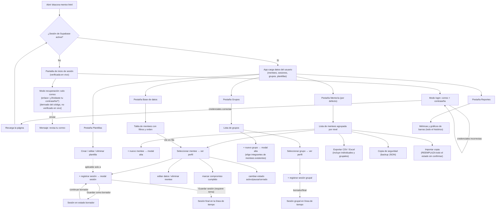

# Bitácora del Mentor — Requerimientos

> Documento base generado por el Analista de Negocio (BA). Derivado de la lectura completa del código fuente de `bitacora-mentor.html` (2065 líneas), `auth-gate.js` y `supabase-client-app.js`, y de una sesión real navegando la pantalla de acceso en el navegador.
>
> **Aviso de cobertura de evidencia:** la pantalla de inicio de sesión fue navegada y capturada en vivo. El resto de las pantallas descritas aquí (Mentoría, Grupos, Plantillas, Base de datos, Reportes y todos los modales) **no pudieron navegarse en vivo** porque la app exige una sesión válida de Supabase y no se dispone de credenciales de prueba. Esas secciones están documentadas a partir de la lectura línea por línea del código (`render*`, funciones de guardado, validaciones), no de observación visual directa. Donde el código deja algo ambiguo, se anota como caso borde en vez de asumir un comportamiento.

## Propósito del app

Bitácora del Mentor es una herramienta personal para que un mentor lleve el registro de sus mentorías: quiénes son sus mentees (individuales o en grupo), qué se conversó en cada sesión, qué compromisos quedaron pendientes, y cómo evoluciona cada proceso a lo largo del tiempo. Además de las sesiones, permite guardar plantillas de preguntas reutilizables para estructurar las sesiones, filtrar y buscar a todos los mentees en una vista de "base de datos", y ver reportes agregados (cuántas personas ha ayudado, tasa de objetivos logrados, sesiones por enfoque, etc.). Los datos se guardan en la nube (Supabase) asociados a la cuenta del mentor que inició sesión, con una copia en caché en el navegador y, opcionalmente, una copia adicional en una carpeta local del computador.

## Requerimientos funcionales

### Acceso / autenticación
1. La app está protegida por una pantalla de inicio de sesión (correo + contraseña) que se muestra antes de cargar cualquier dato; no existe opción de "crear cuenta" visible en el formulario (solo inicio de sesión y recuperación de contraseña).
2. Si las credenciales son incorrectas, se muestra el mensaje "Correo o contraseña incorrectos." y el formulario permanece disponible para reintentar.
3. El enlace "¿Olvidaste tu contraseña?" cambia el formulario a modo de recuperación (título "Recuperar contraseña", botón "Enviar enlace"); al enviarlo, se invoca `resetPasswordForEmail` de Supabase y se muestra "Revisa tu correo para continuar." (Verificado leyendo `auth-gate.js`; no se pudo confirmar visualmente el cambio de formulario porque los clics sobre el enlace no lograron activarse durante la sesión de prueba — ver Casos borde).
4. Cada app del hub (Bitácora del Mentor, StaffGate, LP Bag, MyTravel, Gantt) usa una sesión de Supabase completamente independiente (`storageKey` distinto por app), por lo que iniciar sesión en una app no da acceso a las demás.
5. Al iniciar sesión correctamente, la página se recarga y se cargan los datos del usuario autenticado (mentees, sesiones, grupos, sesiones grupales, plantillas) desde la tabla `app_data` de Supabase, filtrados por su `user_id`.

### Persistencia de datos
6. Mientras hay sesión activa, cada cambio (crear/editar/eliminar mentee, sesión, grupo, plantilla, etc.) se guarda automáticamente: primero en `localStorage` del navegador y luego se sincroniza a Supabase (tabla `app_data`, una fila por usuario y por app).
7. Si falla la sincronización con la nube, el cambio queda guardado localmente igual y se registra una advertencia en la consola del navegador (no se informa al usuario mentor en pantalla que la nube falló).
8. Si el navegador es Chrome o Edge, la app ofrece un botón adicional ("Conectar carpeta de datos" / badge inferior derecho) para vincular una carpeta local del computador donde se guarda una copia adicional del archivo `bitacora-mentor.data.json`, independiente de la nube.
9. Sin sesión de Supabase confirmada, la app no carga datos reales en memoria ni en pantalla, aunque existan datos cacheados de una sesión anterior en ese navegador.

### Gestión de mentees (pestaña "Mentoría")
10. El panel lateral lista los mentees agrupados por nivel (Principiante, Intermedio, Avanzado), ordenados alfabéticamente dentro de cada grupo, con buscador por nombre.
11. Cada mentee en la lista muestra: iniciales como avatar, un punto de color según su estado (activo/pausa/cerrado), su nombre, una etiqueta "1-2 sesiones" si es de tipo "consulta puntual", y una etiqueta "inactivo" si aplica (ver requerimiento 15).
12. Para crear un mentee se requiere como mínimo un nombre; si el área o el objetivo quedan vacíos, se guardan automáticamente como "Sin especificar" sin mensaje de error al usuario.
13. Los campos del mentee son: nombre, área, nivel, tipo de mentoría (seguimiento continuo / consulta puntual), estado (activo/pausa/cerrado), resultado final (solo relevante si está cerrado), estilo de aprendizaje, objetivo principal, teléfono, correo, país y notas de progresión — todos excepto nombre son opcionales o tienen valor por defecto.
14. Cambiar el estado de un mentee a "cerrado" registra automáticamente una fecha de cierre (`closedAt`); cambiarlo de "cerrado" a cualquier otro estado borra esa fecha.
15. Un mentee se marca como "inactivo" solo si su estado es "activo" Y su tipo es "seguimiento continuo" Y han pasado más de 30 días desde su última sesión registrada (o desde su fecha de creación si nunca ha tenido sesiones). Se muestra tanto la etiqueta en la lista como un banner de alerta en su perfil.
16. Eliminar un mentee borra también todo su historial de sesiones individuales; se pide confirmación y aparece un aviso con botón "Deshacer" disponible por unos segundos que restaura al mentee y sus sesiones exactamente como estaban.

### Sesiones individuales
17. Desde el perfil de un mentee se puede "+ registrar sesión": fecha (por defecto hoy), enfoque usado (directivo/socrático/colaborativo), tema tratado, qué funcionó, qué ajustar, próximos pasos, un compromiso/acción pendiente, y opcionalmente una plantilla de preguntas clave.
18. Guardar una sesión como "final" exige que el campo "Tema tratado" no esté vacío; guardarla como "borrador" no exige ningún campo.
19. Las sesiones se listan en orden cronológico descendente (más reciente primero) en el perfil del mentee, cada una con un número de sesión consecutivo (calculado por orden cronológico ascendente, no por orden de creación).
20. Un compromiso registrado en una sesión se puede marcar como cumplido/no cumplido con una casilla directamente en la línea de tiempo, sin necesidad de abrir el modal de edición; el cambio se guarda de inmediato.
21. El contador de "pendientes" que aparece junto al nombre del mentee cuenta todas las sesiones (incluyendo borradores) que tienen un compromiso registrado y no marcado como cumplido.
22. Un borrador se puede "continuar" (reabre el modal con los datos guardados) para completarlo y guardarlo como sesión final.
23. Eliminar una sesión pide confirmación y ofrece "Deshacer" por unos segundos.
24. Si se aplica una plantilla al registrar la sesión, se genera un checklist propio de esa sesión (copiado de los ítems de la plantilla en ese momento); cambios posteriores o eliminación de la plantilla no afectan checklists ya guardados en sesiones pasadas.

### Grupos de mentoría (pestaña "Grupos")
25. Se pueden crear grupos de mentoría con nombre (obligatorio), descripción opcional, e integrantes seleccionados de la lista de mentees ya registrados (si no hay mentees creados todavía, el modal lo indica y no permite seleccionar integrantes).
26. El perfil de grupo muestra sus integrantes como chips, un contador de compromisos pendientes, y su propio historial de sesiones grupales.
27. Las sesiones grupales tienen los mismos campos que las individuales (fecha, enfoque, tema, qué funcionó/ajustar, próximos pasos, compromiso) EXCEPTO que no soportan plantillas/checklist y no muestran un número de sesión consecutivo en la línea de tiempo.
28. Un grupo se considera "inactivo" si han pasado más de 30 días desde su última sesión grupal registrada (o desde su creación); a diferencia de los mentees individuales, esta regla no depende de ningún estado del grupo, porque los grupos no tienen campo de estado (activo/pausa/cerrado).
29. Eliminar un grupo borra también todas sus sesiones grupales; pide confirmación y ofrece "Deshacer".

### Plantillas de preguntas (pestaña "Plantillas")
30. Una plantilla tiene un nombre y una lista de ítems, cada uno de tipo "casilla (sin respuesta)" o "pregunta con respuesta". Se requiere al menos un ítem con texto para guardar.
31. Las plantillas solo se pueden aplicar al registrar/editar sesiones individuales, no sesiones grupales.
32. Eliminar una plantilla pide confirmación (advirtiendo que las sesiones que ya la usaron conservan su checklist), pero a diferencia de las demás eliminaciones del app, **no ofrece opción de deshacer**.

### Base de datos (pestaña "Base de datos")
33. Muestra una tabla de **mentees individuales únicamente** (no incluye grupos) con columnas: nombre, área, país, nivel, tipo, estado, teléfono, correo, cantidad de sesiones y cantidad de pendientes.
34. Permite filtrar por nombre, área (texto libre), país, nivel, tipo y estado; permite ordenar por cualquier columna (clic en el encabezado alterna ascendente/descendente); pagina de 15 en 15 filas.
35. Al hacer clic en una fila se navega a la pestaña "Mentoría" con ese mentee seleccionado.

### Reportes (pestaña "Reportes")
36. Muestra métricas totales de todo el histórico (sin filtro de fecha/rango): personas ayudadas, mentorías registradas (individuales + grupales + borradores), grupos de mentoría, tasa de objetivos logrados (solo sobre mentees con estado "cerrado"), y mentees activos actualmente.
37. Incluye gráficos de barras por: estado de los mentees, resultados de mentorías cerradas, área (top 8), tipo de mentoría, nivel, y enfoque usado en las sesiones — este último combina sesiones individuales y grupales, **incluyendo las que están en estado borrador**.

### Exportación / respaldo
38. "Exportar CSV" y "Exportar Excel" generan una tabla combinada con una fila por sesión (individual o grupal) de cada mentee/grupo, incluyendo datos del mentee/grupo repetidos en cada fila; si un mentee o grupo no tiene sesiones, genera una fila con los campos de sesión vacíos. Si no hay ningún mentee ni grupo, muestra un aviso de que no hay datos para exportar.
39. "Copia de seguridad" descarga un archivo JSON (`bitacora-mentor-backup.json`) con el estado completo de la app (mentees, sesiones, grupos, sesiones grupales, plantillas).
40. "Importar copia" permite subir un archivo JSON de respaldo; si tiene el formato esperado (contiene arreglos `mentees` y `sessions`), **reemplaza por completo el estado actual de la app** con el contenido del archivo importado, sin pedir confirmación previa y sin ofrecer "deshacer".

## Flujo de trabajo

## Casos borde

Cada uno de estos requiere una decisión del tech lead antes de convertirse en un cambio de código; aquí solo se documentan como observados.

1. **Importar copia de seguridad no pide confirmación ni ofrece deshacer.** A diferencia de todas las eliminaciones (mentee, sesión, grupo, sesión grupal), que muestran un diálogo de confirmación y un "Deshacer" temporal, `importBackup()` reemplaza el `state` completo apenas el archivo tiene el formato mínimo esperado (arreglos `mentees` y `sessions`). Un clic accidental en el archivo equivocado borra todos los datos actuales sin posibilidad de recuperarlos desde la propia app.

2. **Eliminar una plantilla no ofrece "Deshacer"**, a diferencia de mentee/sesión/grupo/sesión grupal, que sí lo ofrecen. Puede ser intencional (las plantillas no tienen historial asociado) pero rompe la consistencia de patrón de eliminación en el resto de la app.

3. **Los borradores de sesión "cuentan" en varios lugares donde tal vez no debieran.** Una sesión en estado `draft` (incluso sin tema, sin contenido) ya: (a) actualiza la fecha de "última actividad" del mentee, lo que puede ocultar la alerta de "inactivo" aunque no haya mentoría real; (b) suma al contador de "Sesiones" en la Base de Datos; (c) suma al total de "Mentorías registradas" en Reportes (aunque se desglosa aparte cuántas son borrador); y (d) si tiene un compromiso cargado, cuenta en el badge de "pendientes" del mentee. Falta definir si estos comportamientos son los deseados o si los borradores deberían excluirse de alguno de estos cálculos.

4. **Los campos "Área" y "Objetivo" del mentee no son obligatorios y no muestran ningún aviso al guardarse vacíos** (se autocompletan en silencio con el texto "Sin especificar"), mientras que "Nombre" sí muestra un toast de error si está vacío. Esto puede generar inconsistencia en los reportes por área (todo lo no especificado cae en un mismo cubo "Sin especificar") sin que el mentor se entere de que quedó incompleto.

5. **"Base de datos" no incluye grupos.** La pestaña se llama "Base de datos" y presenta filtros/orden/paginación, pero solo lista mentees individuales; no hay ninguna vista equivalente (tabla filtrable/ordenable) para los grupos de mentoría, aunque sí existen en el resto de la app (Grupos, Reportes, exportaciones).

6. **La pestaña "Grupos" no tiene sus propios botones de exportar/backup.** Los grupos y sus sesiones sí se incluyen en el CSV/Excel/backup que se generan desde la pestaña "Mentoría", pero un usuario que solo mire la pestaña "Grupos" no encontrará ahí ninguna opción de exportación, lo que puede no ser obvio.

7. **Los grupos no tienen un campo de estado (activo/pausa/cerrado) como los mentees.** Por lo tanto, no hay forma de "cerrar" o "pausar" un grupo para detener la alerta de inactividad de 30 días; la única forma de silenciarla es eliminando el grupo o registrando una sesión nueva. Para un mentee individual, en cambio, poner el estado en "pausa" o "cerrado" sí detiene la alerta.

8. **Cambiar el estado de un mentee de "cerrado" a otro estado no limpia el campo "Resultado final" (`outcome`).** El valor anterior queda guardado (aunque deja de mostrarse en el perfil mientras no esté "cerrado") y reaparecerá si el mentee se vuelve a cerrar sin que el mentor lo revise, pudiendo registrar un resultado desactualizado.

9. **El "candado" de acceso es solo visual, no de datos.** La estructura HTML de la app detrás de la pantalla de login (pestañas, botones "+nuevo mentee", etc.) está presente en el DOM y es detectable por herramientas de accesibilidad aun con el overlay de login cubriéndolo visualmente (confirmado durante esta sesión: el lector de accesibilidad del navegador encontró los botones de pestañas mientras la pantalla de login seguía visible en pantalla). El código sí evita cargar datos reales sin sesión confirmada (`storageAdapter.get` devuelve `null` sin sesión), por lo que no parece haber fuga de datos, pero vale que el tech lead confirme que ningún dato sensible (nombres, temas de sesión) queda accesible por esta vía antes de descartar el hallazgo.

10. **El respaldo local en carpeta ("folder bridge") no está vinculado al usuario de Supabase que inició sesión.** Es un mecanismo aparte que espeja la clave `localStorage['ledger-data']` a un archivo `bitacora-mentor.data.json` en una carpeta del computador, sin relacionarlo con el `user_id`. Si dos mentores distintos usan el mismo computador/navegador con esa carpeta conectada, el archivo local podría mezclar o sobrescribirse entre cuentas. Falta decidir si este mecanismo debe quedar restringido a un solo usuario por máquina o si debe evitarse su uso en equipos compartidos.

11. **No se pudo verificar visualmente el modo "Recuperar contraseña" del login.** El enlace "¿Olvidaste tu contraseña?" existe y su comportamiento fue confirmado leyendo `auth-gate.js`, pero los clics automatizados sobre el enlace durante la prueba en navegador no lograron activarlo (posiblemente por cómo el clic cae sobre el `shadow DOM` del componente de login). No es un hallazgo de la app en sí, sino una limitación de esta sesión de verificación; se recomienda una verificación manual puntual antes de dar el flujo de recuperación por probado end-to-end.

12. **El botón "Guardar sesión" (final) exige tema, pero no exige enfoque, compromiso ni ningún otro campo.** Es válido registrar una sesión final con solo la fecha y el tema, dejando "qué funcionó", "qué ajustar" y "próximos pasos" completamente vacíos. Puede ser el comportamiento deseado (campos opcionales por diseño), pero se documenta para que el tech lead confirme que no falta ninguna validación mínima de calidad de registro.

13. **(qa-lead, 2026-07-24) La corrección de mezcla de cuentas (commit `e421ee8`) hace invisibles, de forma permanente y silenciosa, los datos que ya existían en la clave `localStorage['ledger-data']` sin aislar, de antes de este cambio.** Confirmado con evidencia directa en esta sesión: `localStorage.getItem('ledger-data')` en `file:///bitacora-mentor.html` todavía contiene datos reales de una prueba anterior (un mentee "Prueba" con una sesión fechada 20/07/2026, de antes de que este fix se aplicara el 23/07/2026). Con el código nuevo, `storageAdapter.get()` ya nunca lee la clave vieja `ledger-data` — solo lee `ledger-data::<userId>` cuando hay sesión. Si una cuenta real inició sesión antes de este cambio y guardó datos solo localmente (sin fila todavía en `app_data` de Supabase), al volver a entrar después de este fix esa persona vería la app vacía, con sus datos anteriores atrapados de forma inaccesible en la clave vieja (nunca se borran, pero tampoco se vuelven a leer por ninguna ruta del código actual). No es lo mismo que la "ventana de carrera" ya documentada por security-reviewer en el punto 12 de este mismo archivo (esa es sobre datos nuevos que se escriben mal *después* del fix); esto es sobre datos *anteriores* al fix que quedan huérfanos con certeza, no por una carrera de milisegundos. Mismo patrón de diseño aplicado también a StaffGate, LP-Bag y MyTravel (no se encontró evidencia de datos huérfanos reales en esos tres en esta sesión, pero la misma lógica de código aplicaría igual si algún usuario real tuviera caché local previa sin fila en la nube). *Decisión pendiente: ¿vale la pena un script de migración de una sola vez (copiar `key` → `key::userId` en el primer login post-fix) antes de que esto le pase a un usuario real, o se acepta el riesgo por ser bajo volumen (hub personal, pocos usuarios)?*
