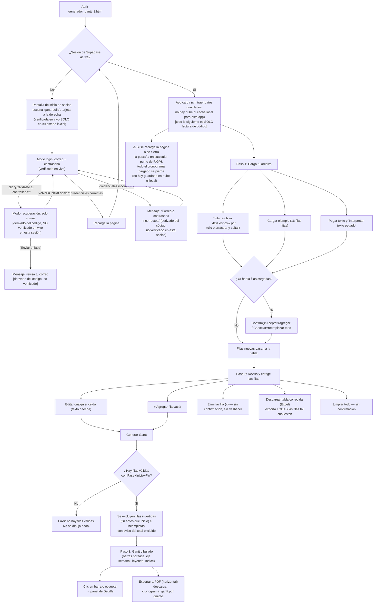

# Generador de Gantt — Requerimientos

> Documento base generado por el Analista de Negocio (BA). Derivado de la lectura completa del código fuente de `generador_gantt_2.html` (582 líneas), `auth-gate.js` (1112 líneas) y `supabase-client-app.js` (27 líneas), y de una sesión en el navegador contra el archivo local.
>
> **Aviso de cobertura de evidencia — importante y distinto de otras apps del hub.** En esta sesión de trabajo, el archivo `generador_gantt_2.html` solo pudo abrirse como una **vista estática de una sola captura** dentro de la herramienta de navegador: se pudo ver el diseño inicial de la pantalla de inicio de sesión (colores, textos, animación de fondo) tal como lo renderiza el navegador, pero **no fue posible hacer clic, escribir en los campos, ni enviar el formulario de forma real** — la propia herramienta indicó explícitamente que "los archivos fuera de la carpeta del proyecto se muestran como una vista estática (snapshot)", y al intentar interactuar con una pestaña nueva, la herramienta respondió literalmente "No site is open in this tab" (no hay ningún sitio realmente cargado en esa pestaña). Se intentó además: (a) forzar la navegación, (b) abrir una pestaña nueva limpia, y (c) cargar la versión publicada en producción (Netlify) para tener una pestaña interactiva real — esta última quedó colgada/sin responder y se abandonó el intento para no arriesgar nada sobre el sitio en vivo. No se encontró ningún servidor local disponible en esta máquina (no hay `python`, `node` ni `npm` instalados) para servir la carpeta del proyecto y así obtener una pestaña interactiva.
>
> Como consecuencia: **de todo lo que hay detrás o alrededor del inicio de sesión, lo único verificado en vivo es la apariencia inicial de la pantalla de "Iniciar sesión"** (confirmada con varias capturas idénticas). El mensaje de error por credenciales incorrectas, el modo "Recuperar contraseña", la pantalla de "Elige una contraseña nueva", el widget de cuenta, y **toda la funcionalidad de la app en sí (carga de archivos, tabla editable, generación del Gantt, exportaciones)** están documentados exclusivamente a partir de la lectura línea por línea del código — no fueron manejados ni vistos en pantalla en funcionamiento real durante esta sesión. Esto se marca explícitamente en cada sección.

## Propósito del app

El Generador de Gantt es una herramienta para convertir un cronograma de proyecto (que puede venir en Excel, CSV, PDF, o pegado como texto) en un diagrama de Gantt visual e interactivo, sin necesidad de plantillas de Excel ni fórmulas. El usuario sube o pega su cronograma, la app intenta reconocer automáticamente las columnas de fase, fechas de inicio/fin, entregable y duración; el usuario revisa y corrige esa tabla directamente en la página; y al pulsar "Generar Gantt" obtiene una línea de tiempo con una barra de color por tarea, agrupada visualmente por fase, con un detalle ampliado al hacer clic en cada tarea. El resultado se puede exportar como PDF horizontal (imagen del Gantt completo) o como un Excel con la tabla ya corregida. A diferencia de las demás apps del hub, esta herramienta **no guarda nada de forma permanente**: todo el cronograma cargado vive solo en la memoria de la pestaña del navegador mientras está abierta.

## Requerimientos funcionales

### Acceso / autenticación

1. La app está protegida por la misma pantalla de acceso compartida del hub (`auth-gate.js`): correo + contraseña, sin opción de "crear cuenta". **(Verificado en vivo solo en su apariencia inicial — ver aviso de cobertura arriba.)**
2. Esta app usa una escena de fondo animada propia y distinta a las demás apps del hub (`AIAPPS_LOGIN_SCENE = 'gantt-build'`): barras horizontales tipo Gantt que "crecen" de forma animada con una banderita al final, en tonos ámbar/dorado y verde-azulado, sobre fondo azul marino casi negro. La tarjeta de acceso se posiciona hacia la derecha de la pantalla (`AIAPPS_LOGIN_LAYOUT = 'right'`), dejando la animación visible a la izquierda. **(Verificado en vivo: se vio esta escena y esta posición en la única captura estática disponible.)**
3. La tarjeta de acceso muestra "📊 Generador de Gantt" como nombre y "PLANIFICACIÓN DE PROYECTOS" como lema, un campo "Correo", un campo "Contraseña", un botón "Entrar" y un enlace "¿Olvidaste tu contraseña?". **(Verificado en vivo.)**
4. Si las credenciales son incorrectas, el código muestra el mensaje "Correo o contraseña incorrectos." debajo del botón, sin borrar el correo escrito. **(No verificado en vivo en esta sesión — ver aviso de cobertura. Comportamiento leído en `auth-gate.js`, idéntico al confirmado en vivo para StaffGate con el mismo archivo compartido.)**
5. El enlace "¿Olvidaste tu contraseña?" cambia el formulario a modo "Recuperar contraseña" (desaparece el campo de contraseña, el botón pasa a "Enviar enlace", aparece "Volver a iniciar sesión"). **(No verificado en vivo en esta sesión — mismo código compartido que StaffGate, pero no se pudo repetir la prueba aquí.)**
6. Si el usuario llega por un enlace real de recuperación de contraseña de Supabase, se muestra la pantalla "Elige una contraseña nueva" (mínimo 6 caracteres). **(No verificado en vivo — requiere un enlace de recuperación real.)**
7. La sesión de esta app es independiente de las demás apps del hub (`storageKey: "sb-gantt-auth"`); iniciar sesión aquí no da acceso a Bitácora del Mentor, StaffGate, LP Bag ni MyTravel, y viceversa. **(Verificado leyendo `supabase-client-app.js`.)**
8. Con sesión iniciada, aparece el widget "👤 Cuenta" (cambiar contraseña, cerrar sesión) porque la app define `AIAPPS_SHOW_ACCOUNT_WIDGET = true`. **(No verificado en vivo — requiere sesión real.)**

### Persistencia de datos (comportamiento distinto al resto del hub)

9. **La app NO guarda el cronograma en ningún lado.** A diferencia de Bitácora del Mentor, StaffGate, LP Bag y MyTravel, `generador_gantt_2.html` no contiene ninguna llamada a `supabaseClient` fuera de la del propio `auth-gate.js`/`supabase-client-app.js` (que solo maneja el inicio de sesión), y tampoco usa `localStorage` en ningún punto del código. Todas las filas cargadas o corregidas viven únicamente en una variable de JavaScript (`rows`) dentro de la pestaña abierta del navegador. **(Verificado leyendo el archivo completo — no aparece ninguna referencia a `localStorage` ni a guardar/leer datos en la nube más allá del login.)**
10. Como consecuencia directa de lo anterior: recargar la página, cerrar la pestaña, o simplemente que el navegador se cierre inesperadamente, borra por completo el cronograma cargado y cualquier corrección hecha en la tabla, sin ningún aviso previo de la app. **(Derivado del punto 9 — ver Casos borde #1.)**

### 1. Carga del cronograma

11. Existen tres formas de cargar filas: subir un archivo (`.xlsx`, `.xls`, `.csv`, `.pdf`) hacienda clic en la zona de arrastre o seleccionándolo, arrastrar y soltar un archivo sobre esa misma zona, o pegar texto tabular en un cuadro de texto y pulsar "Interpretar texto pegado". **(Código: listeners de `fileInput`, `dragover`/`drop` en `#dropzone`, y botón `#parsePaste`.)**
12. También existe un botón "Cargar ejemplo (Opción 1 — Odoo PES)" que carga un cronograma de muestra fijo, ya escrito en el código, de 16 filas (fases como "Análisis, Diseño y Preparación Inicial", "Desarrollo Core Académico y Admisiones", etc., con fechas entre junio y octubre de 2026).
13. Para archivos Excel, la app recorre **todas** las hojas del libro y junta las filas reconocidas de cada una.
14. La app intenta reconocer automáticamente las columnas del archivo/tabla buscando encabezados que **contengan** ciertos textos (sin tildes ni mayúsculas): "fase" para la fase, "fechainicio" o "inicio" para la fecha de inicio, "fechafin" o "fin" para la fecha de fin, "entregable" para el entregable, y "duraciondias", "duracion" o "dias" para la duración. Usa la primera columna que coincida con cada candidato, en el orden en que aparecen los encabezados.
15. Las fechas se interpretan de forma flexible: puede ser un objeto fecha ya reconocido por Excel, un número de serie de Excel, un texto con formato numérico de fecha (por ejemplo "15/6/2026"), o cualquier otro texto que el navegador logre interpretar como fecha por su cuenta. **Importante:** el patrón numérico (`d/d/aaaa`) siempre interpreta el primer número como el MES y el segundo como el DÍA (formato estilo estadounidense MM/DD/AAAA) — ver Casos borde #2.
16. Si una fila no trae duración en días pero sí tiene fecha de inicio y fin, la duración se calcula automáticamente como la diferencia en días más uno (cuenta ambos extremos inclusive).
17. Las filas completamente vacías (sin fase, sin fechas y sin entregable) se descartan automáticamente durante la interpretación del archivo o del texto pegado; no llegan a la tabla.
18. Para archivos PDF, la app extrae el texto del PDF agrupando por líneas según la posición vertical del texto, y luego aplica el mismo intérprete de texto pegado (busca líneas con al menos 3 "celdas" separadas por tabulación o varios espacios, y al menos 2 valores que parezcan fechas). Si no logra reconocer ninguna fila, deja el texto extraído del PDF en el cuadro de texto para que el usuario lo ajuste manualmente y presione "Interpretar texto pegado", en lugar de fallar en silencio.
19. Al pegar texto directamente, si la primera celda de una línea es un número entero puro, se interpreta como la duración en días y la fase pasa a ser la siguiente celda; si no, la primera celda se toma como la fase. Todo el texto que queda después de la segunda fecha reconocida se une como el "entregable".
20. Si ya había filas cargadas en la tabla y el usuario carga un archivo nuevo, pega texto nuevo, o pulsa "Cargar ejemplo", aparece una ventana de confirmación nativa del navegador con el texto "Ya tienes N fila(s) cargadas... Aceptar = agregar estas M filas nuevas ... a las existentes. Cancelar = reemplazar todo con las filas nuevas." Aceptar agrega las filas nuevas a las existentes; Cancelar descarta las filas existentes y deja solo las nuevas (ver Casos borde #5).
21. El botón "Limpiar todo" vacía la tabla de inmediato (sin pedir confirmación) y oculta el panel del Gantt si estaba visible.

### 2. Revisar y corregir la tabla

22. Cada fila cargada aparece en una tabla editable con 5 columnas (Fase, Fecha inicio, Fecha fin, Entregable, Días) más una "x" para eliminar la fila.
23. Todas las celdas de texto son editables directamente haciendo clic sobre ellas (son celdas "contenteditable"); el cambio se guarda al salir de la celda (evento "blur"), no mientras se escribe.
24. Al editar una celda de fecha, el texto escrito se vuelve a interpretar con el mismo analizador flexible de fechas usado al cargar el archivo; si el texto no se puede interpretar como fecha, la fecha de esa fila queda vacía internamente sin ningún aviso visual inmediato en la celda (ver Casos borde #3).
25. El botón "+ Agregar fila" agrega una fila completamente vacía al final de la tabla para llenarla manualmente.
26. El botón "Descargar tabla corregida (Excel)" descarga un archivo `cronograma_corregido.xlsx` con exactamente las filas que están en la tabla en ese momento, tal como están (incluye filas vacías o incompletas si las hay, sin ningún filtro).
27. El botón "x" de cada fila la elimina de inmediato de la lista en memoria, sin confirmación ni opción de deshacer.

### 3. Generar y usar el Gantt

28. El botón "Generar Gantt" solo usa las filas que tengan Fase, Fecha inicio y Fecha fin completas; de esas, separa las que tienen la fecha fin anterior a la fecha inicio ("invertidas") y las excluye del dibujo, mostrando un mensaje de error indicando cuántas son y el nombre de la primera fase afectada como ejemplo.
29. Si no queda ninguna fila válida después de filtrar, la app muestra un error ("No hay filas válidas...") y no dibuja ni actualiza el Gantt.
30. Las filas válidas se ordenan por fecha de inicio ascendente y se numeran de nuevo (#1, #2, #3…) cada vez que se pulsa "Generar Gantt" — la numeración no es fija, puede cambiar si se edita algo y se vuelve a generar.
31. La escala de la línea de tiempo (píxeles por día) se ajusta automáticamente según la duración total del proyecto: más de 150 días usa 12px/día, más de 80 días usa 16px/día, y en cualquier otro caso usa 22px/día. El usuario no puede elegir manualmente el zoom.
32. Se dibuja un eje horizontal con marcas cada 7 días; las marcas que caen en el inicio de un mes se muestran en negrita con el nombre del mes y el año, las demás solo muestran el día y el mes.
33. Cada tarea válida se dibuja como una barra de color horizontal posicionada y dimensionada según sus fechas (ancho mínimo de 6px aunque la duración calculada sea menor), con su número de secuencia dentro de la barra, y la fecha de inicio como etiqueta a la derecha de la barra.
34. El color de cada barra depende de su "Fase": cada fase distinta recibe un color de una paleta fija de 8 colores: si hay más de 8 fases distintas, los colores se repiten cíclicamente (ver Casos borde #6).
35. A la izquierda del gráfico se muestra una lista de etiquetas (el texto del entregable, o el nombre de la fase si no hay entregable) recortada visualmente a 2 líneas; hacer clic en una etiqueta, o directamente en la barra correspondiente, abre un panel de "detalle" debajo del gráfico con el número, fase, entregable completo, rango de fechas formateado y los días de duración (si el dato existe).
36. Debajo del gráfico aparece una leyenda con un cuadro de color por cada fase distinta, y un índice de texto compacto con el número y una versión resumida (60 caracteres) del entregable de cada tarea.
37. Si hubo filas excluidas (invertidas o incompletas), el mensaje de estado final se muestra en un tono de advertencia/error en vez del mensaje de éxito habitual; si todo salió bien, el mensaje de éxito indica el total de tareas y el rango de fechas cubierto.

### Exportar a PDF

38. El botón "Exportar a PDF (horizontal)" exige que ya se haya generado un Gantt (revisa si el contenedor del gráfico tiene un ancho asignado); si no, muestra un mensaje de error pidiendo generar el Gantt primero.
39. Al exportar, la app fuerza temporalmente que el área desplazable del Gantt se muestre a su ancho completo (sin scroll), toma una "foto" (captura) de toda esa área con la librería html2canvas a 2x de escala, arma un PDF en orientación horizontal cuyo tamaño de página coincide con el tamaño de esa captura (limitando el ancho máximo a 3000px, reduciendo proporcionalmente si la captura es más ancha), y descarga el archivo directamente como `cronograma_gantt.pdf`. A diferencia de StaffGate, aquí no se abre una pestaña de vista previa de impresión: el PDF se genera y se descarga de una sola vez.
40. Al terminar la exportación (con éxito o con error), la app regresa el área del Gantt a su comportamiento normal de scroll horizontal.

## Flujo de trabajo

## Casos borde

Cada uno de estos requiere una decisión del tech lead antes de convertirse en un cambio de código; aquí solo se documentan como observados durante la lectura del código.

1. **No existe ningún guardado del cronograma — ni en la nube ni en caché local del navegador.** Todas las demás apps del hub (Bitácora del Mentor, StaffGate, LP Bag, MyTravel) sincronizan sus datos a Supabase y además guardan una copia en `localStorage`. El Generador de Gantt, en cambio, solo usa Supabase para el inicio de sesión — el cronograma completo (filas cargadas, correcciones hechas a mano) vive exclusivamente en la variable `rows` de JavaScript, en la memoria de esa pestaña del navegador. Recargar la página, cerrar la pestaña, o un cierre inesperado del navegador borra todo el trabajo sin ningún aviso previo ni "¿seguro que quieres salir?". La única forma de no perder el trabajo es exportarlo a Excel o a PDF antes de cerrar o recargar. Esto es una diferencia de comportamiento muy importante frente al resto del hub y probablemente sorprenderá a cualquier usuario acostumbrado a las otras apps.

2. **El formato de fecha numérico asume siempre MM/DD/AAAA (estilo Estados Unidos), no DD/MM/AAAA (estilo dominicano/hispano).** La función `parseDateFlexible` interpreta cualquier texto con forma `número/número/año` como mes/día/año, sin importar cuáles sean los valores. El propio ejemplo incluido en la app usa fechas en ese formato ("6/15/2026" = 15 de junio de 2026). Si un usuario dominicano pega o escribe una fecha en el formato que le resulta natural, DD/MM/AAAA (por ejemplo "15/6/2026" queriendo decir 15 de junio), la app la interpretará como mes 15 — un mes inválido que JavaScript "desborda" automáticamente hacia marzo del año siguiente, sin ningún mensaje de error. Esto puede generar cronogramas con fechas completamente equivocadas y sin ninguna señal visible de que algo salió mal, salvo que el usuario note que las fechas del Gantt no coinciden con lo que esperaba.

3. **Editar una fecha en la tabla con un texto que la app no puede interpretar no muestra ningún error.** Si el usuario escribe algo no reconocible en la celda de "Fecha inicio" o "Fecha fin" y sale de la celda, el dato interno de esa fila queda en `null` silenciosamente — la celda no se re-formatea ni se marca en rojo ni muestra ningún aviso en ese momento. El usuario solo se entera indirectamente más tarde, al pulsar "Generar Gantt", cuando esa fila se cuenta dentro de un mensaje genérico ("N fila(s) sin fase o fechas completas fueron excluidas") que no dice cuál fila ni por qué.

4. **La detección automática de columnas puede confundirse con encabezados parecidos.** `pickCol` busca la primera columna cuyo encabezado (sin tildes/mayúsculas) *contenga* el texto buscado. Para la columna de fecha de fin, el criterio de búsqueda es simplemente que el encabezado contenga "fin" — cualquier columna cuyo título incluya esa secuencia de letras (por ejemplo "Financiamiento" o alguna palabra que contenga "fin") podría emparejarse antes que la columna real de fecha de fin si aparece antes en el archivo, sin que el usuario reciba ninguna advertencia de que se usó la columna equivocada.

5. **La ventana de confirmación al cargar filas nuevas usa "Cancelar" para una acción destructiva, al revés de lo que la mayoría de usuarios esperaría.** El diálogo dice "Aceptar = agregar ... Cancelar = reemplazar todo con las filas nuevas." — es decir, hacer clic en "Cancelar" (el botón que casi siempre se asocia con "no hacer nada" o "retroceder") en realidad **descarta todas las filas ya cargadas y corregidas**, reemplazándolas por las nuevas, sin ninguna confirmación adicional ni forma de deshacerlo. Un usuario que reflexivamente pulse "Cancelar" pensando que así no pasa nada podría perder de golpe todo el trabajo de corrección manual hecho hasta ese momento.

6. **La paleta de colores del Gantt solo tiene 8 colores; con más de 8 fases distintas, los colores se repiten.** Si un cronograma tiene, por ejemplo, 10 fases diferentes, la fase #1 y la fase #9 recibirán exactamente el mismo color tanto en las barras como en la leyenda, sin ninguna distinción visual adicional (como un patrón o un número), lo que puede hacer que dos fases no relacionadas parezcan ser la misma a simple vista.

7. **El campo "Días" no se usa para nada al dibujar el Gantt, y puede quedar desincronizado sin aviso.** El ancho de cada barra se calcula siempre a partir de la resta entre fecha de fin y fecha de inicio, nunca a partir del valor de la columna "Días". Si un usuario edita manualmente el número de días sin ajustar las fechas (o viceversa), el Gantt seguiro usando las fechas para dibujar, pero el número de "Días" mostrado en la tabla, en el detalle de la tarea, y en el Excel exportado, seguirá mostrando el valor desactualizado que el usuario escribió, sin ninguna advertencia de inconsistencia.

8. **La lectura de texto desde PDF es aproximada y la propia app lo advierte, pero no ofrece ninguna forma de verificar fila por fila contra el PDF original.** El mensaje de estado dice textualmente "La lectura de PDF es aproximada — revisa bien cada fila antes de generar el Gantt", pero no hay ningún indicador de confianza por fila, ni un enlace para ver el PDF original al lado de la tabla — la única forma de comprobar que una fila se interpretó correctamente es que el usuario tenga el PDF original abierto aparte y compare manualmente.

9. **"Descargar tabla corregida (Excel)" exporta la tabla completa sin filtrar, incluyendo filas vacías o inválidas** (por ejemplo, filas agregadas con "+ Agregar fila" y nunca completadas, o filas con fecha inválida por edición). A diferencia de "Generar Gantt", que sí informa cuántas filas excluyó y por qué, la descarga a Excel no aplica ningún filtro ni aviso — el archivo descargado puede contener filas en blanco o a medio llenar mezcladas con las válidas.

10. **No se pudo confirmar en vivo si el "candado" de inicio de sesión es solo visual (como se confirmó para StaffGate) o si además bloquea el acceso a los controles subyacentes**, porque en esta sesión no fue posible interactuar realmente con la página (ver aviso de cobertura al inicio del documento). Sin embargo, la lectura del árbol de accesibilidad de la única captura obtenida sí detectó, incluso con la pantalla de login cubriendo la vista, los controles reales del Paso 1 y Paso 2 (el cuadro de arrastre de archivos, "Cargar ejemplo (Opción 1 — Odoo PES)", "Limpiar todo", "Interpretar texto pegado", "+ Agregar fila", "Descargar tabla corregida (Excel)", "Generar Gantt"), lo cual es consistente con el mismo patrón confirmado en StaffGate (el candado tapa visualmente pero no retira del DOM los controles de la página). A diferencia de StaffGate, aquí esto tiene menos riesgo de exposición de datos porque, sin sesión, la variable `rows` de todas formas empieza vacía (no hay ninguna carga previa de datos guardados que mostrar) — pero conviene que el tech lead lo confirme explícitamente con una prueba interactiva real antes de descartarlo del todo.

11. **Limitación de herramientas de esta sesión, no del app: no se pudo verificar en vivo ningún flujo interactivo, solo la apariencia inicial estática de la pantalla de login.** Se documenta aparte en `entrenamiento.md` con el detalle de qué se intentó. Se recomienda repetir esta sesión de documentación cuando se disponga de un entorno con un servidor local real (por ejemplo, sirviendo la carpeta del proyecto con algún servidor HTTP) para poder confirmar en vivo el resto de los flujos: mensaje de error de login, modo de recuperación, y sobre todo **toda la funcionalidad propia de esta app** (carga de archivos, edición de tabla, generación del Gantt, exportaciones), que en este documento está descrita únicamente a partir del código fuente.
