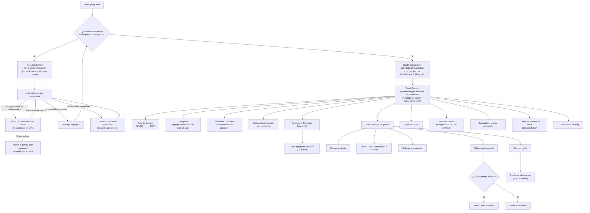

# LP-Bag (Presupuesto Inteligente) — Requerimientos

> Documento base generado por el Analista de Negocio (BA). Derivado de la lectura completa del código fuente de `lpbag.html` (1216 líneas) y de los archivos compartidos `auth-gate.js` y `supabase-client-app.js` que usa, más una sesión de manejo en el navegador contra la copia local `file:///C:/Users/LissetteIPS/Documents/AI%20APPs/lpbag.html` (sin sesión activa, según lo pedido para esta tarea).

> **Aviso de cobertura de evidencia (importante, léase antes que el resto del documento):** en esta sesión de trabajo, al abrir `lpbag.html` directamente como archivo local (`file://`), la herramienta de navegador de este entorno mostró la app como una **vista estática** de la pantalla interna (el "Panel General" con categorías, formulario, tabla, etc.) — la superposición de inicio de sesión de `auth-gate.js` **no llegó a aparecer** en el árbol de accesibilidad ni en el texto de la página, y los intentos de escribir texto en un campo (categoría nueva) o de tomar una captura de pantalla **no tuvieron efecto ni respondieron** (el escritorio de captura llegó a agotar el tiempo de espera dos veces). Esto coincide exactamente con la limitación ya reportada por este mismo equipo para `generador_gantt_2.html` y `mytravel-pro-v4.html` (ver `docs/team-memory.md`, sección "Hechos que todo el equipo debe conocer"), por lo que se interpreta como una limitación de la herramienta de prueba de este entorno al abrir archivos locales, **no como una confirmación de que la pantalla de login de LP-Bag realmente se salta sobre `file://`**. No se navegó a la URL de producción (Netlify) para comparar, según instrucción explícita de esta tarea (podría haber una sesión real activa ahí, ver aviso "⚠️ Requiere atención" de `docs/team-memory.md`). Por lo tanto: **ninguna pantalla de esta app (login, formulario normal, error de credenciales, modo de recuperación, ni el panel interno) se pudo verificar mediante interacción real confirmada en esta sesión.** Todo lo que sigue en este documento proviene de la lectura del código fuente, salvo donde se indica explícitamente "confirmado por el árbol de accesibilidad" (que sí refleja con fidelidad la estructura HTML tal como el navegador la renderizó, aunque no se haya podido interactuar con ella).

## Propósito del app

LP-Bag es una herramienta personal para llevar el control de los **gastos fijos recurrentes** (renta, servicios, suscripciones, transporte, etc.), organizados por categoría, con la posibilidad de registrar cada gasto en dólares (USD) o pesos dominicanos (DOP) y verlos convertidos a una sola moneda de referencia usando una tasa de cambio que la propia persona actualiza manualmente. Calcula automáticamente el total mensual y anualizado de todos los gastos, muestra una distribución por categoría en un gráfico de dona, y permite exportar/importar toda la información como un archivo JSON. Los datos se guardan en la nube (Supabase) asociados a la cuenta de quien inició sesión, con una copia en caché en el navegador y, opcionalmente, una copia adicional en una carpeta del computador.

## Requerimientos funcionales

### Acceso / autenticación

1. La app está protegida por la pantalla de login compartida (`auth-gate.js`), que se muestra antes de cargar cualquier dato real, con los campos "Correo" y "Contraseña" y el botón "Entrar". **(No verificado en vivo esta sesión — ver aviso de cobertura arriba; comportamiento leído en `auth-gate.js`.)**
2. Si las credenciales son incorrectas, el código muestra el mensaje "Correo o contraseña incorrectos." debajo del botón. **(No verificado en vivo esta sesión.)**
3. El enlace "¿Olvidaste tu contraseña?" cambia el formulario a modo "Recuperar contraseña" (desaparece el campo de contraseña, el botón pasa a "Enviar enlace", aparece "Volver a iniciar sesión"); al enviarlo, si no hay error, muestra "Revisa tu correo para continuar.". **(No verificado en vivo esta sesión.)**
4. LP-Bag tiene una decoración visual propia en la pantalla de login: fondo oscuro con una animación de monedas de oro 🪙 cayendo desde arriba y un "piso" de montones de monedas generado por código en la parte inferior (`window.AIAPPS_LOGIN_SCENE = 'coins-rain'`, definido en la línea 186 del HTML). **(Descrito a partir del código de `auth-gate.js`, líneas 520-599 — no se pudo ver esta animación en pantalla esta sesión por la limitación de herramienta ya explicada.)**
5. Cada app del hub usa una sesión de Supabase independiente (`storageKey: "sb-lpbag-auth"`), por lo que iniciar sesión en LP-Bag no da acceso a las demás apps ni viceversa. **(Verificado leyendo `supabase-client-app.js`.)**
6. Con sesión iniciada, `auth-gate.js` agrega un widget "👤 Cuenta" para cambiar contraseña y cerrar sesión, adicional a la tarjeta "Seguridad de Acceso" que la propia app ya trae en su panel principal (ver requerimiento 20). **(No verificado en vivo.)**
7. El botón "← Salir" de la barra superior de la app llama a `window.aiAppsSignOut()` (función que expone `auth-gate.js`) para cerrar la sesión.

### Persistencia de datos

8. Cada cambio en la app (tasa, categorías, gastos) se guarda primero en `localStorage` bajo la clave `LPBag_db`, y después se intenta sincronizar hacia Supabase (tabla `app_data`, una fila por `user_id` + `app_id='lpbag'`, mediante `upsert`).
9. La sincronización hacia la nube solo se activa después de que la carga inicial haya terminado (bandera `cloudSyncReady`), para evitar que un guardado disparado antes de tiempo sobrescriba la nube con un estado vacío/desactualizado (comentario explícito en el código, línea 830-832).
10. Si falla la sincronización con la nube, el cambio queda igual guardado en `localStorage` y solo se registra una advertencia en la consola del navegador (`console.warn`); la app no informa nada al usuario dentro de la interfaz.
11. Al cargar con sesión activa, la app intenta leer primero desde Supabase (`app_data` filtrado por ese usuario). Si existe una fila, esos datos reemplazan tanto la memoria como la caché de `localStorage`. Si no existe fila para ese usuario (cuenta nueva) o la lectura falla, la app recurre a `loadFromLocalStorage()`, que usa lo que haya en la clave `LPBag_db` de ese navegador (ver Caso borde 1).
12. Sin sesión de Supabase confirmada, `load()` no hace nada: la variable `appData` se queda en su valor inicial por defecto (tasa 59, 5 categorías predefinidas — Vivienda, Servicios, Suscripciones, Transporte, Otros — y cero gastos), y ese es justamente el estado que se observó en el árbol de accesibilidad de esta sesión (**confirmado por el árbol de accesibilidad**: 5 categorías predefinidas, "0 gasto(s) registrado(s)").
13. En navegadores compatibles (Chrome/Edge), un badge en la esquina inferior derecha ("📁 Conectar carpeta de datos") permite conectar una carpeta local donde se guarda una copia adicional en `lpbag-presupuesto.data.json`, independiente de la nube; en otros navegadores muestra "⚠️ Guardado solo local (usa Chrome/Edge)". **(Confirmado por el árbol de accesibilidad que el texto "📁 Conectar carpeta de datos" existe en la página; su funcionamiento interno se documenta solo por lectura del código.)**

### Tasa de cambio y moneda de vista

14. Existe un campo "1 USD = ___ DOP" que actualiza `appData.rate` y la fecha de actualización (`rateDate`, formateada en español dominicano) cada vez que cambia, guarda, sincroniza y muestra un aviso temporal "✓ Tasa actualizada" (3 segundos) más un toast "Tasa: 1 USD = X DOP". La función `updateRate(v)` solo actúa si `v>0`; si el valor no es mayor que cero, no pasa nada y no se muestra ningún mensaje de error (ver Caso borde 2).
15. Un selector "Vista" en la barra superior (DOP / USD) determina en qué moneda se muestran los totales, el gráfico y la columna "Vista" de la tabla; **no cambia la moneda en que quedó guardado cada gasto individual**, solo la conversión que se muestra.
16. La conversión (`convert()`) siempre usa la tasa **actual** guardada en `appData.rate`: no existe ningún mecanismo para conservar la tasa vigente en el momento en que se registró cada gasto (ver Caso borde 3).

### Categorías

17. Se puede agregar una categoría nueva escribiendo un nombre no vacío y no duplicado (comparación exacta de texto) y presionando "+" o Enter.
18. Una categoría solo se puede eliminar si **ningún** gasto la está usando actualmente; si está en uso, aparece el toast de error "Categoría en uso, no se puede eliminar" y no se borra. Si no está en uso, se elimina de inmediato con un clic en su "×", **sin ningún diálogo de confirmación** (a diferencia de eliminar un gasto, que sí pide confirmar — ver Caso borde 4).
19. No existe ninguna función para **renombrar** una categoría: la única forma de cambiar el nombre de una categoría ya en uso es editar manualmente, uno por uno, cada gasto que la usa para asignarle una categoría distinta, y luego crear/eliminar según corresponda.

### Registro y edición de gastos

20. El formulario "Registrar Gasto Fijo" es un `<form>` real con envío nativo (`onsubmit="addExpense(event)"`), por lo que los atributos HTML5 sí se aplican: "Descripción" es obligatoria (`required`), "Monto" es obligatorio y no permite menos de 0.01 (`required min="0.01"`), y "Moneda" (DOP/USD) y "Frecuencia" (Mensual/Anual) se eligen de listas fijas. La categoría se toma de la lista de categorías existentes en ese momento (no se puede escribir una nueva desde el formulario de gasto).
21. Cada gasto guardado incluye: id (marca de tiempo), título, monto, moneda, frecuencia, categoría y fecha de creación (formato `es-DO`).
22. Editar un gasto abre un modal con los mismos campos, pero el botón "Guardar cambios" llama a `saveEdit()` por `onclick`, **no** mediante el envío nativo del formulario, así que las validaciones HTML5 (`required`, etc.) del modal de edición son solo visuales/cosméticas; la validación real ocurre en JavaScript: exige título no vacío y monto mayor que 0 (muestra el toast "Datos inválidos" si falla), pero no valida que la categoría elegida siga existiendo en la lista actual de categorías (ver Caso borde 5).
23. Eliminar un gasto exige confirmar en un modal ("¿Eliminar permanentemente...? Esta acción no se puede deshacer.") y el borrado es inmediato y permanente al confirmar — no existe función de "Deshacer" en ningún lugar de la app.

### Tabla de gastos, búsqueda, filtros y orden

24. La tabla (vista de escritorio) o tarjetas (vista móvil, por debajo de 700px) lista todos los gastos, con búsqueda de texto libre (por título o categoría, sin distinguir mayúsculas) y tres filtros de frecuencia en forma de "pills": Todos, Mensuales, Anuales (excluyentes entre sí, uno activo a la vez).
25. Los encabezados de columna (Descripción, Categoría, Frecuencia, Monto Original) son clicables para ordenar ascendente/descendente; un segundo clic invierte el orden. El orden por defecto al cargar es por Descripción (`sortKey='title'`).
26. Cuando hay más de una categoría representada en el listado filtrado actual, la tabla agrega una fila de "Subtotal" por categoría con el total convertido a la moneda de vista.
27. La columna "Vista" siempre muestra el monto convertido a la moneda seleccionada en el selector "Vista" de la barra superior, usando la tasa de cambio actual.

### Resumen y gráfico

28. La tarjeta "Resumen Totalizado" calcula, sobre **todos** los gastos (sin importar filtros de la tabla): el total mensual (gastos mensuales tal cual + gastos anuales divididos entre 12), el total anualizado (gastos mensuales × 12 + gastos anuales tal cual), y un desglose "Mens · Anuales" que muestra por separado la suma de los gastos originalmente mensuales y la de los originalmente anuales, todo convertido a la moneda de vista.
29. El gráfico de dona (dibujado en un `<canvas>`, sin librerías externas) agrupa el gasto **mensual equivalente** por categoría (los gastos anuales se dividen entre 12 para la comparación) y muestra una leyenda con monto y porcentaje por categoría; si no hay gastos, muestra el mensaje "Agrega gastos para ver la distribución."

### Exportar / Importar

30. "Exportar" descarga un archivo `LPBag_YYYY-MM-DD.json` con el contenido completo de `appData` (tasa, fecha de tasa, categorías y todos los gastos).
31. "Importar" acepta un archivo `.json`, valida únicamente que el objeto tenga las propiedades `expenses` y `categories` (no valida el campo `rate`, ni la forma/tipo de cada gasto individual, ni que las categorías referenciadas por los gastos existan en la lista de categorías importada), y **reemplaza por completo** el `appData` en memoria, sin pedir confirmación ni ofrecer deshacer (ver Caso borde 1).

### Seguridad de acceso (cambiar contraseña)

32. Dentro del panel principal (no en el widget del login), hay una tarjeta "🔑 Cambiar Contraseña" con un solo campo (mínimo 6 caracteres) que llama a `supabase.auth.updateUser({password})`; muestra un mensaje de éxito o de error dentro de la tarjeta y además un toast "Contraseña actualizada".

## Flujo de trabajo

**Estado de verificación de este diagrama:** ningún nodo se pudo confirmar mediante interacción real en esta sesión (ver aviso de cobertura al inicio del documento). El nodo **F** se apoya parcialmente en observación real: el árbol de accesibilidad del navegador, sobre la copia local abierta por `file://`, mostró efectivamente la estructura del "Panel General" con sus 5 categorías por defecto y "0 gasto(s) registrado(s)" — coincidiendo con lo que el código predice para el estado sin sesión confirmada — pero no fue posible verificar que esa vista corresponda realmente a la pantalla protegida por el candado de login (ver Caso borde 6), ni ejecutar ninguna acción real sobre ella (los intentos de escribir texto no tuvieron efecto).

## Casos borde

Cada uno de estos requiere una decisión del tech lead antes de convertirse en un cambio de código; aquí solo se documentan como observados durante la lectura del código (y, donde se indica, respaldados por lo visto en el árbol de accesibilidad).

1. **Mismo patrón de riesgo de mezcla de cuentas ya documentado para StaffGate y MyTravel — confirmado también en LP-Bag.** `load()` (línea 867) intenta leer primero de Supabase; si el usuario tiene sesión pero **todavía no existe una fila** para él en la tabla `app_data` (cuenta nueva), o si la lectura falla por cualquier razón, la función cae en `loadFromLocalStorage()` (línea 863), que toma lo que haya bajo la clave `LPBag_db` de ese navegador — datos que podrían pertenecer a otra persona que usó el mismo equipo con otra cuenta antes. Además, el respaldo en carpeta local (`lpbag-presupuesto.data.json`, ver folder bridge al inicio del HTML, líneas 1-177) tampoco está vinculado al `user_id`: si dos personas comparten la misma carpeta conectada, sus categorías y gastos podrían mezclarse o sobrescribirse. El código sí protege explícitamente el caso de "sin sesión en absoluto" (comentario en línea 891-893: "no debe haber datos reales detrás mientras no hay sesión"), pero no cubre el caso de "sesión nueva sin fila previa en la nube". *Decisión pendiente: el tech lead ya está evaluando este patrón como un hallazgo compartido entre apps (ver `docs/team-memory.md`); LP-Bag debería incluirse en esa misma decisión, en vez de tratarse aparte.*

2. **`updateRate()` no da ninguna señal cuando el valor ingresado es inválido.** La función solo actualiza la tasa `if(v>0)`; si el usuario borra el campo, escribe 0 o un número negativo, la función simplemente no hace nada — no aparece ningún mensaje de error, ni se revierte visualmente el campo a su valor anterior de forma explícita (aunque como el campo se vuelve a pintar desde `appData.rate` en el próximo `render()`, el valor visual eventualmente vuelve a ser el correcto, pero solo si algo más dispara un `render()`). Un usuario podría pensar que su cambio de tasa se guardó cuando en realidad no pasó nada. *Decisión pendiente: ¿agregar un mensaje de error visible para valores de tasa inválidos?*

3. **Las conversiones de moneda siempre usan la tasa de cambio actual, nunca la vigente al momento de registrar el gasto.** `convert()` (línea 1015) lee `appData.rate` en el momento de calcular, no un valor guardado por gasto. Esto significa que si la persona actualiza la tasa de cambio meses después de haber registrado varios gastos, **todos los totales, el gráfico y la columna "Vista" de gastos antiguos se recalculan retroactivamente** con la tasa nueva, no con la tasa que estaba vigente cuando se registraron. Puede ser el comportamiento deseado (ver el presupuesto siempre "al día") o puede sorprender a alguien que esperaba un historial fijo. *Decisión pendiente: ¿es intencional, o debería guardarse la tasa vigente en el momento de cada gasto para poder mostrar un histórico fiel?*

4. **Eliminar una categoría no pide confirmación, a diferencia de eliminar un gasto.** `removeCategory()` (línea 925) borra la categoría de inmediato con un solo clic en el botón "×" de su etiqueta, sin ningún modal de confirmación — mientras que borrar un gasto sí exige pasar por el modal "¿Confirmar eliminación?". Como la función ya impide borrar una categoría que esté en uso, el impacto práctico es limitado (solo se pueden borrar categorías vacías), pero la inconsistencia en el patrón de confirmación entre dos acciones igual de permanentes dentro de la misma app podría sorprender a un usuario acostumbrado a que "todo lo destructivo pide confirmar".

5. **Editar un gasto no valida que la categoría elegida siga existiendo, y puede reasignar la categoría de un gasto sin que el usuario se dé cuenta.** `openEdit()` (línea 960-969) rellena el selector de categoría del modal marcando como `selected` la opción que coincida exactamente con `exp.category`; si esa categoría ya no existe en `appData.categories` (por ejemplo, tras un `importJSON()` que trae gastos con categorías que no vienen en la lista de categorías importada — ver Caso borde 1 sobre `importJSON`, que no valida esta relación), ninguna opción queda marcada como seleccionada y el navegador selecciona por defecto la **primera** categoría de la lista. Si el usuario abre "Editar" solo para corregir el título o el monto, sin fijarse en el campo de categoría, y presiona "Guardar cambios", el gasto queda silenciosamente reasignado a esa primera categoría. *Decisión pendiente: ¿validar la integridad de las categorías al importar, y/o avisar en el modal de edición cuando la categoría original ya no existe?*

6. **No se pudo confirmar en esta sesión si el "candado" de login realmente bloquea el panel interno de LP-Bag, ni si el panel es interactivo detrás de él.** Al abrir el archivo local por `file://`, la herramienta de navegador de este entorno mostró directamente el contenido del "Panel General" sin ninguna superposición de login visible en el árbol de accesibilidad, y los intentos de escribir en un campo de texto no tuvieron ningún efecto observable (el valor del campo no cambió), ni fue posible tomar una captura de pantalla (la herramienta agotó el tiempo de espera dos veces). Esto es exactamente la misma limitación ya reportada para `generador_gantt_2.html` y `mytravel-pro-v4.html` esta semana, por lo que el hallazgo más probable es una limitación de la herramienta de prueba al renderizar `file://` como una vista estática — **no** una confirmación de que el candado de LP-Bag esté roto. Sin embargo, a diferencia de StaffGate (donde sí se pudo usar la herramienta de accesibilidad para confirmar que los botones existen en el DOM pero sin poder interactuar, y se descartó fuga de datos porque `load()` no puebla candidatos reales sin sesión), aquí no se pudo ni siquiera confirmar con certeza si un clic o una tecla realmente llega a ejecutarse contra la página. *Decisión pendiente: repetir esta verificación con una herramienta de navegador distinta (o contra la versión publicada, evitando la sesión real que pueda estar activa en la pestaña de producción) antes de dar por cerrado este punto. Nota importante para quien lo repita: aunque el candado no cargue datos reales sin sesión (requerimiento 12), si el panel de fondo resultara ser interactivo, cualquier acción como "agregar categoría" o "actualizar tasa" ejecutaría `save()`, que escribe sobre `localStorage['LPBag_db']` incondicionalmente (línea 841-842) — sobrescribiendo cualquier caché real que hubiera ahí de una sesión anterior con datos de demostración/por defecto, incluso sin sesión confirmada. Esto sería un riesgo real de pérdida de datos si se confirma que la interacción sí llega a ejecutarse.*

7. **`importJSON()` reemplaza todos los datos sin pedir confirmación, sin respaldo previo automático, y con una validación mínima.** Solo verifica que el JSON tenga las propiedades `expenses` y `categories` (línea 1077); no valida que `rate` esté presente y sea un número (si falta, las conversiones futuras usarán `undefined`, produciendo `NaN` en totales y en el gráfico hasta que alguien vuelva a escribir una tasa), ni que cada gasto tenga los campos esperados con el tipo correcto, ni que las categorías referenciadas por los gastos existan en el arreglo de categorías importado (ver Caso borde 5). Al no pedir confirmación, un clic accidental en "Importar" seleccionando el archivo equivocado sobrescribe de inmediato todo lo que la persona tenía guardado, sin ninguna forma de deshacer dentro de la app (solo quedaría recurrir a una exportación anterior, si existe). *Decisión pendiente: ¿agregar confirmación antes de importar, y validación más estricta del archivo?*

8. **No existe forma de renombrar una categoría.** Ver requerimiento 19: al no existir una función de edición de categorías, y estar bloqueada la eliminación mientras esté en uso, corregir un error de escritura en el nombre de una categoría ya usada por varios gastos obliga a editar cada gasto uno por uno para reasignarlo a una categoría nueva, en vez de simplemente corregir el nombre en un solo lugar. *Decisión pendiente: ¿vale la pena agregar una función de "renombrar categoría" que actualice en cascada los gastos que la usan?*

9. **(security-reviewer, 2026-07-23) Ventana de carrera estrecha en la que `save()` todavía puede escribir en la clave local sin aislar por usuario, pese a la corrección de mezcla de cuentas.** El formulario `<form id="expenseForm" onsubmit="addExpense(event)">` (línea 682) es estático e interactivo desde que la página pinta, sin depender de que `load()` termine. `cachedUserId` (línea 838) solo se fija dentro de `load()` (línea 882), que es asíncrono. Si se agrega un gasto antes de esa asignación (por ejemplo, si `getSupabaseSession()` tarda por una renovación de token), `save()` (línea 853-854) escribe con `scopedKey('LPBag_db', null)` — la clave vieja sin aislar. La nube no se ve afectada (usa `session.user.id` fresco en `syncToCloud()`), pero esa entrada queda huérfana en la clave vieja y, al coincidir con el prefijo de `isSyncKey()` (línea 8), se replica también en el respaldo de carpeta local, quedando expuesta a cualquier otra cuenta que conecte esa carpeta. *Decisión pendiente: ¿deshabilitar los controles de guardado hasta que `cachedUserId` esté confirmado?*

10. **(release-manager, 2026-07-24) Dos PRs reescribiendo la misma escena decorativa `coins-rain` de `auth-gate.js` a la vez, sin que nadie lo notara hasta la revisión previa al merge.** El PR #17 (fusionado a `master` el 2026-07-24T19:03:51Z) y el PR #18 (abierto después, sobre una rama creada antes de que #17 se fusionara) rehicieron de forma independiente y con implementación distinta la misma cordillera/monedas 3D del fondo de login de LP-Bag. Resultado: `git merge-tree` muestra conflictos reales en `.coin-floor`, `.coin-floor-bg` y en la generación de la cordillera/monedas, y la API de GitHub confirma `mergeable: false` / `mergeable_state: "dirty"` para el PR #18. Como ambas ramas modifican `auth-gate.js` (compartido por las 5 apps), este no es un conflicto cosmético menor: si se fusionara a la fuerza sin reconciliar a mano, alguna de las dos implementaciones se perdería o el archivo quedaría con marcadores de conflicto sin resolver. Detalle completo en `docs/release-log.md` (entrada del 2026-07-24). *Decisión pendiente: el tech lead debe decidir con el autor cuál implementación queda (o cómo combinarlas) antes de reabrir el PR #18; en general, cuando dos ramas activas tocan la misma escena/archivo compartido, avisar antes de que la segunda rama avance mucho, no solo al momento del PR.*

11. **(release-manager, 2026-07-24) Caso borde de infraestructura, no observado pero a vigilar: ¿qué pasa si el build de Netlify corre mientras el proyecto de Supabase está en pausa automática o a mitad de reanudarse?** `lpbag.html` (como las otras 4 apps) no llama a Supabase durante el build estático — la llamada ocurre en el navegador del usuario al cargar la página. Por lo tanto un build de Netlify en sí no fallaría por un Supabase pausado; el síntoma sería que la app se despliega bien pero el login falla o queda colgado al primer intento del usuario tras la pausa (la reanudación automática de Supabase al recibir tráfico puede tardar hasta uno o dos minutos, ver documentación de Supabase). No se verificó el comportamiento real de `auth-gate.js` ante un timeout largo de Supabase (¿muestra algún mensaje, o se queda cargando en silencio?). *Decisión pendiente: revisar si `auth-gate.js` tiene algún timeout/mensaje para una respuesta lenta de Supabase Auth; ver `docs/infra-watch.md` para el estado de riesgo de auto-pausa.*

12. **(accessibility-reviewer, 2026-07-24) El overlay de login (`auth-gate.js`) no atrapa el foco de teclado: el panel de la app queda totalmente alcanzable con Tab detrás de él, aunque esté visualmente cubierto.** Confirmado en vivo con Playwright: el host del shadow DOM (`#aiapps-auth-gate`) es `position:fixed; z-index:2147483647`, pero `#appScreen` detrás sigue `display:block`, sin `inert` ni `aria-hidden`. En una sesión de LP-Bag recién cargada (sin categorías), 25 controles del panel oculto (moneda, Exportar/Importar/Salir, tasa, categoría nueva, etc.) son alcanzables con Tab **antes** de llegar al campo de correo del login (Tab #25). Tabular hacia adelante desde el botón "Entrar" saca el foco de la tarjeta y lo devuelve al panel oculto en vez de ciclar. Confirmado idéntico en el commit previo al PR #17 (`eae42fb`) — es arquitectónico de cómo `auth-gate.js` monta el overlay, no algo introducido por el PR #18 ni específico de LP-Bag (el mismo mecanismo de montaje lo comparten las 5 apps). *Decisión pendiente: el tech lead debe decidir si se agrega `inert`/`aria-hidden` al contenido de fondo mientras el overlay está montado, y gestión de foco (enviar el foco al primer campo del formulario al montar, devolverlo al disparador al desmontar). Detalle completo, incluyendo el método de prueba, en `docs/lpbag/accessibility-notes.md`.*

    **RESUELTO (tech lead, 2026-07-24).** El candado ahora marca `inert` en todos los hijos del `<body>` menos el suyo al pintarse, y lo quita al retirarse — eso saca al panel de atrás del orden de tabulación, del árbol de accesibilidad y de los clics de una sola vez. Además el foco arranca en el campo de correo. Un `MutationObserver` cubre los elementos que las apps agregan después del candado (el badge de carpeta local, que abre el selector de carpetas con permiso de escritura, se escapaba del bloqueo). Verificado en las 5 apps: 0 hijos del body sin `inert`, y un control del panel de atrás ya no puede recibir foco ni con `.focus()` directo. Esto también cierra el riesgo de escritura descrito en el caso borde 6. Nota de versión: `release-notes/2026-07-24-7.md`.

13. **(accessibility-reviewer, 2026-07-24) El enlace "¿Olvidaste tu contraseña?" de `auth-gate.js` es inalcanzable por teclado.** `auth-gate.js:824`: `<a class="toggle-mode">¿Olvidaste tu contraseña?</a>` no tiene `href` ni `tabindex`. Confirmado en vivo: llamar `.focus()` sobre el elemento no lo activa, y la secuencia natural de Tab (correo → contraseña → botón "Entrar") nunca pasa por él. Mismo código exacto ya estaba en el commit previo al PR #17 (línea 731 de esa versión) — preexistente, no introducido por el PR #18, y afecta a las 5 apps por igual (componente compartido). Además ese mismo texto tiene contraste insuficiente contra el fondo de la tarjeta (`#8B94A3` sobre `#EFEADC` = 2.55:1, bajo el mínimo de 4.5:1) — el mismo elemento acumula dos problemas de accesibilidad independientes. *Decisión pendiente: agregar `href="#"` (con `preventDefault` ya presente en el handler) o `tabindex="0"` + manejo de tecla Enter/Espacio, y subir el contraste del texto del enlace. Detalle completo en `docs/lpbag/accessibility-notes.md`.*

    **RESUELTO (tech lead, 2026-07-24).** Pasó a ser `<button type="button" class="toggle-mode">`, con el mismo aspecto de enlace y un anillo de foco visible (`:focus-visible`). Verificado en las 5 apps: es alcanzable con foco y al activarlo cambia a modo "Recuperar contraseña". Nota de versión: `release-notes/2026-07-24-7.md`.

14. **(accessibility-reviewer, 2026-07-24) Si se agrega soporte de `prefers-reduced-motion` a `auth-gate.js`, un bloque ingenuo (`animation:none` parejo) dejaría invisible la escena `gantt-build` en vez de solo calmarla.** Varios elementos de esa escena tienen como estado de reposo (el `0%` del keyframe) `opacity:0` o `width:0%`: `.gantt-bar` (línea 195-198), `.gantt-dot` (202-208), `.gantt-flag` (211-217), `.gantt-date` (219-223), `.milestone` (327-331 aprox.). Quitarles solo la animación los deja permanentemente invisibles, no "quietos pero visibles". Como es una escena decorativa (gráfico de Gantt ficticio, no datos reales del usuario), que desaparezca bajo reduced-motion podría ser aceptable — pero debe decidirse a propósito, fijando un estado final legible (`width` final, `opacity:1`), no como efecto colateral accidental. *Decisión pendiente: la usuaria debe decidir el alcance del bloque `prefers-reduced-motion` propuesto en `docs/lpbag/accessibility-notes.md` (sección 2.2) antes de que se implemente — no se aplicó ningún cambio de código.*

15. **(qa-lead, 2026-07-24, revisión del PR #18 ya fusionado) En viewports más angostos que 360px, las monedas del piso vuelven a aplastarse levemente — una versión chica del mismo bug que el PR #18 dice haber corregido.** `auth-gate.js`, generación de la escena `coins-rain`: `const W = Math.max(Math.round(window.innerWidth || 1280), 360);` fija un ancho mínimo de 360px para el `viewBox` del SVG, pero el contenedor `.coin-floor` sigue teniendo `left:0; right:0` (ancho real = ancho de la ventana). Con `preserveAspectRatio="none"`, si `window.innerWidth` es menor a 360 (ej. 320px, un Android angosto), el `viewBox` queda en 360 unidades pero se renderiza en solo 320px reales de ancho — una compresión horizontal de ~11%. Confirmado con Playwright a 320×700: `viewBox="0 0 360 151"` contra un `.coin-floor` con `getBoundingClientRect().width === 320`. Es mucho más leve que el bug original que el PR corrigió (que llegaba a estirar ~12.8x en pantallas anchas con el viewBox fijo de `100×20`), y visualmente casi no se nota en la captura tomada — pero es real y reproducible, y contradice la explicación que da el propio PR de "ahora el viewBox se genera en píxeles [de la ventana], así ya no hay estiramiento". *Decisión pendiente: ¿usar `Math.min` en vez de forzar un piso de 360, o ajustar también el `preserveAspectRatio` para que nunca haya mismatch entre el viewBox y el ancho real del contenedor?*

    **RESUELTO (tech lead, 2026-07-24).** Se quitó el piso por completo: `const W = Math.round(window.innerWidth) || 1280;`. El viewBox pasa a medir siempre exactamente lo que mide el contenedor, así que no queda ningún mismatch en ningún ancho, en vez de mover el problema a otro umbral. Reverificado con el mismo método a 320, 375 y 1440px: `viewBox` y `getBoundingClientRect().width` coinciden en los tres. Nota de versión: `release-notes/2026-07-24-6.md`.
