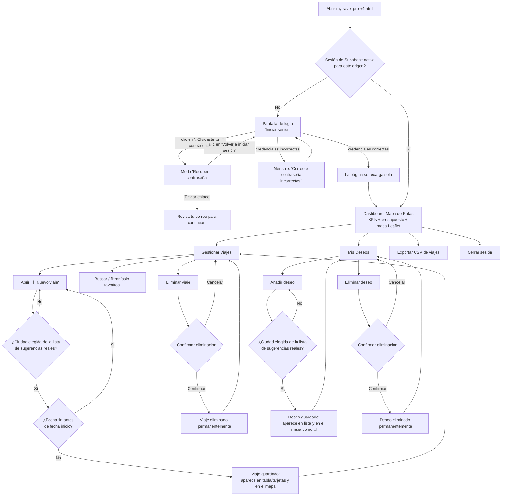

# MyTravel Agent Pro — Requerimientos

> Documento base generado a partir de la lectura completa del código fuente de
> `mytravel-pro-v4.html` (y de los archivos compartidos `auth-gate.js` y
> `supabase-client-app.js` que usa) y de una sesión de manejo real de la app
> en el navegador. En la sección "Casos borde" y en el documento
> `entrenamiento.md` se indica con precisión qué se pudo confirmar viendo la
> app funcionar y qué se documentó solo leyendo el código.

## Propósito del app

MyTravel Agent Pro es una libreta de viajes personal. Permite registrar los
viajes ya realizados (ciudad, país, fechas, presupuesto, notas y escalas),
verlos en un mapa mundial interactivo, llevar un control simple de cuánto se
ha gastado frente a un límite de presupuesto, y mantener una lista separada
de "deseos" (destinos que la persona quiere visitar en el futuro, pero que
todavía no ha viajado). Todo se guarda en la nube (Supabase) asociado a la
cuenta de quien inició sesión, con una copia de respaldo en el navegador y,
opcionalmente, en una carpeta del computador.

## Requerimientos funcionales

1. La app exige iniciar sesión con una cuenta de Supabase antes de mostrar
   cualquier dato; mientras no hay sesión, ninguna pantalla real del app se
   carga en memoria (comentario explícito en el código, línea ~1019 de
   `mytravel-pro-v4.html`: "Sin sesión confirmada: no cargar datos reales en
   memoria/DOM").
2. Tras iniciar sesión correctamente, la página se recarga y muestra tres
   secciones accesibles desde la barra lateral (escritorio) o la barra
   inferior (móvil): **Mapa de Rutas** (panel principal/dashboard),
   **Gestionar Viajes** y **Mis Deseos**.
3. El panel **Mapa de Rutas** muestra un mapa mundial (Leaflet + teselas de
   OpenStreetMap) con un marcador 🚩 por cada viaje registrado (🚩❤️ si está
   marcado como favorito) y un marcador 🎯 por cada deseo. Al hacer clic en
   un marcador se abre una ventana emergente con ciudad, país, presupuesto,
   duración (si hay fechas) y notas (si las hay).
4. El panel principal también muestra una tarjeta de "Presupuesto
   ejecutado": suma el presupuesto de todos los viajes registrados frente a
   un límite fijo de **$10,000 USD** (no configurable desde la interfaz),
   con una barra de progreso que cambia de color: verde por debajo de 50%,
   ámbar entre 50% y 80%, rojo en 80% o más.
5. La barra lateral muestra 4 indicadores (KPIs) calculados en vivo: países
   visitados (países distintos entre los viajes), viajes marcados como
   favoritos, presupuesto total y días de viaje acumulados (suma de
   duración de cada viaje con fechas válidas).
6. Para registrar un viaje nuevo, el usuario abre el formulario "＋ Nuevo
   viaje" (modal) y debe escribir al menos 3 caracteres en el campo
   "Ciudad de destino" para que aparezcan sugerencias reales (vía la API
   pública de búsqueda de Nominatim/OpenStreetMap); el campo "País" se
   completa solo, en modo de solo lectura, al elegir una sugerencia de la
   lista.
7. El formulario de viaje solo se guarda si la ciudad fue seleccionada de
   la lista de sugerencias (es decir, si el campo tiene coordenadas de
   latitud/longitud asociadas); si el usuario escribe una ciudad pero no
   hace clic en ninguna sugerencia, al guardar aparece el error "Selecciona
   una ciudad de la lista." y no se guarda nada.
8. Si la fecha de fin es anterior a la fecha de inicio, la app bloquea el
   guardado con el mensaje "La fecha fin no puede ser antes del inicio."
   Si de fecha inicio y fin se completan correctamente, se calcula y
   muestra automáticamente la duración en días dentro del propio
   formulario, antes incluso de guardar.
9. Los campos "Presupuesto (USD)", "Notas" y "Escalas intermedias" son
   opcionales. Las escalas se agregan como filas de texto libre
   (sin autocompletado ni validación) mediante el botón "＋ Añadir escala",
   y cada una se puede quitar individualmente con su botón "✕" sin pedir
   confirmación.
10. Si ya existe un viaje registrado en el mismo país (comparación sin
    distinguir mayúsculas/minúsculas), la app muestra un aviso de
    advertencia ("Ya tienes un viaje registrado en {país}.") pero **no
    impide guardar** el nuevo viaje; es solo informativo.
11. Cada viaje se puede marcar como "favorito ❤️" con una casilla en el
    formulario; esto afecta el ícono en el mapa y el filtro de la sección
    "Gestionar Viajes".
12. La sección **Gestionar Viajes** muestra todos los viajes en una tabla
    (escritorio) o en tarjetas (móvil), con búsqueda por texto (ciudad o
    país) y un filtro "Solo favoritos ❤️". Ambos filtros se combinan entre
    sí y actualizan la tabla/tarjetas en tiempo real mientras se escribe.
13. Cada viaje se puede eliminar individualmente desde su fila/tarjeta,
    pidiendo confirmación mediante un cuadro de diálogo propio de la app
    (no el de "confirm" nativo del navegador). Una vez confirmado, el
    borrado es inmediato y permanente — no hay función de deshacer.
14. La sección **Mis Deseos** permite añadir un destino futuro con el mismo
    mecanismo de autocompletado de ciudad/país que el formulario de viajes
    (también exige seleccionar una sugerencia real de la lista). Los
    deseos se listan debajo del formulario y cada uno se puede eliminar
    individualmente con confirmación.
15. El botón "📥 Exportar CSV" descarga un archivo CSV con **todos** los
    viajes registrados (columnas: Ciudad, País, Fecha Inicio, Fecha Fin,
    Días, Presupuesto, Favorito, Escalas, Notas). Si no hay ningún viaje
    registrado, muestra la advertencia "No hay viajes que exportar." y no
    descarga nada. La exportación **no** incluye los "deseos" y **no**
    respeta ningún filtro/búsqueda activo en la tabla de viajes: siempre
    exporta el listado completo.
16. El botón "↩ Cerrar sesión" (presente tanto en la barra lateral/superior
    de la app como en el widget de cuenta "👤 Cuenta" que agrega
    `auth-gate.js` en la esquina superior derecha) cierra la sesión de
    Supabase y recarga la página, mostrando de nuevo la pantalla de login.
17. Los datos se guardan en tres niveles: (a) `localStorage` del navegador
    bajo la clave `mytravel_v4`, (b) la tabla `app_data` de Supabase
    (una fila por usuario y por `app_id='mytravel'`), y (c), de forma
    opcional, un archivo `mytravel-pro.data.json` dentro de una carpeta del
    computador que el usuario conecte mediante el botón "📁 Conectar
    carpeta de datos" (esquina inferior derecha). Cada cambio se sincroniza
    automáticamente hacia la nube y, si está conectada, hacia el archivo
    local.
18. Al cargar la app con sesión activa, si hay datos en la nube para ese
    usuario, esos datos reemplazan lo que hubiera en `localStorage`. Si la
    nube no responde (error de red) o no tiene ninguna fila para ese
    usuario todavía, la app usa lo que haya en `localStorage` de ese
    navegador como resguardo.
19. La pantalla de inicio de sesión (`auth-gate.js`, compartida con las
    demás apps del hub) tiene una decoración visual propia para MyTravel:
    fondo azul marino oscuro, un horizonte de ciudad estilizado con
    ventanas iluminadas, nubes en movimiento y varios aviones que cruzan la
    pantalla en distintas trayectorias (`window.AIAPPS_LOGIN_SCENE =
    'travel-sky'`, definido en la línea 188 del HTML). El formulario en sí
    (campos Correo/Contraseña, botón "Entrar", enlace "¿Olvidaste tu
    contraseña?") es idéntico en estructura y comportamiento al que usan
    StaffGate y el Generador de Gantt, incluyendo el modo "Recuperar
    contraseña" y la pantalla de "Elige una contraseña nueva".

## Flujo de trabajo

**Estado de verificación de cada parte de este diagrama:** el nodo **F**
(Dashboard, con la app ya autenticada) se confirmó de forma real en esta
sesión — no viendo la pantalla como imagen (ver aviso de captura de pantalla
más abajo y en `entrenamiento.md`), sino leyendo directamente el árbol de
accesibilidad y el texto de la página ya cargada en el navegador, en un
estado con sesión activa. Todos los demás nodos (login, recuperar
contraseña, formularios de viaje/deseo, filtros, eliminación) se documentan
a partir de la lectura del código fuente — se intentó repetidamente
interactuar con ellos en vivo durante esta sesión (ver detalle en
`entrenamiento.md`) sin éxito, por una falla de la herramienta de navegador
de este entorno, no por un comportamiento confirmado distinto de la app.

## Casos borde

Cada uno de estos casos fue identificado leyendo el código fuente de
`mytravel-pro-v4.html`. Se documentan aquí para que el tech lead decida si
requieren un cambio; esta persona (BA) no los resuelve.

1. **El formulario de "Nuevo viaje" no usa una etiqueta `<form>` con
   `type="submit"`** — el botón "Guardar itinerario" llama directamente a
   `guardarViaje()` por `onclick`. Esto significa que atributos HTML5 como
   `min="0"` en el campo de presupuesto o `required` nunca se validan por
   el navegador. En la práctica, el único filtro real es el que hace el
   propio JavaScript (`parseFloat(...)||0`), que **no descarta valores
   negativos**: es posible escribir un presupuesto negativo (por ejemplo
   "-500") y guardarlo, lo cual dañaría el cálculo del "Presupuesto
   ejecutado" y el semáforo de porcentaje. *Decisión pendiente: ¿se debe
   validar explícitamente que el presupuesto no sea negativo?*
2. **No existe ninguna forma de editar un viaje o un deseo ya guardado.**
   Solo hay funciones para crear (`guardarViaje`, `guardarDeseo`) y borrar
   (`borrarViaje`, `borrarDeseo`); no hay ningún botón ni función "Editar".
   Si el usuario se equivoca en una fecha, el presupuesto, una nota o una
   escala después de guardar, su única opción es eliminar el viaje completo
   y volver a crearlo desde cero, perdiendo el registro original. *Decisión
   pendiente: ¿se necesita una función de edición, o este comportamiento es
   aceptado tal cual?*
3. **El botón "Exportar CSV" siempre exporta todos los viajes**, sin
   importar si hay una búsqueda o el filtro "Solo favoritos" activos en la
   sección "Gestionar Viajes", y **nunca incluye los "deseos"** (no hay
   ninguna forma de exportar la lista de deseos). Esto es distinto al
   patrón que se documentó en StaffGate, donde el CSV sí respeta los
   filtros activos — podría sorprender a alguien que espere el mismo
   comportamiento entre apps del hub. *Decisión pendiente: ¿debe el CSV
   respetar los filtros, o es intencional que siempre sea el listado
   completo?*
4. **Toda la búsqueda de ciudades (autocompletado) depende de una llamada
   en vivo a la API pública y gratuita de Nominatim/OpenStreetMap**, sin
   caché local ni lista de respaldo. Si no hay conexión a internet, esa
   API está caída, o aplica un límite de uso (rate limit) en ese momento,
   el cuadro de sugerencias simplemente no aparece — no hay ningún mensaje
   de error visible para el usuario (el código solo hace
   `console.error(e)`), y sin una sugerencia seleccionada de esa lista, es
   **imposible guardar un viaje o un deseo nuevo** (ver requerimiento 7).
   Un usuario no técnico se quedaría sin poder entender por qué el botón
   "Guardar" no funciona en ese momento. *Decisión pendiente: ¿agregar un
   mensaje visible ("no se pudo buscar la ciudad, intenta de nuevo") para
   este caso?*
5. **El aviso de "ya tienes un viaje registrado en ese país" es solo
   informativo, no bloquea nada** (ver requerimiento 10) y compara el
   nombre del país tal como lo devuelve Nominatim. Como Nominatim no
   siempre devuelve el mismo texto exacto para el mismo país en búsquedas
   distintas (por ejemplo variaciones de idioma o formato), este aviso
   podría no dispararse en algunos duplicados reales, o dispararse por
   error si el texto no coincide exactamente. *Decisión pendiente: ¿vale la
   pena esta advertencia tal como está, o conviene revisar/quitar?*
6. **Las "escalas intermedias" son texto libre sin geocodificación ni
   validación alguna** — no se buscan en Nominatim, no aparecen en el mapa
   como marcadores ni como una ruta, y no hay límite de caracteres ni
   verificación de que sea un nombre de ciudad real. Un usuario podría
   escribir cualquier texto ahí sin que la app lo detecte. Esto contrasta
   con el campo de ciudad principal, que sí exige una selección validada.
   *Decisión pendiente: ¿es intencional que las escalas no tengan la misma
   validación, o falta ese comportamiento?*
7. **El límite de presupuesto de $10,000 USD está fijo en el código**
   (`pct=Math.min((total/10000)*100,100)`) y no hay ningún campo en la
   interfaz para cambiarlo, ni selección de moneda distinta a USD. Si la
   persona que usa la app necesita un límite distinto o gasta en otra
   moneda, no hay forma de ajustarlo sin modificar el código. *Decisión
   pendiente: ¿conviene hacer el límite y la moneda configurables?*
8. **Riesgo de mezcla de datos entre cuentas distintas en el mismo
   navegador/computador.** Si dos personas distintas usan la misma
   computadora y el mismo navegador (sin cerrar sesión entre una y otra),
   y la segunda persona inicia sesión con una cuenta que **todavía no
   tiene ninguna fila guardada en la nube** (usuario nuevo), `loadDB()`
   cae en `loadFromLocalStorage()`, que carga lo último que haya en la
   clave `mytravel_v4` de ese navegador — que bien podría ser los datos de
   la primera persona. Si la segunda persona guarda cualquier cambio
   después de eso, esos datos "heredados" se sincronizarían hacia la nube
   de su propia cuenta. El código sí protege el caso de "sin sesión en
   absoluto" (comentario explícito en la línea ~1019), pero no cubre este
   caso de "sesión nueva sin fila previa en la nube todavía". *Decisión
   pendiente: esta es la misma familia de riesgo que ya se documentó para
   la carpeta local de StaffGate — el tech lead debería decidir si conviene
   limpiar `localStorage` al detectar un `user_id` distinto al de la última
   sesión conocida.*
9. **El archivo de respaldo en la carpeta local (`mytravel-pro.data.json`)
   tiene el mismo riesgo que ya se documentó para StaffGate**: no
   distingue entre cuentas de usuario, así que si dos personas comparten la
   misma carpeta conectada, sus datos podrían mezclarse o sobrescribirse.
10. Durante esta sesión de documentación, al abrir el archivo local
    `mytravel-pro-v4.html` directamente en el navegador (protocolo
    `file://`), la superposición de inicio de sesión de `auth-gate.js`
    **no llegó a aparecer en absoluto** — ni en el texto de la página ni en
    el árbol de accesibilidad; en su lugar se veía directamente el
    contenido interno de la app (vacío, sin datos). Esto coincide con el
    comportamiento ya reportado para `generador_gantt_2.html` en una
    sesión anterior ("se muestra como una vista estática"), por lo que se
    interpreta como una limitación de la herramienta de navegador de este
    entorno al abrir archivos locales, **no como un candado de acceso roto
    de la app real** — pero no se pudo confirmar con certeza al 100% en
    esta sesión, ya que tampoco fue posible cargar la versión publicada sin
    sesión previa para comparar (ver detalle completo en
    `entrenamiento.md`). *Decisión pendiente: si alguien logra repetir esta
    prueba con una herramienta de navegador distinta y confirma que el
    candado sí bloquea correctamente sobre `file://`, este caso puede
    cerrarse sin cambios; si en cambio se confirma que el candado no
    aparece en algún escenario real (no solo de herramienta de prueba),
    sería un hallazgo de seguridad urgente.*
