# Nutri Log — guía de uso para la persona usuaria

Esta guía explica, en lenguaje simple, cómo usar Nutri Log — la app del hub para llevar el registro diario de un producto alimenticio o suplemento (por ejemplo, "Urth Superfood Brew"). No necesitas ningún conocimiento técnico para seguirla.

Todas las capturas de esta guía son pantallas reales de la app, tomadas navegándola de principio a fin (no son dibujos ni simulaciones). Están guardadas en `docs/nutrilog/capturas/`.

> **Aviso que verás varias veces dentro de la app:** los efectos y comparaciones que muestra Nutri Log (energía, enfoque, ánimo, etc.) son referenciales y se basan en información de la marca del producto, autopercibidos por ti — **no son un consejo médico ni una medición clínica.**

---

## 1. La primera vez que abres la app: configuración inicial (onboarding)

La primera vez que entras a Nutri Log, antes de ver la pantalla principal, la app te guía con 3 pasos cortos. En cualquiera de los 3 puedes tocar **"Omitir"** (arriba a la derecha) para saltarte el resto y empezar a usar la app con las opciones que trae por defecto.

### Paso 1 de 3 — Elegir tu producto

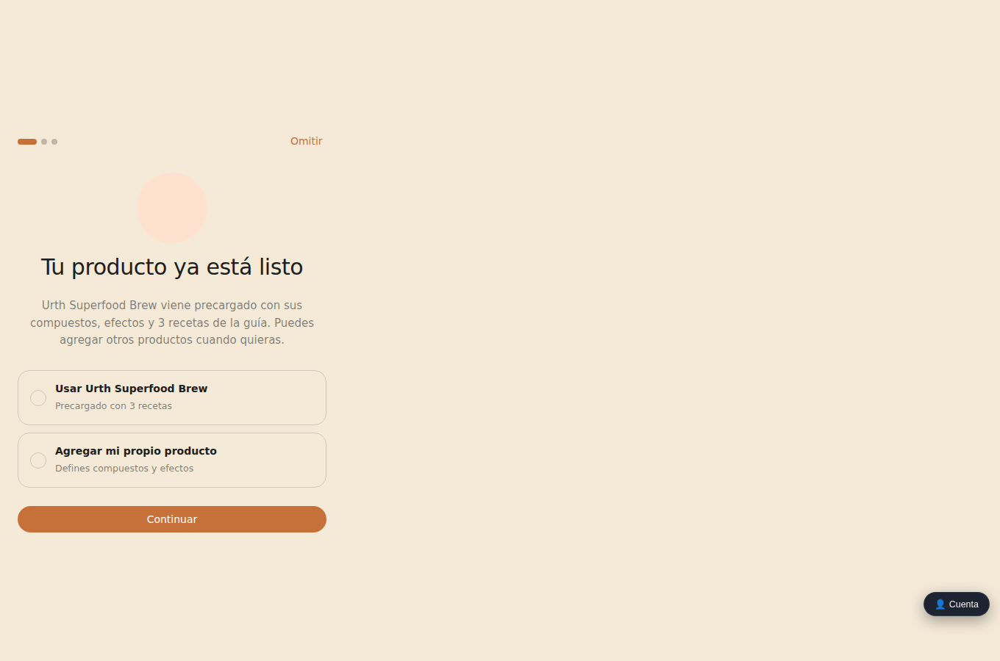

Aquí eliges entre:
- **"Usar Urth Superfood Brew"** — el producto que ya viene cargado en la app, con 3 recetas listas para usar. Es la opción más simple para empezar de inmediato.
- **"Agregar mi propio producto"** — si tú tomas otro producto y quieres registrar el tuyo en vez del de ejemplo. Si eliges esta opción, al terminar los 3 pasos la app te va a llevar directo a la pantalla para escribir el nombre y la marca de tu producto.

Toca **"Continuar"** para pasar al siguiente paso.

### Paso 2 de 3 — Qué quieres medir

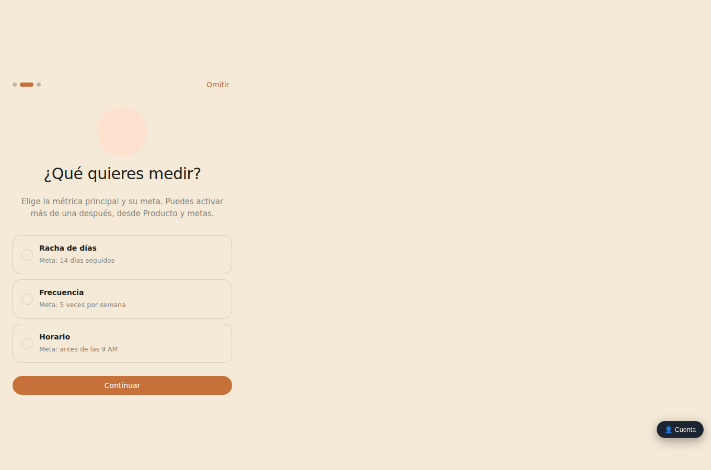

Elige la métrica principal que quieres que la app siga de cerca:
- **Racha de días** — cuántos días seguidos registras tu consumo (meta sugerida: 14 días seguidos).
- **Frecuencia** — cuántas veces por semana lo tomas (meta sugerida: 5 veces por semana).
- **Horario** — si lo tomas antes de una hora límite (meta sugerida: antes de las 9 AM).

Puedes activar las otras dos métricas más adelante, desde "Producto y metas" — aquí solo eliges cuál va a ser la principal para empezar. Toca **"Continuar"**.

### Paso 3 de 3 — Recordatorio

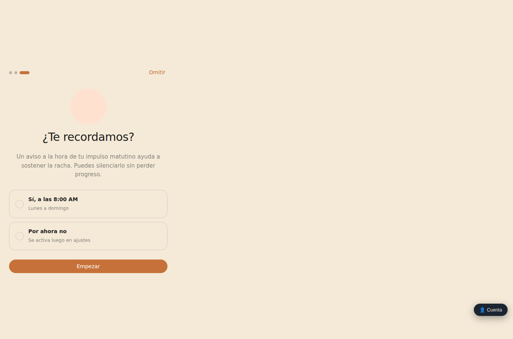

Elige si quieres un aviso todos los días a las 8:00 AM para recordarte registrar tu consumo, o "Por ahora no" (puedes activarlo después desde Ajustes).

**Importante:** en esta versión de la app, esta opción solo guarda tu preferencia — todavía no envía avisos reales a tu teléfono o computadora. La propia pantalla de "Producto y metas" lo aclara.

Toca **"Empezar"** para terminar la configuración y entrar a la app.

---

## 2. Pantalla de Inicio: tu resumen del día

Es la pantalla principal, la que ves cada vez que abres la app.

### Antes de registrar tu consumo de hoy

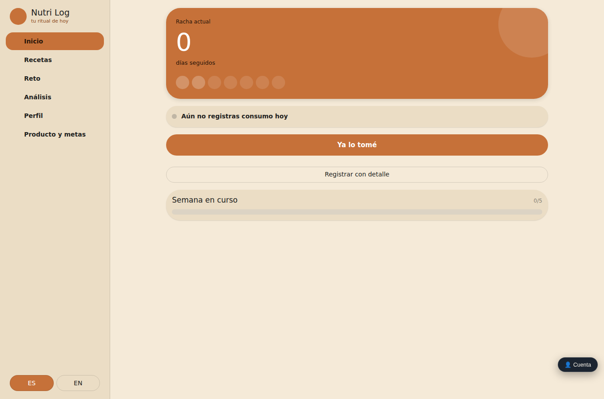

Aquí ves:
- Tu **racha actual** (cuántos días seguidos llevas), en un número grande.
- 7 puntos que representan los días de la semana en curso.
- Un mensaje que te dice si ya registraste tu consumo hoy o no.
- El botón naranja **"Ya lo tomé"** — regístralo con un solo toque, usando la misma receta y tipo de consumo (caliente/frío/licuado) que usaste la última vez.
- El botón **"Registrar con detalle"**, para elegir hora, receta y agregar una nota.
- Una barra que muestra tu progreso de la semana contra tu meta de frecuencia.

### Después de registrar tu consumo de hoy

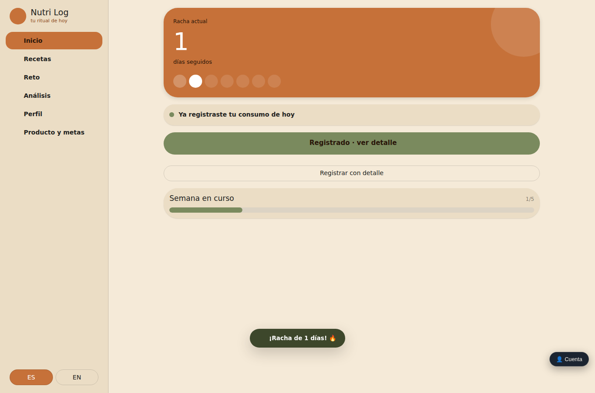

Una vez registras, el aviso cambia a "Ya registraste tu consumo de hoy", uno de los 7 puntos de la semana se marca como cumplido, tu racha sube, y el botón grande cambia a **"Registrado · ver detalle"** — si lo tocas de nuevo, te lleva a la pantalla de Análisis en vez de crear un segundo registro (no corres el riesgo de registrar dos veces por error).

En la parte de abajo de la pantalla aparece también un mensaje flotante confirmando tu racha (por ejemplo "¡Racha de 1 días! 🔥").

---

## 3. Registrar consumo con detalle

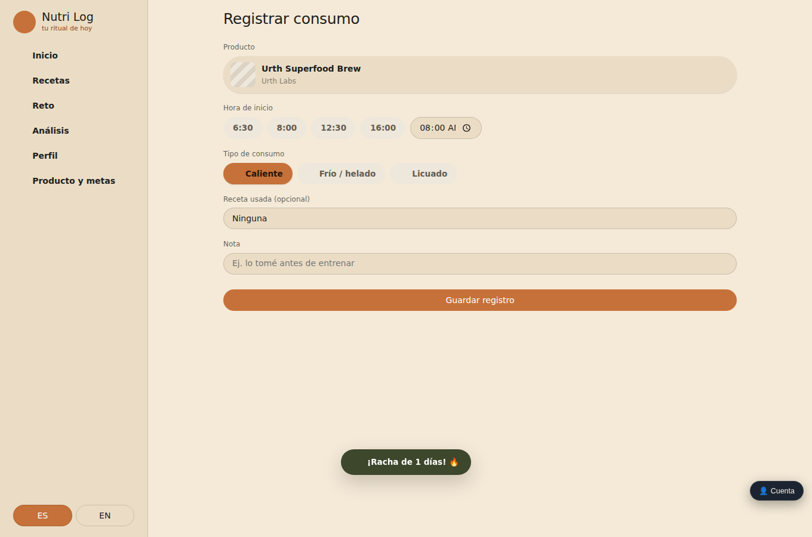

Si tocas **"Registrar con detalle"** desde Inicio, llegas a este formulario, donde puedes elegir:
- **Hora de inicio** — chips con horas comunes (6:30, 8:00, 12:30, 16:00) o escribir una hora personalizada.
- **Tipo de consumo** — Caliente, Frío/helado o Licuado.
- **Receta usada (opcional)** — puedes buscar y elegir una receta de la lista, o dejarla en "Ninguna".
- **Nota** — un espacio de texto libre, por ejemplo "lo tomé antes de entrenar".

> **Ten en cuenta:** lo que escribas en el campo "Nota" se guarda, pero la app no lo vuelve a mostrar en ninguna otra pantalla — ni en tu historial, ni en ningún detalle. Es un dato que queda archivado pero no visible después de guardarlo.

Al tocar **"Guardar registro"**, vuelves a Inicio con la confirmación.

---

## 4. Recetas

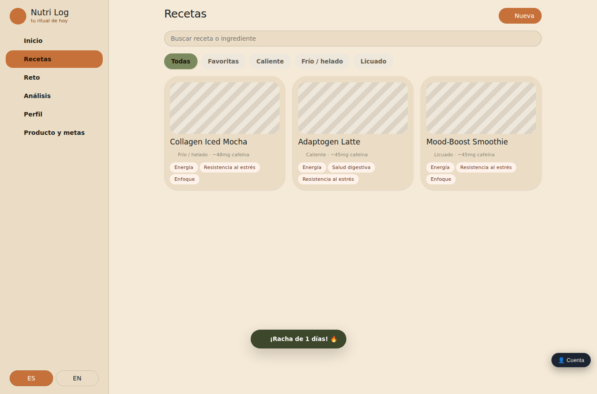

Aquí ves todas las recetas disponibles para tu producto activo (por defecto: Collagen Iced Mocha, Adaptogen Latte, Mood-Boost Smoothie). Puedes:
- Buscar una receta por nombre o por un ingrediente, con el buscador de arriba.
- Filtrar por Todas / Favoritas / Caliente / Frío-helado / Licuado.
- Ver, en cada tarjeta, la cafeína estimada, el tipo, y hasta 3 efectos principales.
- Tocar **"Nueva"** (arriba a la derecha) para crear tu propia receta, escribiendo nombre, tipo, ingredientes y pasos.

Al tocar cualquier tarjeta, entras al detalle de esa receta.

---

## 5. Detalle de receta

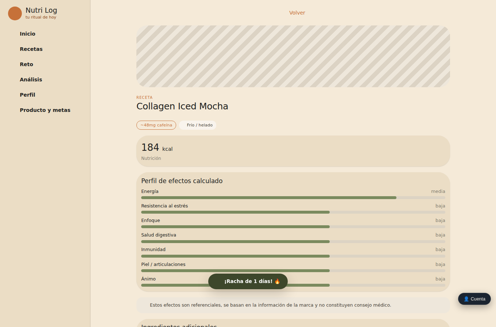

Muestra:
- Las calorías totales de esa receta preparada (con acceso directo a la pantalla de Nutrición para ver el desglose completo).
- Un **perfil de efectos calculado**, con una barra por categoría (Energía, Resistencia al estrés, Enfoque, Salud digestiva, Inmunidad, Piel/articulaciones, Ánimo) y su nivel (bajo/medio/alto).
- El aviso de que estos efectos son referenciales, no consejo médico.
- Más abajo (no visible en esta captura): los ingredientes adicionales, los pasos de preparación, una calificación de 1 a 5 estrellas que puedes editar, y el botón "Registrar consumo con esta receta" para ir directo al formulario de registro con esa receta ya elegida.

Si la receta es una que tú creaste, vas a ver además botones para editarla o eliminarla — las 3 recetas que trae la app de fábrica no tienen esos botones.

---

## 6. Nutrición

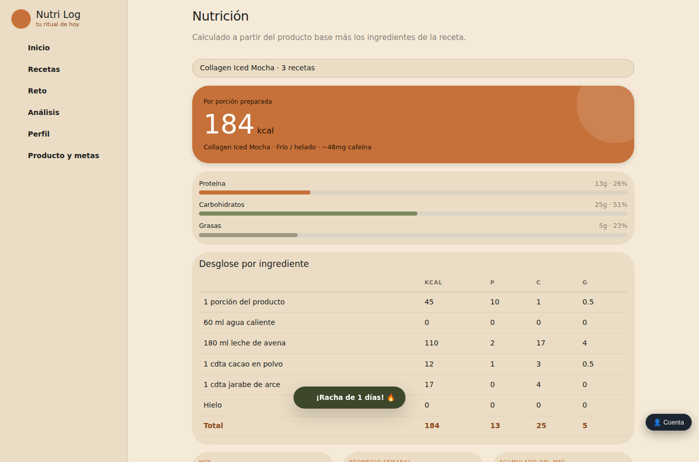

Aquí ves el detalle nutricional de una receta a tu elección (usa el buscador de arriba para cambiar de receta):
- Las **calorías por porción preparada**, en grande.
- Proteína, carbohidratos y grasas, con su porcentaje.
- Un **desglose por ingrediente** — por ejemplo, cuántas calorías aporta cada elemento (el producto en sí, la leche, el cacao, etc.), con una fila de total al final.
- Más abajo (no visible en esta captura): tus acumulados de "Hoy", "Promedio semanal" y "Acumulado del mes", que se recalculan automáticamente cada vez que registras un nuevo consumo.

---

## 7. Análisis: tu historial y tus estadísticas

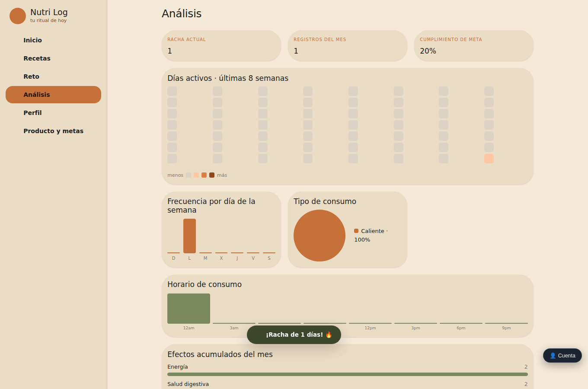

Esta es la pantalla más completa de la app. Si todavía no tienes ningún registro, en vez de esto vas a ver un mensaje de "aún no hay datos". Con registros ya guardados, verás:
- 3 indicadores arriba: **racha actual**, **registros del mes** y **cumplimiento de meta** (en %).
- Un **mapa de calor de los últimos 56 días** (8 semanas), donde el color va de más claro a más oscuro según cuántas veces registraste ese día.
- Un gráfico de **frecuencia por día de la semana**.
- Una **dona con el tipo de consumo** (Caliente/Frío/Licuado) más usado.
- Un gráfico de **horario de consumo**, agrupado en bloques de 3 horas.
- **Efectos acumulados del mes** (no visible completo en esta captura, sigue más abajo en la pantalla).
- Más abajo, una **tabla con tu historial completo** (fecha, hora, tipo, receta) donde puedes eliminar cualquier registro (con una confirmación antes de borrarlo).
- Un botón **"Exportar CSV"** que descarga un archivo con todo tu historial, por si quieres abrirlo en Excel u otro programa.

---

## 8. Reto de 14 días

### Antes de iniciar el reto

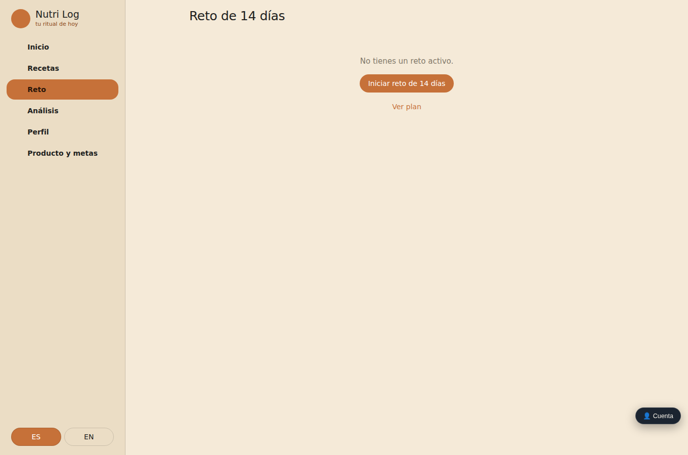

Si todavía no tienes un reto activo para tu producto, ves este mensaje simple con el botón **"Iniciar reto de 14 días"** y un enlace **"Ver plan"** para revisar de antemano qué trae cada día (ver sección 9, Plantilla del reto).

### Durante el reto (Día 1)

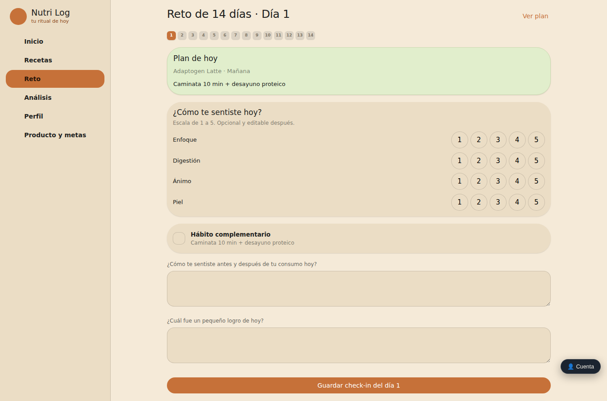

Al iniciar el reto, empiezas en el Día 1. Cada día tiene:
- Una tarjeta con el **"Plan de hoy"**: qué receta usar, en qué momento del día, y un hábito complementario sugerido (por ejemplo, "Caminata 10 min + desayuno proteico").
- Un **check-in de "¿Cómo te sentiste hoy?"**, con 4 categorías (Enfoque, Digestión, Ánimo, Piel) que calificas del 1 al 5 tocando el número correspondiente (si tocas el mismo número otra vez, se desmarca).
- Una casilla para marcar si cumpliste el hábito complementario.
- Dos preguntas de reflexión en texto libre.
- El botón **"Guardar check-in del día [N]"** al final.

Arriba puedes ver los números del 1 al 14 para saltar entre días. En el último día (14), guardar el check-in además marca el reto como completado y te muestra un resumen comparando cómo te sentiste el día 1 contra el mejor día registrado.

> **Nota de esta guía:** no se llegó a completar en vivo el ciclo completo de los 14 días de check-in para capturar en pantalla ese resumen final — su funcionamiento se confirmó revisando el código y guardando realmente el check-in del día 1, pero la pantalla del resumen final no tiene una captura propia en este documento.

---

## 9. Plantilla del reto: el plan completo de los 14 días

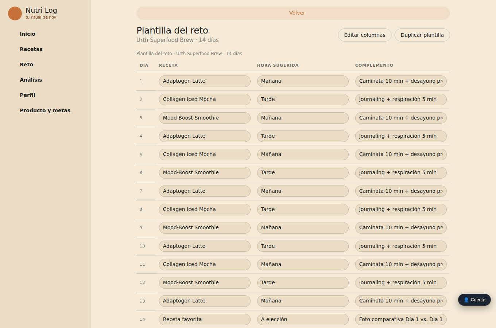

Se abre desde "Ver plan" (dentro de la pantalla de Reto). Es una tabla con una fila por cada uno de los 14 días, y 3 columnas: Receta, Hora sugerida y Complemento.

- Puedes editar el texto de cualquier celda de la tabla en cualquier momento, tocándola y escribiendo.
- El botón **"Editar columnas"** (arriba a la derecha) solo te deja cambiar el *nombre* de las columnas (por ejemplo, renombrar "Complemento" a otra cosa) — no afecta si puedes o no editar las celdas de cada fila, que siempre son editables.
- El botón **"Duplicar plantilla"** crea una copia completa de este plan, por si quieres tener una versión alternativa.

El día 14 usa, por defecto, la receta que hayas marcado como favorita (o el texto "Receta favorita" si todavía no marcaste ninguna).

---

## 10. Perfil: tu racha, tus insignias y tus días libres

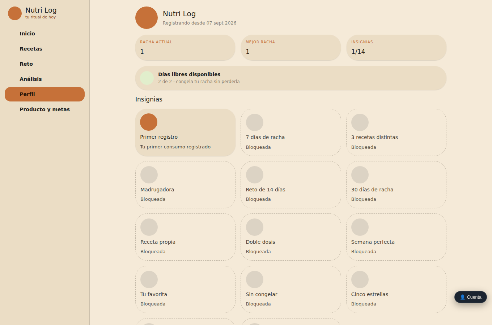

Aquí ves un resumen de tu progreso general:
- La fecha desde que empezaste a registrar.
- Tu **racha actual** y tu **mejor racha histórica**.
- El conteo de **insignias** desbloqueadas sobre el total (14).
- Tus **días libres disponibles** (hasta 2) — un "día libre" te permite no perder la racha aunque no registres consumo ese día en particular. El botón "Usar hoy" (no visible en esta captura porque no aparece hasta que ya registraste o hay uno disponible sin usar hoy) descuenta uno de tus días libres y cubre el día.
- Una **cuadrícula de insignias**, cada una con su nombre y su estado ("Bloqueada" en gris, o desbloqueada con su ícono a color). En esta captura, por ejemplo, "Primer registro" ya está desbloqueada (fue lo primero que se hizo al usar la app), y el resto siguen bloqueadas porque todavía no se cumplieron sus condiciones.

> **Aviso importante de esta guía:** dos de las insignias que ves aquí — **"Semana perfecta"** y **"Sin congelar"** — no tienen, en esta versión de la app, ninguna forma de desbloquearse, sin importar lo que hagas. Si estás tratando de conseguirlas, no es que te esté faltando algo: ese comportamiento ya quedó anotado como pendiente para el equipo técnico (ver `requerimientos.md`, Caso borde 16).

---

## 11. Producto y metas: configurar tu producto

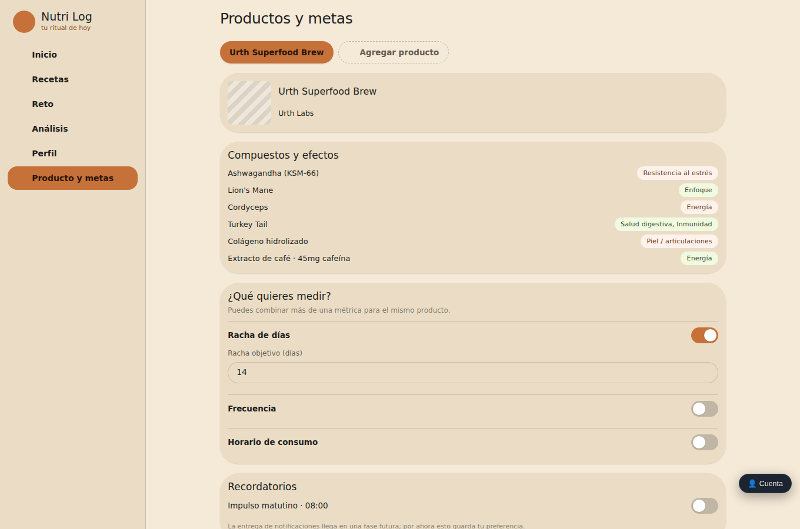

Aquí puedes:
- Ver y editar el **nombre y la marca** del producto, tocando directamente sobre el texto.
- Ver los **compuestos** del producto y los efectos asociados a cada uno (información de solo lectura).
- Activar o desactivar de forma independiente las 3 métricas — **Racha de días**, **Frecuencia**, **Horario de consumo** — con un interruptor; al activar una, aparece su campo de meta correspondiente (por ejemplo, "Racha objetivo (días)").
- Activar o desactivar el **recordatorio matutino** — con el mismo aviso de que todavía no envía notificaciones reales, solo guarda tu preferencia.
- Más abajo (no visible en esta captura): agregar un producto nuevo con el botón **"Agregar producto"**, y archivar un producto existente (solo disponible cuando tienes más de uno).

> **Aviso importante de esta guía:** si agregas un segundo producto, vas a ver una pestaña por cada uno arriba de esta pantalla (junto a "Urth Superfood Brew"). Tocar esas pestañas te deja **ver** los datos de ese producto aquí, pero **no cambia** cuál producto usa el resto de la app (Inicio, Recetas, Registro, Nutrición, Análisis, Reto) — ese comportamiento ya quedó anotado como pendiente para el equipo técnico (ver `requerimientos.md`, Caso borde 17). Si necesitas registrar consumo de un producto distinto al que está activo hoy, por ahora no hay una forma directa de cambiarlo desde la interfaz.

---

## Resumen de navegación

El menú lateral (o la barra inferior, en el celular) te permite moverte en cualquier momento entre: **Inicio, Recetas, Reto, Análisis, Perfil** y **Producto y metas** (este último, en el celular, solo se abre desde un ícono de engranaje en la barra superior, no desde la barra inferior). El idioma (ES/EN) se puede cambiar en cualquier momento desde los botones de abajo del menú lateral, o desde la barra superior en el celular.
