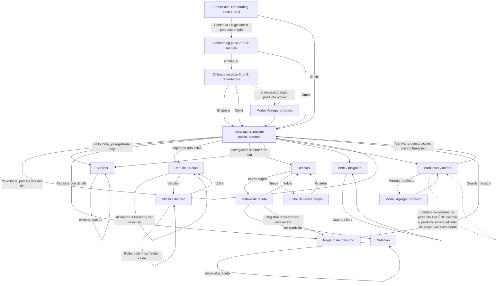

# Nutri Log — requerimientos

Este archivo se alimenta de la revisión de los 5 agentes (business-analyst, qa-lead, security-reviewer, accessibility-reviewer, release-manager), no solo de business-analyst. Primer archivo de esta app (no existía `docs/nutrilog/` antes del 2026-09-08) — creado por `accessibility-reviewer` durante la primera revisión de accesibilidad de `claude/nutri-log-app`, solo con la sección de Casos borde, y ampliado el mismo día por `qa-lead` (entradas 9-12) durante su propia revisión de la rama completa (ver `docs/nutrilog/qa-checklist.md` para el detalle de ejecución real detrás de esas entradas). **Propósito y requerimientos funcionales agregados el 2026-09-08 por `business-analyst`**, a partir del comportamiento real de `nutri-log.html` (commit `4982f8d`, rama `claude/nutri-log-app`) — verificado con Playwright real (mismo método que `accessibility-reviewer`/`qa-lead`: `build.sh` + `http-server`, `window.supabase` mockeado vía `addInitScript` para pasar el candado de `auth-gate.js`) y con lectura directa del código. El PRD original (RF-01 a RF-43) no estaba disponible para este agente en el momento de escribir esto, así que la numeración de requerimientos de abajo es propia de este documento, no una transcripción del PRD — cada ítem está redactado para ser verificable contra el comportamiento real, no copiado de una fuente que no se pudo leer.

## Propósito del app

Nutri Log es la app del hub para llevar un registro diario de consumo de un producto alimenticio/suplemento (por defecto, "Urth Superfood Brew", con 3 recetas de preparación de su guía de marca), con el objetivo de sostener el hábito en el tiempo: calcula una racha de días consecutivos, calorías/macros por porción, un perfil de efectos referencial según los compuestos del producto, y ofrece un reto guiado de 14 días con check-ins diarios de autopercepción. Incluye gamificación estilo Duolingo (racha, días libres para no perderla, 14 insignias) para motivar la constancia, y permite configurar metas personalizadas (racha, frecuencia semanal u horario) por producto. La app deja explícito en varias pantallas que los efectos y comparaciones que muestra son referenciales/autopercibidos, no consejo médico ni medición clínica.

## Requerimientos funcionales

Verificado con ejecución real salvo que se indique lo contrario.

**Onboarding**
1. Al primer uso (`state.onboardingDone === false`) se muestra un onboarding de 3 pasos con puntos de progreso y un botón "Omitir" siempre visible y funcional en cualquier paso.
2. Paso 1 ofrece elegir entre usar el producto precargado (Urth Superfood Brew) o "Agregar mi propio producto". Si se elige la segunda opción, al terminar el onboarding (por "Empezar" o por "Omitir") la app navega a Productos y metas y abre directamente el diálogo de "Agregar producto" — corrección aplicada el 2026-09-08 sobre el hallazgo original de `qa-lead` (Caso borde 9, antes era un no-op silencioso).
3. Paso 2 permite elegir la métrica principal a medir (racha de días / frecuencia semanal / horario) y aplica automáticamente su meta sugerida (14 días de racha, o 5 veces por semana); la métrica elegida queda como la única activa, las otras dos quedan desactivadas hasta que la persona las active a mano después.
4. Paso 3 permite elegir si se quiere un recordatorio matutino (a las 8:00 AM, todos los días) o no. Verificado por lectura de código: esto solo guarda una preferencia (`state.reminderPref`) — no hay entrega real de notificaciones implementada en esta versión, la propia pantalla de Productos y metas lo advierte explícitamente.
5. Al terminar el onboarding (con cualquiera de sus dos caminos) `state.onboardingDone` queda en `true` de forma persistente y el onboarding no se vuelve a mostrar en sesiones futuras.

**Inicio**
6. Muestra la racha actual en un número grande, con 7 puntos que representan la semana en curso (cumplido/pendiente/futuro, según haya o no registro ese día).
7. Muestra si ya se registró consumo hoy o no, con un indicador de color y texto correspondiente.
8. El botón rápido "Ya lo tomé" crea un registro para el momento actual, reutilizando la receta y el tipo de consumo del último registro guardado (o valores por defecto — receta "Adaptogen Latte", tipo "Caliente" — si todavía no hay ningún registro previo), y muestra un mensaje de confirmación con la racha actualizada.
9. Si ya se registró hoy, el mismo botón cambia de texto ("Registrado · ver detalle") y, al presionarlo de nuevo, navega a Análisis en vez de crear un segundo registro — confirmado que un doble clic rápido no duplica el registro del día.
10. El botón "Registrar con detalle" lleva al formulario completo de Registro de consumo.
11. Se muestra una barra de progreso semanal (registros de los últimos 7 días / meta de frecuencia configurada).
12. Si hay un reto de 14 días activo para el producto, se muestra una tarjeta con el día actual del reto; al hacer clic navega a la pantalla del Reto.
13. Si no hay ningún producto activo, se muestra el mensaje "Agrega un producto para empezar" en vez del resto de la pantalla. **No se pudo llevar la app a este estado por la interfaz real** (ver Caso borde nuevo sobre archivado del único producto restante) — este comportamiento se documenta por lectura de código, no por ejecución confirmada.

**Registro de consumo**
14. El formulario permite elegir hora (chips con horarios predefinidos, o un campo de hora personalizado), tipo de consumo (Caliente/Frío-helado/Licuado), una receta opcional (buscador desplegable con "Ninguna" más la lista de recetas del producto activo) y una nota de texto libre.
15. Al guardar, se crea un registro con la fecha de hoy y la hora elegida, se vuelve a la pantalla de Inicio y se muestra un mensaje de confirmación.
16. **El campo "Nota" se guarda pero nunca se vuelve a mostrar en ninguna pantalla de la app** (ni en el historial de Análisis, ni en ningún detalle) — comportamiento confirmado por lectura de código, ya reportado por `security-reviewer` como Caso borde 14 de este mismo archivo.

**Recetas**
17. Lista las recetas del producto activo, con un buscador que filtra por nombre de receta o por texto de sus ingredientes, y filtros por Todas/Favoritas/Caliente/Frío-helado/Licuado.
18. Cada tarjeta muestra la cafeína estimada, el tipo de consumo, hasta 3 etiquetas de efecto principal, la calificación en estrellas si ya se calificó, y un corazón de favorito que alterna su estado con un clic.
19. El botón "Nueva" abre un editor para crear una receta propia (nombre, tipo, ingredientes y pasos, uno por línea); estas recetas propias quedan marcadas como `origin:'user'`.

**Detalle de receta**
20. Muestra el perfil de efectos calculado (una barra por categoría, con nivel bajo/medio/alto según la cantidad de compuestos del producto + receta que aportan a esa categoría), la cafeína estimada, las calorías totales (con acceso directo a la pantalla de Nutrición), los ingredientes adicionales, los pasos de preparación, y una calificación editable de 1 a 5 estrellas (volver a hacer clic sobre la estrella ya marcada la quita).
21. Las recetas propias (creadas por la persona) muestran botones de Editar y Eliminar (con confirmación); las 3 recetas semilla de la marca no los muestran.
22. El botón "Registrar consumo con esta receta" lleva al formulario de Registro de consumo con esa receta ya preseleccionada.

**Nutrición**
23. Calcula calorías, proteína, carbohidratos y grasas por porción preparada, sumando la base del producto más los ingredientes propios de la receta elegida (verificado con valores reales: Collagen Iced Mocha → 184 kcal, Adaptogen Latte → 83 kcal, coincidiendo con lo esperado).
24. Permite elegir qué receta ver mediante un buscador desplegable.
25. Muestra un desglose de calorías/macros por ingrediente en una tabla, con fila de total.
26. Muestra acumulados de "Hoy", "Promedio semanal" y "Acumulado del mes" calculados a partir de los registros reales del producto activo (confirmado que se recalculan al crear un registro nuevo, no quedan como valores fijos).

**Análisis**
27. Si el producto activo no tiene ningún registro todavía, la pantalla completa muestra un estado vacío en vez de los indicadores/gráficos.
28. Con registros existentes, muestra 3 indicadores (racha actual, registros del mes, cumplimiento de meta en %), un mapa de calor de 56 días (últimas 8 semanas) con 4 niveles de intensidad según cantidad de registros por día, un gráfico de frecuencia por día de la semana, una dona de tipo de consumo, un gráfico de horario de consumo (en bloques de 3 horas) y los efectos acumulados del mes (hasta 6 categorías, sumando las categorías de cada receta registrada).
29. Muestra una tabla de historial completo (fecha, hora, tipo, receta) con indicador visual "editado" cuando aplica, y un botón para eliminar cada registro individualmente (con confirmación).
30. El botón "Exportar CSV" descarga un archivo real (`nutri-log-historial.csv`) con el historial completo del producto activo — confirmado con la descarga real disparándose en el navegador, no solo con la construcción del archivo en memoria.

**Reto de 14 días**
31. Si no hay un reto activo para el producto, se muestra un botón para iniciarlo y, si existe una plantilla para ese producto, un acceso a "Ver plan" (la Plantilla del reto).
32. Al iniciar el reto se crea con fecha de inicio hoy, duración de 14 días (tomada de la plantilla), sin check-ins todavía.
33. El día actual del reto se calcula a partir de la fecha de inicio, limitado entre 1 y la duración total (no puede pasarse ni quedar en 0).
34. El plan del día (receta sugerida, momento del día, hábito complementario) se toma de la plantilla; el día 14 usa la receta que la persona haya marcado como favorita (o un texto genérico "Receta favorita" si todavía no marcó ninguna).
35. El check-in del día permite calificar 4 categorías (Enfoque/Digestión/Ánimo/Piel) en una escala de 1 a 5 (volver a pulsar el mismo valor lo desmarca a 0), marcar un hábito complementario como cumplido, y escribir 2 reflexiones de texto libre.
36. Guardar el check-in lo persiste (confirmado con recarga real de página, no solo en memoria); en el último día del reto, además marca el reto como completado y muestra un mensaje distinto ("¡Insignia de reto completado desbloqueada!") en vez del mensaje normal de "Check-in guardado."
37. Al completar el reto se muestra un resumen que compara el check-in del día 1 con el del día con el número más alto guardado, categoría por categoría. **No se completó el flujo real de los 14 días de check-in para ver este resumen renderizado en pantalla** — se confirmó su lógica por lectura de código (`renderChallengeSummary`) y por el guardado real del check-in del día 1, siguiendo la misma limitación ya anotada por `qa-lead` en su checklist.

**Plantilla del reto**
38. Tabla editable de 14 filas por 3 columnas configurables (por defecto: Receta / Hora sugerida / Complemento); los nombres de columna solo son editables cuando se activa el botón "Editar columnas" ("Listo" para salir de ese modo).
39. Las celdas de cada fila son editables como texto libre en todo momento, sin importar si el modo "Editar columnas" está activo o no — el botón afecta únicamente a los encabezados de columna, no a las celdas de fila (confirmado por `qa-lead`, Caso borde 11 de este archivo, y no es un error sino el diseño descrito en el propio texto de ayuda visible en pantalla).
40. Las celdas con valor bilingüe (hora sugerida, complemento) conservan el texto del idioma que no se está editando; las celdas que originalmente referenciaban el id de una receta se reemplazan por texto libre en cuanto se editan a mano una vez, y de ahí en adelante se muestran tal cual sin volver a resolverse contra el catálogo de recetas.
41. El botón "Duplicar plantilla" crea una copia completa de la plantilla con un id nuevo y el nombre "(copia)" agregado.

**Perfil**
42. Muestra la fecha de inicio de registro, la racha actual, la mejor racha histórica y el conteo de insignias desbloqueadas sobre el total (14).
43. Muestra hasta 2 "días libres" (freeze) disponibles; el botón "Usar hoy" (visible solo si quedan días libres disponibles y todavía no se registró consumo hoy) descuenta uno y cubre ese día sin romper la racha.
44. 14 insignias con desbloqueo automático. Confirmado por lectura de código (`refreshBadges`) que 12 de las 14 tienen una regla de desbloqueo real implementada (primer registro; racha de 7 y de 30 días; 3 recetas distintas registradas; 10 consumos antes de las 9 AM; 10 consumos después de las 4 PM; receta propia creada; receta marcada como favorita; 5 recetas calificadas; segundo producto agregado; doble dosis en un mismo día; reto completado). **Las 2 insignias restantes ("Semana perfecta" y "Sin congelar") no tienen ninguna condición de desbloqueo en el código** — ver Caso borde nuevo abajo.

**Productos y metas**
45. Permite editar el nombre y la marca del producto que se esté viendo en esta pantalla, de forma inline.
46. Lista los compuestos del producto y sus efectos asociados (de solo lectura).
47. Ofrece 3 métricas activables de forma independiente entre sí (racha de días / frecuencia / horario de consumo); cada una revela su propio campo de meta al activarse (racha objetivo en días, veces por semana, u hora límite).
48. Ofrece un interruptor de recordatorio matutino, con una nota explícita en pantalla de que la entrega real de notificaciones todavía no está implementada, solo se guarda la preferencia.
49. Permite agregar un producto nuevo (modal con nombre y marca) y archivar un producto existente (solo si hay más de uno, con confirmación); si el producto archivado era el activo, la app reasigna automáticamente el primer producto no archivado como el nuevo activo.
50. Esta pantalla muestra una pestaña por cada producto no archivado y permite hacer clic para "ver" los datos de cualquiera de ellos aquí — **pero ese clic no cambia cuál es el producto activo para el resto de la app** (Inicio, Recetas, Registro, Nutrición, Análisis, Reto). Ver Caso borde nuevo abajo: no existe ningún control en la aplicación para cambiar el producto activo real una vez que hay más de uno.

**General**
51. Selector de idioma ES/EN persistente (sidebar en escritorio, barra superior en móvil) que traduce toda la interfaz de inmediato al cambiarlo.
52. Diseño responsive: sidebar + barra superior en escritorio; barra de pestañas inferior con 5 accesos (Inicio/Recetas/Reto/Análisis/Perfil) en pantallas de hasta 768px de ancho. El acceso a "Producto y metas" en móvil solo está disponible mediante un ícono de engranaje en la barra superior, no en la barra de pestañas inferior.
53. Persistencia: todo se guarda en `localStorage` siempre; además se sincroniza con la tabla `app_data` de Supabase (con un guardado con demora de 250ms tras cada cambio) cuando hay una sesión iniciada. **No verificado contra un proyecto real de Supabase en esta revisión** (mismo límite ya anotado por `qa-lead` en su checklist) — solo contra un mock de `window.supabase` en el navegador de prueba.
54. El texto de descargo de responsabilidad ("Estos efectos son referenciales... no constituyen consejo médico") se repite en las pantallas de Detalle de receta, Análisis y Reto de 14 días.

## Flujo de trabajo

Diagrama derivado de la navegación real recorrida con Playwright (capturas en `docs/nutrilog/capturas/`), no de una lectura aislada del código.

## Casos borde

1. **(accessibility-reviewer, 2026-09-08) `prefers-reduced-motion` no implementado en `nutri-log.html` — ¿alguna de las dos animaciones propias de esta app carga información que se perdería al desactivarla?** Confirmado en vivo (emulación real de la preferencia + `getAnimations()`) que ni `nl-pop` (número de racha al registrar consumo) ni `nl-toastin` (aparición del toast de confirmación) respetan la preferencia del sistema — corren igual con `prefers-reduced-motion: reduce` activo. Revisadas ambas específicamente por si cargaban información más allá del efecto visual: **no la cargan** — el valor final (número de racha, texto del toast) ya está en el DOM independientemente del movimiento, y ninguna de las dos termina en un estado con `opacity:0`/tamaño 0 como sí ocurre en varias escenas de `auth-gate.js` (según la nota histórica del equipo del 2026-07-25) — así que el fix es un `animation:none` simple, sin necesidad de fijar un estado intermedio a mano. **IMPLEMENTADO (tech lead, 2026-09-08):** se agregó un bloque `@media (prefers-reduced-motion: reduce)` que desactiva `nl-pop` y `nl-toastin` (`animation:none`), mismo patrón que el resto del hub. Regresión completa re-verificada en vivo tras el cambio (ver nota de verificación al final de este archivo).

2. **(accessibility-reviewer, 2026-09-08) El `aria-label` del corazón de favorito en la tarjeta de lista de Recetas (`nutri-log.html:1180`) nunca cambia — queda fijo en "Favorita" sin importar el estado real.** No es un descuido cosmético: es un mensaje incorrecto confirmado con clicks reales (favorito real pasó de `true` a `false` y el `aria-label` siguió diciendo "Favorita" en ambos casos). La versión de la pantalla de Detalle de receta (`nutri-log.html:1232`) sí actualiza correctamente su texto equivalente, pero usa el atributo `title` en vez de `aria-label` (funciona como nombre accesible en el motor de Chrome, confirmado, pero es un mecanismo distinto e inconsistente con el resto de los botones-ícono de la app, que usan `aria-label`). **IMPLEMENTADO (tech lead, 2026-09-08):** unificado a `aria-label` (con `aria-pressed`) dinámico en ambas instancias (tarjeta de lista y Detalle de receta), calculado desde el estado real de favorito en cada render, no fijo. Detalle original en `docs/nutrilog/accessibility-notes.md`, punto 5.

3. **(accessibility-reviewer, 2026-09-08) Ningún `<label>` de formulario en toda la app está asociado programáticamente a su control (`for`/`id` o anidamiento) — es un patrón repetido, no un campo aislado.** Confirmado en vivo (nombre accesible vacío) en los dos textareas del check-in del reto; confirmado por lectura de código en los ~15 campos restantes (Registro de consumo, Editor de receta, Producto nuevo y metas). Algunos campos sí tienen `id` en el `<input>`/`<textarea>` (editor de receta, producto nuevo) pero el `<label>` correspondiente sigue sin `for` apuntando a ese `id`, así que el `id` no cumple ninguna función de accesibilidad hoy. **IMPLEMENTADO (tech lead, 2026-09-08):** `for`/`id` agregado en Registro de consumo (hora, nota), Editor de receta (4 campos), los 3 tipos de campo de meta, Producto nuevo (2 campos) y los textareas del check-in del reto. Detalle original en `docs/nutrilog/accessibility-notes.md`, punto 9.

4. **(accessibility-reviewer, 2026-09-08) La tabla de la Plantilla del reto no tiene forma de que un lector de pantalla sepa en qué fila/columna está una celda editable.** Sin `<caption>`, sin `scope="col"` en los encabezados, sin `<th scope="row">` para el número de día, y sin `aria-label` en los 42 `<input>` de celda — su "nombre accesible" termina siendo el valor ya escrito (ej. "Adaptogen Latte"), no una referencia a qué celda es. **IMPLEMENTADO (tech lead, 2026-09-08):** `<caption>`, `scope="col"` en los 4 encabezados, `<th scope="row">` en el número de día, y `aria-label` (patrón `"Día N, Columna"`) en los 42 `<input>` de celda más el input de renombrar columna. Verificado en vivo con Playwright: caption presente, 4 `th[scope=col]`, 14 `th[scope=row]`, 42 inputs con `aria-label`, edición de celda sigue funcionando. Detalle original en `docs/nutrilog/accessibility-notes.md`, punto 10.

5. **(accessibility-reviewer, 2026-09-08) `.nl-scale-btn` (escalas 1-5 del check-in) y `.nl-star`/`.nl-check` no comunican su estado ni su propósito más allá del color.** Las escalas exponen solo el número ("1".."5") sin categoría ni "de 5"; las estrellas y el botón de hábito exponen **nombre accesible vacío** (ni siquiera un número). Ninguno de los tres usa `aria-pressed` ni equivalente. **IMPLEMENTADO (tech lead, 2026-09-08):** `aria-label` + `aria-pressed` agregados a las estrellas, al botón de hábito (`.nl-check`, con `for`/`id` en su textarea asociado) y a las escalas 1-5 del check-in (categoría + valor + "de 5" en el label). Detalle original en `docs/nutrilog/accessibility-notes.md`, puntos 2-4.

6. **(accessibility-reviewer, 2026-09-08) El anillo de foco de los switches (`.nl-switch input:focus-visible + .track`) tiene contraste insuficiente contra el fondo de tarjeta donde vive.** Medido en vivo con colores reales: `2.69:1` (color de acento `#c67139` sobre `--color-surface` `#ebddc5`), por debajo del 3:1 mínimo para indicadores de foco (WCAG 1.4.11/2.4.11). Es visible, no es un caso de "invisible", solo de contraste bajo. **IMPLEMENTADO (tech lead, 2026-09-08), más allá de lo que pedía el hallazgo:** en vez de parchear solo el switch, se corrigió la regla global `:focus-visible` (`--color-accent` → `--color-accent-700`, verificado en Python: 5.72:1 contra `--color-surface`, 5.09:1 contra `--color-bg`, ambos ≥3:1), porque el mismo problema es sistémico a cualquier control dentro de `.card`. Detalle original en `docs/nutrilog/accessibility-notes.md`, punto 1.

7. **(accessibility-reviewer, 2026-09-08) El color de acento base del sistema de diseño (`--color-accent` `#c67139`) usado como fondo con texto blanco a tamaño normal falla AA de forma sistemática, no en un solo componente.** Confirmado con 5 pares de colores distintos (etiqueta de racha, indicador de día pendiente, pill activa, item de navegación activo, botón rápido "hecho") todos entre 2.57:1 y 3.73:1, todos por debajo de 4.5:1. Solo el número grande de racha (56px) se salva por caer en el umbral de texto grande (3:1). **IMPLEMENTADO (tech lead, 2026-09-08):** se introdujo el token `--color-ink-on-accent:#281408` (verificado en Python: 4.88:1 contra `--color-accent`, 4.71:1 contra `--color-accent-2`, ambos ≥4.5:1) y se aplicó en los ~9 puntos afectados (item de nav activo, pills activas, botón rápido "hecho", indicador de día pendiente, etiqueta/número de racha, "días seguidos", "Por porción preparada", sufijo kcal, línea de receta/tipo/cafeína) en vez de resolverlo componente por componente. Detalle original con la tabla de 8 pares medidos en `docs/nutrilog/accessibility-notes.md`, punto 6.

8. **(accessibility-reviewer, 2026-09-08, hallazgo de calidad funcional, no de accesibilidad — trasladado a `qa-lead`) El click sobre un botón de escala (`.nl-scale-btn`, ej. "3" en la fila de Enfoque) no aplicó la clase `.on` inmediatamente después del click en una prueba en vivo.** Solo se observó una vez, sin investigar si es timing de la prueba (posible carrera entre el click y el siguiente `render()`) o un bug real de estado. No se reporta como hallazgo de accesibilidad cerrado — se dimensiona explícitamente como **pendiente de confirmación por `qa-lead`** con más tiempo y una prueba dirigida (click + espera + verificación de `checkin.ratings[cat]` en el estado real, no solo la clase CSS). Ver `docs/nutrilog/accessibility-notes.md`, punto 2.
   - **CERRADO (qa-lead, 2026-09-08): no reproducido, era un artefacto de la prueba, no un bug de la app.** Se probó el click sobre 6 combinaciones distintas de categoría/valor del check-in del reto (`focus`, `digestion`, `mood`, `skin`, valores 1-5), leyendo la clase `class` del botón **inmediatamente después del click, sin ninguna espera** (0 ms) y también confirmando el valor real en `state` (`checkin.ratings[cat]`), no solo la clase CSS. En los 6 casos la clase `.on` apareció de inmediato y el valor en `state` coincidió exactamente con el botón clicado. `update()` llama a `render()` de forma síncrona (no hay ningún `await`/`setTimeout` entre el click y el repintado), así que no hay ninguna carrera real posible aquí. Se documenta el caso como cerrado para que no quede como pendiente abierto sin resolver.

9. **(qa-lead, 2026-09-08, ejecución real) La opción "Agregar mi propio producto" del paso 1 del onboarding no tiene ningún efecto — es un no-op silencioso.** Confirmado completando los 3 pasos reales del onboarding eligiendo esa tarjeta: al terminar, `state.activeProductId` sigue en `'urth'` y `state.products.length` sigue en 1 — no se crea ningún producto nuevo, no se abre ningún modal, no hay redirección a la pantalla de creación. La causa (confirmada por lectura de código) es que `applyOnboardingChoices()` solo consulta `picks[1]` (métrica) y `picks[2]` (recordatorio); `picks[0]` (la elección del paso 1) se guarda en `state.onbPicks` pero nunca se usa. **IMPLEMENTADO (tech lead, 2026-09-08):** se agregó `finishOnboarding()`, que lee `picks[0]` antes de aplicar el resto de las elecciones; si es `'own'`, deja `state.screen='product'` y abre `openProductEditor()` tras el render — exactamente el fix que sugería el hallazgo.

10. **(qa-lead, 2026-09-08, ejecución real) El widget flotante compartido "Cuenta" (`#aiapps-account-widget`, de `auth-gate.js`) se solapa unos 6px con el borde superior del primer interruptor de métrica ("Racha de días") en Productos y metas, en viewport móvil (390×812).** Medido con `getBoundingClientRect()` real: widget en `y:656-689,x:286-376`; interruptor en `y:683-710,x:314-360`. **No es bloqueante** — un clic real en el centro del interruptor (`elementFromPoint` apunta al `.knob` propio del switch) lo activa sin problema. Mismo patrón de "control parcialmente tapado por el widget de cuenta compartido" ya visto antes en el hub para otras apps (ver `docs/team-memory.md`); inherente al componente compartido (`position:fixed` sobre contenido con scroll), no específico de este diff. **Descartado como no bloqueante por el propio qa-lead** dado que la interacción real funciona; se deja anotado por si se decide en algún momento dar más margen inferior a las tarjetas de esta pantalla en móvil.

11. **(qa-lead, 2026-09-08, ejecución real) La grilla de 14 filas de la Plantilla del reto es editable como texto libre en TODO momento**, independientemente del botón "Editar columnas"/"Listo" — ese botón solo alterna el ENCABEZADO de columna entre texto plano e `<input>`. Confirmado que en el estado inicial (sin tocar el botón) las 14 filas ya muestran `<input>` en cada celda. **No es un bug** (el copy `t.colsHelp` ya describe que el botón es solo para columnas; "las filas se mantienen" se refiere a que no se pierden al renombrar, no a que estén protegidas), pero el nombre del botón puede sugerir erróneamente que las celdas de fila quedan protegidas fuera de ese modo. Se anota por claridad de UX, no como defecto — **descartado como caso a corregir**, es diseño consistente con el propio texto de ayuda ya visible en pantalla.

12. **(qa-lead, 2026-09-08, ejecución real) El KPI "Cumplimiento de meta" de Análisis siempre usa la meta de frecuencia semanal (`frequencyTarget`), sin mirar qué métrica(s) están realmente activas para el producto.** `renderKpis()` llama `weekProgress(productId)`, que toma `cfg.goal.frequencyTarget || 5` sin condicionar a `cfg.metrics.frequency`. Si la persona desactiva "Frecuencia" y deja solo "Racha" activa, el KPI sigue mostrando un porcentaje basado en una meta que ya no es editable desde Productos y metas (usa el último valor guardado o el default 5). **Pendiente, comunicado al tech lead** — no confirma un cálculo erróneo per se, pero sí una posible desalineación entre la métrica que la persona configuró como principal y lo que ve en ese KPI. **No incluido en el lote de correcciones del 2026-09-08** (fuera de alcance de accesibilidad/onboarding) — sigue pendiente.

13. **(accessibility-reviewer, 2026-09-08, medido pero no incluido como caso numerado en la primera versión de este archivo) Insignia bloqueada ("Bloqueada") con contraste 4.04:1, por debajo de 4.5:1** — causado por `opacity:.75` aplicado a toda la caja de la tarjeta (texto y fondo atenuados juntos contra `--color-bg`), no por un color aislado. Ver `docs/nutrilog/accessibility-notes.md` líneas 107-112. **IMPLEMENTADO (tech lead, 2026-09-08):** se quitó el `opacity:.75` de la caja y se reemplazó por colores explícitos ya conformes (`--color-neutral-700`/`--color-neutral-800`) para texto e ícono, con `background:transparent` — desacopla el contraste del texto de cualquier efecto de atenuación de capa.

14. **(security-reviewer, 2026-09-08) 2 observaciones no bloqueantes de la revisión de seguridad, no tocadas en el lote de correcciones de accesibilidad de este mismo día:** (a) CSV injection de baja severidad en `exportLogsCsv()` (sin escapar `=`/`+`/`-`/`@` al inicio de celda); (b) el campo "Nota" del registro de consumo se guarda pero nunca se vuelve a mostrar en ninguna pantalla (write-only). **Pendiente, comunicado al usuario en este mismo mensaje del tech lead** — ninguna de las dos es bloqueante para este release; quedan abiertas para una iteración futura si se decide priorizarlas. Detalle en `docs/security-notes.md` ("Revisión 2026-09-08").

---

**Nota de verificación (tech lead, 2026-09-08):** tras aplicar el lote de correcciones de arriba (ítems 1-7, 9, 13), se corrió `node --check` sobre el script principal (sin errores de sintaxis) y una verificación en vivo con Playwright (`build.sh` + `http-server`, sesión de Supabase mockeada): tabla de Plantilla con `<caption>`, 4 `th[scope=col]`, 14 `th[scope=row]`, 42 `aria-label` de celda y edición de celda funcionando; regresión completa de Inicio (registro rápido), Registro de consumo, Recetas → Detalle (estrella), Nutrición, Análisis (botón CSV presente), Perfil (insignias visibles, texto de insignia bloqueada legible), Producto y metas (switch), y vista móvil (390×812, tab bar inferior visible, sidebar de escritorio oculto) — sin errores de consola de página en ninguna pantalla.
