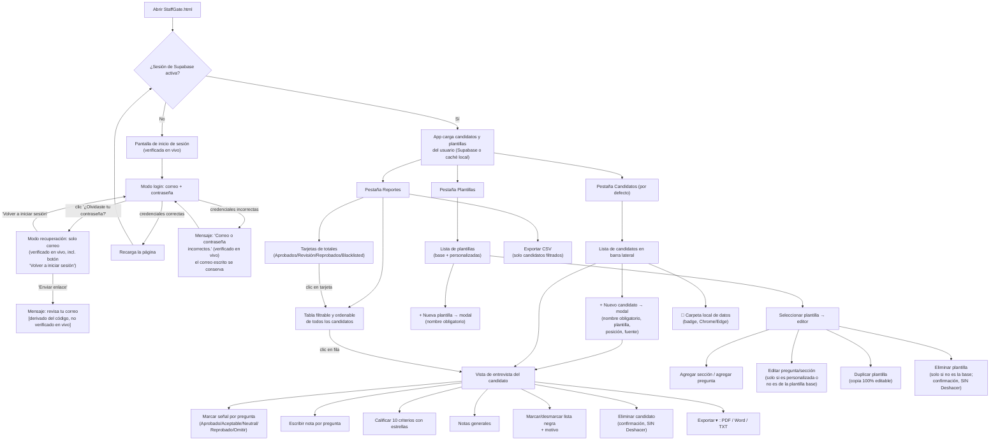

# StaffGate — Requerimientos

> Documento base generado por el Analista de Negocio (BA). Derivado de la lectura completa del código fuente de `StaffGate.html` (2418 líneas), `auth-gate.js` y `supabase-client-app.js`, y de una sesión real navegando la pantalla de acceso en el navegador (incluyendo el modo de recuperación de contraseña y el mensaje de error por credenciales incorrectas).
>
> **Aviso de cobertura de evidencia:** la pantalla de inicio de sesión, su modo de recuperación de contraseña y el mensaje de error por credenciales incorrectas fueron navegados y observados en vivo en el navegador. El resto de las pantallas descritas aquí (Candidatos, Plantillas, Reportes, editor de plantillas, exportaciones PDF/Word/TXT/CSV, widget de cuenta) **no pudieron navegarse en vivo** porque la app exige una sesión válida de Supabase y no se dispone de credenciales de prueba. Esas secciones están documentadas a partir de la lectura línea por línea del código (funciones `render*`, `export*`, `save`, `load`), no de observación visual directa. Donde el código deja algo ambiguo o parece contradecirse a sí mismo, se anota como caso borde en vez de asumir un comportamiento.

## Propósito del app

StaffGate es una herramienta personal para conducir y documentar entrevistas técnicas a candidatos (por ejemplo, pasantías de Business Analyst, roles de PM o desarrollo). Permite crear una ficha por candidato basada en una plantilla de preguntas organizada en secciones, calificar cada respuesta con una "señal" (aprobado/aceptable/neutral/reprobado/omitida), anotar comentarios libres por pregunta, calificar al candidato con estrellas en 10 criterios adicionales (comunicación, puntualidad, actitud, etc.), marcarlo como "lista negra" (blacklist) con un motivo, y ver un veredicto automático (aprobado / en revisión / reprobado / sin evaluar) calculado en tiempo real. También permite crear plantillas de preguntas propias además de la plantilla base incluida, exportar la ficha de un candidato en PDF, Word o texto plano, y ver un reporte consolidado de todos los candidatos con filtros, orden y exportación a CSV. Los datos se guardan en la nube (Supabase) asociados a la cuenta del usuario que inició sesión, con una copia en caché en el navegador y, opcionalmente, una copia adicional en una carpeta local del computador.

## Requerimientos funcionales

### Acceso / autenticación
1. La app está protegida por una pantalla de inicio de sesión (correo + contraseña) que se muestra antes de cargar cualquier dato; no existe opción de "crear cuenta" visible en el formulario (solo inicio de sesión y recuperación de contraseña). **(Verificado en vivo.)**
2. Si las credenciales son incorrectas, se muestra el mensaje "Correo o contraseña incorrectos." debajo del botón "Entrar", y el campo de correo conserva lo que el usuario escribió (no se borra). **(Verificado en vivo con un correo y contraseña de prueba inexistentes.)**
3. El enlace "¿Olvidaste tu contraseña?" cambia el formulario a modo "Recuperar contraseña": desaparece el campo de contraseña, el botón pasa a decir "Enviar enlace" y aparece un enlace "Volver a iniciar sesión" para regresar al modo normal. **(Verificado en vivo: se hizo clic en el enlace, se observó el cambio de formulario, y se regresó al modo de login con "Volver a iniciar sesión".)**
4. Al enviar el formulario en modo recuperación, el código invoca `resetPasswordForEmail` de Supabase con `redirectTo` apuntando a la URL actual, y si no hay error muestra "Revisa tu correo para continuar." **(Esto NO se verificó en vivo: no se llegó a pulsar "Enviar enlace" con un correo real, para evitar generar un envío real sin necesidad. Es comportamiento leído directamente del código de `auth-gate.js`.)**
5. Si el usuario llega a la app a través de un enlace de recuperación de contraseña real (evento `PASSWORD_RECOVERY` de Supabase), se muestra una pantalla distinta, "Elige una contraseña nueva", que exige un mínimo de 6 caracteres. **(No verificado en vivo — requiere un enlace de recuperación real generado por correo.)**
6. Cada app del hub (Bitácora del Mentor, StaffGate, LP Bag, MyTravel, Gantt) usa una sesión de Supabase completamente independiente (`storageKey` distinto por app: `sb-staffgate-auth`), por lo que iniciar sesión en una app no da acceso a las demás. **(Verificado leyendo `supabase-client-app.js`.)**
7. Con sesión iniciada, aparece un widget "👤 Cuenta" en la esquina superior derecha que permite cambiar la contraseña (mínimo 6 caracteres) y cerrar sesión. **(No verificado en vivo — requiere sesión real.)**

### Persistencia de datos
8. Cada cambio (candidato, señal, nota, plantilla, etc.) se guarda primero en `localStorage` (`staffgate_cands_v1`, `staffgate_tpls_v1`) y luego se sincroniza a Supabase (tabla `app_data`, una fila por usuario y por `app_id='staffgate'`), usando `upsert` sobre `user_id + app_id`.
9. La sincronización a la nube solo se activa después de que la carga inicial haya terminado (`cloudSyncReady`), para evitar que un guardado disparado antes de tiempo sobrescriba la nube con un estado vacío.
10. Si falla la sincronización con la nube, el cambio queda guardado localmente igual y solo se registra una advertencia en la consola del navegador — no se informa al usuario dentro de la app.
11. Al iniciar sesión, la app intenta leer primero desde Supabase; si existe una fila para ese usuario, esos datos reemplazan la caché local; si no existe fila (cuenta nueva) o falla la lectura, se usa lo que haya en `localStorage`.
12. Sin sesión de Supabase confirmada, la app no carga candidatos ni plantillas reales en memoria, aunque existan datos cacheados de una sesión anterior en ese navegador (según comentario explícito en el código).
13. En navegadores compatibles (Chrome/Edge), un badge en la esquina inferior derecha permite conectar una carpeta local del computador donde se guarda una copia adicional de los datos en `staffgate.data.json`, independiente de la nube; en otros navegadores se muestra un aviso de "Guardado solo local". **(Se confirmó que el botón/badge existe en el DOM incluso con la pantalla de login activa, ver Casos borde.)**

### Gestión de candidatos
14. Crear un candidato exige solo un nombre; la plantilla se elige de un listado desplegable (por defecto, la primera plantilla de la lista); posición/rol y fuente/canal son campos de texto libres y opcionales.
15. Una vez creado, el candidato se abre directamente en la vista de entrevista, con todas las preguntas de la plantilla elegida en ese momento.
16. En el panel lateral, cada candidato muestra: nombre (con etiqueta "BL" si está en lista negra), un punto de color (verde si ya tiene al menos una pregunta evaluada, ámbar si ninguna), su posición o el rol de la plantilla, la fecha de creación, y una fila de hasta 14 "pips" de color que representan la señal de las primeras 14 preguntas de su plantilla en orden.
17. Eliminar un candidato exige confirmar en un diálogo modal ("Esta acción no se puede deshacer") y el registro se borra de inmediato de forma permanente, sin opción de "Deshacer" en ningún lugar de la app.

### Vista de entrevista
18. Cada pregunta tiene un cuadro de texto para notas libres y cinco botones de señal: Aprobado (verde), Aceptable (azul), Neutral (ámbar), Reprobado (rojo) y Omitir (gris); hacer clic sobre la misma señal ya activa la deselecciona.
19. Un panel de puntaje recalcula en vivo (sin recargar la página) los conteos de cada señal y el veredicto: "Sin evaluar aún" si hay menos de 5 preguntas evaluadas (sin contar omitidas); "Candidato aprobado ✓" si el 70% o más de lo evaluado es aprobado+aceptable Y hay 2 o menos reprobadas; "Candidato reprobado ✗" si hay 5 o más reprobadas; en cualquier otro caso, "Evaluar con cuidado ~".
20. Marcar una pregunta como "Omitir" tacha visualmente el texto, atenúa la fila, agrega una etiqueta "omitida", y la excluye del conteo total de evaluadas y del denominador que se muestra bajo "Evaluadas".
21. Existe un panel de calificación manual por estrellas con 10 criterios fijos (Comunicación, Comprensión, Fluidez verbal, Presentación personal, Pensamiento analítico, Autonomía, Actitud/fit cultural, Conocimiento del área, Puntualidad, Notificación previa); cada uno se califica de 1 a 5 estrellas (2 puntos por estrella, hasta 10); hacer clic sobre la misma estrella ya marcada la desmarca (vuelve a 0).
22. El promedio general en estrellas ("X / 10") se calcula solo sobre los criterios que tienen un valor mayor a 0; los criterios sin calificar no cuentan ni a favor ni en contra del promedio.
23. Existe un campo de "Notas generales" de texto libre por candidato, independiente de las notas por pregunta.
24. Un checkbox permite marcar al candidato como "BLACKLISTED"; al marcarlo aparece un campo de motivo. El campo se resalta en rojo si se deja el foco sin escribir nada, pero esto es solo visual: nada impide guardar, exportar o incluir en reportes a un candidato en lista negra sin motivo escrito.
25. Desmarcar el checkbox de lista negra borra de inmediato tanto el estado de "blacklisted" como el texto del motivo, sin pedir confirmación ni ofrecer "Deshacer".

### Plantillas de preguntas
26. La app incluye una plantilla base, "Entrevista técnica BA", con 25 preguntas repartidas en 9 secciones (Intro, Pensamiento analítico, Documentación, Agile, Priorización, Validación, Comunicación, Escenarios prácticos, Fit), cada sección con una lista de "flags" verdes y rojas (indicadores de comportamiento) que se muestran como referencia al entrevistador — estas flags son solo texto informativo, no son clickeables ni afectan el puntaje.
27. Las preguntas y secciones originales de la plantilla base no se pueden editar ni eliminar (los campos aparecen de solo lectura y no se muestra el botón de eliminar), pero sí se pueden agregar preguntas nuevas dentro de sus secciones existentes, o secciones completamente nuevas — esas adiciones personalizadas sí son editables y eliminables.
28. Para tener control total sobre la plantilla base (editar o quitar sus preguntas originales), el usuario debe usar el botón "Duplicar", que crea una copia independiente y totalmente editable con IDs nuevos para cada sección y pregunta.
29. Crear una plantilla nueva desde cero exige solo un nombre (el rol queda como "General" si se deja vacío) y empieza sin secciones ni preguntas; hay que construirla con "Agregar nueva sección" / "Agregar pregunta a esta sección".
30. Al eliminar una plantilla que no es la base, si algún candidato ya la está usando, el mensaje de confirmación advierte que esos candidatos "quedarán sin plantilla asignada". Sin embargo, el código real, al volver a abrir la ficha de ese candidato, no lo deja "sin plantilla": recurre silenciosamente a la primera plantilla de la lista (que normalmente es la plantilla base) para poder mostrar algo, lo cual no coincide con lo que dice el aviso (ver Casos borde).
31. La plantilla base no tiene botón de eliminar y, además, el código la vuelve a insertar automáticamente en la lista de plantillas cada vez que la app carga si no la encuentra, por lo que no puede perderse de forma permanente por esta vía.

### Reportes
32. La pestaña "Reportes" muestra tarjetas con el total de Aprobados, En revisión, Reprobados y Blacklisted, calculadas sobre TODOS los candidatos sin importar los filtros activos, y una tabla filtrable/ordenable con: candidato, posición, veredicto, conteos de cada señal, % positivo, promedio de estrellas y fecha.
33. Los filtros de veredicto, posición y "blacklisted" son de selección múltiple (se pueden combinar varios a la vez) y se combinan entre sí con lógica "Y"; también hay un buscador de texto libre por nombre/posición. Un botón "✕ Limpiar filtros" aparece solo cuando hay algún filtro activo.
34. Se puede hacer clic en cualquier tarjeta de totales para aplicar ese filtro, y clic en cualquier fila de la tabla para ir directo a la vista de entrevista de ese candidato.
35. Los encabezados de columna son clickeables para ordenar ascendente/descendente; el orden por defecto es por fecha.
36. El botón "Exportar CSV" (disponible tanto en el botón principal de la barra lateral —que se renombra a "Exportar todo" en la pestaña Reportes— como en un botón dedicado del encabezado del reporte) exporta únicamente el conjunto de candidatos que está **actualmente filtrado**, no la totalidad de candidatos guardados.

### Exportación de una ficha individual (PDF / Word / TXT)
37. Desde la vista de entrevista de un candidato, un menú "Exportar ▾" ofrece tres formatos: PDF, Word (.docx) y texto plano (.txt).
38. "Exportar PDF" abre una pestaña nueva del navegador con un reporte con estilo, listo para imprimir, y un botón "Imprimir / Guardar como PDF" — no genera un archivo PDF descargable directamente, depende del diálogo de impresión del navegador.
39. "Exportar Word" construye un archivo `.docx` real (formato ZIP + XML de Office) de forma manual en el propio código, sin usar ninguna librería externa.
40. "Exportar texto" genera un archivo `.txt` plano con la misma información.
41. Los tres formatos incluyen: nombre, posición, plantilla, fuente y fecha del candidato; el resumen de puntaje y el veredicto; las notas generales; las calificaciones por estrella (solo los criterios con valor mayor a 0); y, por sección, únicamente las preguntas que NO están marcadas como "omitida" (las omitidas se excluyen por completo de los tres formatos de exportación).
42. El nombre del archivo exportado sigue el patrón `Entrevista - {posición} - {nombre} - {fecha}.{extensión}`, quitando los caracteres `< > : " / \ | ? *`.

## Flujo de trabajo

```mermaid
flowchart TD
    A[Abrir StaffGate.html] --> B{"¿Sesión de Supabase activa?"}
    B -- No --> C["Pantalla de inicio de sesión\n(verificada en vivo)"]
    C --> C1["Modo login: correo + contraseña"]
    C1 -- clic '¿Olvidaste tu contraseña?' --> C2["Modo recuperación: solo correo\n(verificado en vivo, incl. botón\n'Volver a iniciar sesión')"]
    C2 -- 'Enviar enlace' --> C2a["Mensaje: revisa tu correo\n[derivado del código, no verificado en vivo]"]
    C2 -- 'Volver a iniciar sesión' --> C1
    C1 -- credenciales correctas --> D[Recarga la página]
    C1 -- credenciales incorrectas --> C1e["Mensaje: 'Correo o contraseña\nincorrectos.' (verificado en vivo)\nel correo escrito se conserva"]
    C1e --> C1
    D --> B
    B -- Sí --> E["App carga candidatos y plantillas\ndel usuario (Supabase o caché local)"]
    E --> F["Pestaña Candidatos (por defecto)"]

    F --> F1["Lista de candidatos en barra lateral"]
    F1 --> F2["+ Nuevo candidato → modal\n(nombre obligatorio, plantilla,\nposición, fuente)"]
    F2 --> F3["Vista de entrevista del candidato"]
    F1 --> F3
    F3 --> F4["Marcar señal por pregunta\n(Aprobado/Aceptable/Neutral/\nReprobado/Omitir)"]
    F3 --> F5["Escribir nota por pregunta"]
    F3 --> F6["Calificar 10 criterios con estrellas"]
    F3 --> F7["Notas generales"]
    F3 --> F8["Marcar/desmarcar lista negra\n+ motivo"]
    F3 --> F9["Eliminar candidato\n(confirmación, SIN Deshacer)"]
    F3 --> F10["Exportar ▾ : PDF / Word / TXT"]

    E --> G["Pestaña Plantillas"]
    G --> G1["Lista de plantillas\n(base + personalizadas)"]
    G1 --> G2["+ Nueva plantilla → modal\n(nombre obligatorio)"]
    G1 --> G3["Seleccionar plantilla → editor"]
    G3 --> G4["Agregar sección / agregar pregunta"]
    G3 --> G5["Editar pregunta/sección\n(solo si es personalizada o\nno es de la plantilla base)"]
    G3 --> G6["Duplicar plantilla\n(copia 100% editable)"]
    G3 --> G7["Eliminar plantilla\n(solo si no es la base;\nconfirmación, SIN Deshacer)"]

    E --> H["Pestaña Reportes"]
    H --> H1["Tarjetas de totales\n(Aprobados/Revisión/Reprobados/Blacklisted)"]
    H --> H2["Tabla filtrable y ordenable\nde todos los candidatos"]
    H2 -- clic en fila --> F3
    H1 -- clic en tarjeta --> H2
    H --> H3["Exportar CSV\n(solo candidatos filtrados)"]

    F1 --> I["📁 Carpeta local de datos\n(badge, Chrome/Edge)"]
```

## Casos borde

Cada uno de estos requiere una decisión del tech lead antes de convertirse en un cambio de código; aquí solo se documentan como observados durante la lectura del código (y, donde se indica, confirmados en vivo).

1. **Bug confirmado: el color del veredicto en las exportaciones PDF y Word es incorrecto para "aprobado" y "reprobado".** Tanto `exportPDF()` como `exportWord()` deciden el color del veredicto buscando si el texto de `vLbl` contiene las palabras `'sólido'`, `'cuidado'` o `'flags'`. Pero los veredictos reales que produce `getVerdict()` son `"Candidato aprobado ✓"`, `"Evaluar con cuidado ~"`, `"Candidato reprobado ✗"` y `"Sin evaluar aún"`. Solo `"cuidado"` coincide (por eso "Evaluar con cuidado" sí sale ámbar); "aprobado" y "reprobado" no contienen ninguna de esas tres palabras, así que ambos caen al color gris por defecto. Resultado: en el PDF y el Word exportados, un candidato aprobado y uno reprobado se ven visualmente idénticos (badge de veredicto gris), perdiendo la señal de color que sí funciona correctamente dentro de la app. Esto es un hallazgo verificado leyendo el código, no una suposición.

2. **El motivo de lista negra no es realmente obligatorio pese a parecerlo.** El campo se pone en rojo (`.error`) si se deja el foco vacío, pero ninguna función bloquea guardar, exportar (PDF/Word/TXT no incluyen el motivo de todas formas) ni reportar un candidato blacklisted sin motivo. Además, desmarcar el checkbox borra el estado y el motivo de inmediato sin pedir confirmación — hay un comentario en el código ("require reason before unchecking if already blacklisted with a reason") que sugiere que se planeó una validación que nunca se implementó.

3. **Eliminar una plantilla en uso no deja a los candidatos "sin plantilla asignada" como dice el aviso.** El mensaje de confirmación dice textualmente que los candidatos "quedarán sin plantilla asignada", pero el código (`renderInterview`, `getTpl(c.templateId)||templates[0]`) hace que esos candidatos muestren silenciosamente la primera plantilla disponible (normalmente la plantilla base de 25 preguntas de BA) la próxima vez que se abran, con un conjunto de preguntas totalmente distinto al que se usó originalmente. Las respuestas ya guardadas (señales/notas) quedan huérfanas — no se pierden en el almacenamiento, pero tampoco se muestran contra ninguna pregunta visible, porque los IDs de pregunta ya no existen en la plantilla de reemplazo.

4. **No existe la opción "Deshacer" en ningún lugar de StaffGate.** A diferencia de Bitácora del Mentor (que sí ofrece "Deshacer" temporal tras borrar mentees/sesiones/grupos), en StaffGate eliminar un candidato, una plantilla, una sección o una pregunta es inmediato y permanente en cuanto se confirma el diálogo modal. El único "seguro" es el propio diálogo de confirmación.

5. **"Exportar CSV" en Reportes exporta solo el subconjunto filtrado, no todos los candidatos**, y no hay ningún aviso en pantalla que lo aclare en el momento de exportar (ni en el botón, ni en un mensaje posterior). Alguien que aplicó un filtro y luego exporta puede asumir que descargó el reporte completo.

6. **No hay forma de cambiar la plantilla de un candidato después de creado.** La plantilla se elige una sola vez, en el modal de creación (`c.templateId` solo se asigna en `createCandidate()`); si el usuario se equivoca de plantilla, no hay ningún botón o flujo posterior para reasignarla — habría que eliminar el candidato y crearlo de nuevo, perdiendo todo lo ya evaluado.

7. **El "candado" de acceso es solo visual, no de datos — confirmado directamente sobre StaffGate en esta sesión.** Con la pantalla de login cubriendo la vista, se usó la herramienta de lectura de accesibilidad del navegador y detectó igualmente los botones de pestañas ("Candidatos", "Plantillas", "Reportes"), el botón "+ Nuevo candidato", el buscador, los botones del diálogo de confirmación, y el badge de carpeta local ("📁 Conectar carpeta de datos") — todo esto sigue presente en el DOM de la página aunque el overlay de login lo tape visualmente. Por el lado de los datos, el código de `load()` sí evita poblar `candidates`/`templates` sin sesión confirmada, por lo que no parece haber una fuga de información sensible (nombres de candidatos, notas de entrevista) por esta vía — pero conviene que el tech lead lo confirme explícitamente antes de descartar el hallazgo, igual que se recomendó para Bitácora del Mentor.

8. **El promedio de estrellas puede ser engañoso si se calificaron pocos criterios.** `calcStarTotal()` promedia solo los criterios con valor mayor a 0; un candidato evaluado en 1 o 2 de los 10 criterios (por ejemplo, calificado con 5 estrellas solo en "Puntualidad") mostraría "10 / 10" de promedio general, dando la impresión de una evaluación completa y sobresaliente cuando en realidad casi no se evaluó nada por este método.

9. **El respaldo en carpeta local ("folder bridge") no está vinculado al usuario de Supabase que inició sesión**, igual que se documentó para Bitácora del Mentor: espeja las claves `staffgate_cands_v1` / `staffgate_tpls_v1` de `localStorage` a un archivo `staffgate.data.json` en una carpeta del computador, sin relacionarlo con el `user_id`. En un equipo compartido con la carpeta conectada, dos personas distintas podrían mezclar o sobrescribir datos de candidatos entre sí.

10. **La vista previa de "pips" de color en la lista de candidatos solo muestra las primeras 14 preguntas de la plantilla.** La plantilla base tiene 25 preguntas; las señales marcadas en las preguntas 15 a 25 no se reflejan de ninguna forma en la lista lateral, solo dentro de la ficha completa del candidato. No es necesariamente un error, pero puede dar una impresión incompleta del avance de la entrevista con solo mirar la barra lateral.

11. **El mensaje de éxito del modo "Recuperar contraseña" ("Revisa tu correo para continuar.") no se verificó en vivo.** Se confirmó en vivo el cambio de formulario al hacer clic en "¿Olvidaste tu contraseña?" y el regreso con "Volver a iniciar sesión", pero no se llegó a pulsar "Enviar enlace" con un correo real para no generar un envío de correo real sin necesidad durante esta sesión de documentación. El comportamiento de éxito/error de ese envío está documentado solo a partir de la lectura de `auth-gate.js`.

12. **(security-reviewer, 2026-07-23) Ventana de carrera estrecha en la que `save()` todavía puede escribir en la clave local sin aislar por usuario, pese a la corrección de mezcla de cuentas.** El botón "+ Nuevo candidato" (línea 792, `onclick="openNewModal()"`) es HTML estático, visible e interactivo desde que la página pinta — no depende de que `load()` haya terminado. `cachedUserId` (línea 975) solo se fija dentro de `load()` (línea 1028), que es asíncrono. Si `createCandidate()` (línea 1874) se dispara antes de que esa asignación ocurra (por ejemplo, si `getSupabaseSession()` tarda por una renovación de token), `save()` (línea 989-991) escribe con `scopedKey('staffgate_cands_v1', null)`, es decir, en la clave vieja sin aislar `staffgate_cands_v1`. El guardado en la nube (`syncToCloud()`, línea 995) no se ve afectado porque usa `session.user.id` fresco, así que no hay mezcla de cuentas por lectura — pero esa fila queda huérfana en la clave vieja, y como `isSyncKey()` (línea 11) la reconoce igual por el prefijo, también se replica al respaldo de carpeta local, donde sí queda expuesta a cualquier otra cuenta que conecte esa misma carpeta. *Decisión pendiente: ¿deshabilitar los controles de guardado hasta que `cachedUserId` esté confirmado, en vez de solo gatear la subida a la nube con `cloudSyncReady`?* **Actualización 2026-07-24 (security-reviewer):** corregido en el commit `a4a2d10` — ver `docs/security-notes.md`. Este ítem queda como implementado, no pendiente.

13. **(security-reviewer, 2026-07-24, commit `ba88936`) `ICONS[iconName]` en el camino `AIAPPS_LOGIN_DECORATIONS` (`auth-gate.js:1293`) es un acceso de objeto por clave arbitraria sin `hasOwnProperty`/lista blanca — hoy inofensivo, pero fue heredado sin cambios por `scatterCells()`, no introducido por este commit.** Si `iconName` fuera algún día `"__proto__"`/`"toString"`/`"constructor"`, `ICONS[iconName]` devolvería un objeto/función heredado de `Object.prototype` (veraz, no `undefined`), pasando el `if (!svgPath) return ''` y terminando interpolado en el template literal (`auth-gate.js:1299`) — pero el resultado sería solo texto inerte (`"[object Object]"` o el código fuente de la función nativa), sin etiquetas HTML, así que no es explotable como XSS con el código actual. No es un hallazgo nuevo de este commit (el patrón `ICONS[iconName]` ya existía antes con exactamente el mismo comportamiento) y **hoy no es explotable en la práctica**: no se encontró ninguna app en el repo que defina `window.AIAPPS_LOGIN_DECORATIONS` (`grep` sin resultados en los 5 HTML), así que es una rama muerta. Queda documentado para que, si alguna vez una app llena `AIAPPS_LOGIN_DECORATIONS` con datos que no sean literales hardcodeados por el desarrollador, se revise este punto antes de escalar el riesgo.

14. **(security-reviewer, 2026-07-24, commit `ba88936`) No verificado en vivo: si el zoom automático de los iconos decorativos (`.auto-focus`, `auth-gate.js:952-964`) puede solaparse visualmente con el borde de la tarjeta de login en viewports angostos (móvil).** Por código, no debería pasar: `scatterCells()` excluye explícitamente la columna donde va la tarjeta (`sameColumnAsCard`, `auth-gate.js:68`) y solo permite celdas "arriba/abajo" cuando `top<=10` o `top>=88` (`auth-gate.js:69`), y aunque hubiera solape geométrico, `.card` tiene `z-index:4` explícito (`auth-gate.js:117`) mientras que `.deco`/`.interview-icon` no declaran `z-index` (por lo tanto quedan por debajo en el stacking, sin importar la escala del `transform:scale(1.3)` del auto-zoom) — así que no debería haber forma de que un icono agrandado intercepte un clic destinado al botón "Entrar" (no hay clickjacking). Esto es análisis estático, no una prueba visual en vivo en un viewport de 375px (limitación de herramienta ya documentada por otros agentes en `docs/team-memory.md` — el snapshot del DOM puede no reflejar el render visual real). Pendiente: que QA/accessibility-reviewer lo confirme visualmente en móvil real la próxima vez que revisen StaffGate. **Actualización (tech lead, misma sesión): confirmado en vivo — sí había solape (ver caso 19), y ya está corregido.**

15. **(accessibility-reviewer, 2026-07-24, commit `ba88936`) El gate de `prefers-reduced-motion` del zoom automático (`auto-focus`) es de una sola lectura al construir el overlay, no reactivo.** `auth-gate.js:935-936` lee `window.matchMedia("(prefers-reduced-motion: reduce)").matches` una sola vez antes de decidir si crea el `setInterval`; confirmado por `grep` que no existe ningún `addEventListener("change", ...)` sobre ese `matchMedia` en todo el archivo. Si la persona abre el login con esa preferencia desactivada (el `setInterval` arranca) y la activa después desde el sistema operativo sin recargar la página, el zoom automático que ya está corriendo sigue indefinidamente hasta que el overlay se reconstruya o la página se recargue. El caso inverso (empezar con la preferencia activada y desactivarla después) es inofensivo — el intervalo simplemente nunca llegó a arrancar. Recomendación: agregar `mql.addEventListener("change", ...)` que cancele `host._aiappsTimers` si la preferencia pasa a "reduce" en vivo. Detalle completo en `docs/staffgate/accessibility-notes.md` (sección 1).

16. **(accessibility-reviewer, 2026-07-24, commit `ba88936`) `interview-bounce` (36 iconos, loop de 2.6s) y `deco-float` (5s) siguen sin ningún soporte de `prefers-reduced-motion`, deuda transversal ya documentada para las 5 apps en `docs/team-memory.md` y `docs/gantt/accessibility-notes.md`.** Este commit no las toca (no está en el diff de `ba88936`) y por lo tanto no las corrige, pero tampoco las empeora estructuralmente — sí agrega, sobre esa misma base sin protección, un nuevo efecto (`auto-focus`) que compone visualmente con el rebote ya existente cuando reduced-motion está desactivado. Pendiente de una solución única a nivel de todo `auth-gate.js`, no solo de esta escena — ver la recomendación concreta y las advertencias de "animaciones que terminan en `opacity:0`/`width:0%`" ya documentadas en `docs/gantt/accessibility-notes.md`.

17. **(accessibility-reviewer, 2026-07-24, commit `ba88936`) Los SVG de `.interview-icon` (`auth-gate.js:858`) y `.deco` (`auth-gate.js:871`) no tienen `aria-hidden="true"`, a diferencia de otros dos SVG puramente decorativos en el mismo archivo que sí lo tienen** (`fallingCoin`, línea 698; `.logo-bars`, línea 883). Es código preexistente (no está en el diff de `ba88936`, solo cambia el cálculo de posición de esos iconos), pero es una inconsistencia con costo de arreglo trivial dentro del mismo archivo, que ya conoce y aplica el patrón correcto en otros dos lugares. No verificado con un lector de pantalla real (no disponible en este entorno) si el impacto práctico es audible o no. Detalle en `docs/staffgate/accessibility-notes.md` (sección 6).

18. **(accessibility-reviewer, 2026-07-24, commit `ba88936`) WCAG 2.2.2 (Pausar/Detener/Ocultar, Nivel A) probablemente aplica en la letra estricta al zoom automático nuevo**, por ser movimiento que arranca solo, se repite sin límite de tiempo mientras el login esté abierto, y corre en paralelo al formulario — el gate de `prefers-reduced-motion` es una mitigación real pero no es, en la letra estricta de la norma, equivalente a un mecanismo on-page independiente de la configuración del sistema operativo. No lo considero bloqueante (elemento decorativo pequeño, movimiento no invasivo, hub personal sin obligación de conformidad WCAG formal), pero si se sigue acumulando movimiento automático en el login (esta sesión ya sumó esto a StaffGate, y otras revisiones recientes de Gantt/MyTravel/Bitácora reportan lo mismo — ver `docs/team-memory.md`), recomiendo un control de pausa único y compartido en `auth-gate.js` en vez de resolverlo pieza por pieza. Detalle en `docs/staffgate/accessibility-notes.md` (sección 3).

19. **(qa-lead, 2026-07-24, commit `ba88936`) BUG CONFIRMADO EN VIVO — contradice tanto la afirmación del tech lead ("0 iconos encima de la tarjeta, 0 cortados por el borde") como el análisis estático del caso borde 14 de security-reviewer ("no debería pasar... análisis estático, no una prueba visual en vivo").** Medido con `getBoundingClientRect()` real sobre `.card` y los 36 `.interview-icon`, cargando el archivo del commit `ba88936` en el navegador (no una simulación):
    - **Móvil 375×812:** la tarjeta de login ocupa el **100% del ancho de pantalla** (`cardRect.left=0, right=375`, borde a borde) — no el 38% centrado que `scatterCells()` asume al fijar `cardLeft=31`/`cardRight=69` en porcentaje. Resultado: **15 de 36 iconos (42%) se superponen con la tarjeta** y **6 de 36 quedan parcial o totalmente fuera de la pantalla**. Confirmado también visualmente con una captura de pantalla real (dos iconos visiblemente cortados justo en el borde superior/inferior de la tarjeta, uno cortado en el borde derecho).
    - **1280×600 (pantalla baja, ancho normal):** 1 de 36 iconos se superpone con la esquina de la tarjeta (~2px de solape) — la tarjeta no escala su altura con el viewport, así que en pantallas bajas la franja "arriba/abajo de la tarjeta" (`top<=10 || top>=88` en `scatterCells()`) ya no coincide con el borde real de la tarjeta.
    - **1280×800 (desktop estándar):** 0 de 36 superpuestos, 0 fuera de pantalla — coincide con lo que afirmó el tech lead, **pero solo en este tamaño**.
    - **Causa raíz:** `.card` tiene `width:min(320px, 90vw)` **más** `padding:32px 28px` (no `box-sizing:border-box`), así que el ancho real renderizado (~376-393px) no es un porcentaje fijo del viewport — en viewports angostos crece hasta ocupar casi/todo el ancho. `scatterCells()` usa un `cardLeft`/`cardRight` en porcentaje fijo (31/69 centrado, 58/99 alineado a la derecha) que nunca se ajusta a esa geometría real ni al alto real de la tarjeta (~440px fijo por contenido). No hay ninguna medición en tiempo de ejecución del `getBoundingClientRect()` real de `.card` — es una suposición geométrica hardcodeada.
    - Este hallazgo responde directamente la pregunta que la usuaria pidió verificar ("¿algún icono puede terminar encima o pegado al borde de la tarjeta... en móvil angosto?") con un **sí, de forma severa**, no un caso marginal.
    - **Actualización (tech lead, misma sesión, sin qa-lead disponible para segunda opinión — murió por límite de sesión antes de reportar este hallazgo):** corregido. La causa raíz identificada aquí (padding sin `box-sizing:border-box`, ancho real ~376px no ~320px) era exactamente el número que `scatterCells()` usaba mal — se corrigió sumando los 56px de padding al cálculo del ancho de la tarjeta. Además se agregó una red de seguridad independiente del cálculo: después de pintar los iconos, el código mide `cardEl.getBoundingClientRect()` real (no una suposición geométrica) y oculta cualquier icono que la toque de verdad. Reverificado en los mismos tres tamaños que reportó qa-lead — 375×812, 1280×600 y 1280×800 — con 0 iconos superpuestos y 0 ocultados por la red de seguridad en los tres. Como esto se corrigió sin que qa-lead (ni ningún otro agente) lo verificara de forma independiente después del fix, sigue pendiente una segunda opinión real la próxima vez que alguien revise StaffGate.

20. **(qa-lead, 2026-07-24, commit `ba88936`) `scatterCells()` puede devolver posiciones casi idénticas (iconos visualmente apilados) cuando la cantidad pedida excede el tamaño del "pool" de celdas disponible — hoy no ocurre en ninguna app real, pero es un bug latente confirmado en vivo.** Con `AIAPPS_LOGIN_SCENE` sin definir y `AIAPPS_LOGIN_DECORATIONS` con 100 iconos (el único camino que hoy usa un `count` variable en vez del `36` fijo de StaffGate), la distancia mínima medida entre dos iconos fue de **0.5 puntos porcentuales** (prácticamente superpuestos, dado que cada icono mide 1.7-2.8rem) y hubo **4 pares dentro de 2 puntos porcentuales** de distancia. La función no revienta (no hay `undefined`/excepción; el `±3%` de jitter evita coordenadas exactamente iguales), pero el resultado visual sería iconos amontonados unos sobre otros — justo lo opuesto de "más segregado" que pidió la usuaria. Para `count=0` y `count=1` se rastreó el código con los tamaños de pool reales (80 celdas "sides" + 9 "overUnder" en layout centrado) y no hay riesgo de `decoCells[i] === undefined`; no se pudo repetir esta prueba puntual en vivo por un problema de la herramienta de navegación con archivos temporales nuevos (ver nota de proceso en `docs/team-memory.md`), pero sí se ejecutó en vivo el caso de 100 iconos, que es el que realmente demuestra el problema. Hoy es código muerto (`grep` sin resultados de `AIAPPS_LOGIN_DECORATIONS` en las 5 apps, igual que documentó security-reviewer en el caso 13), así que no bloquea esta revisión, pero debe corregirse antes de que cualquier app futura use ese camino con más de ~9-80 iconos.

21. **(qa-lead, 2026-07-24, commit `ba88936`) El reparto por zona de `scatterCells()` es determinístico en cantidad, no aleatorio, entre recargas — hallazgo menor, no bloqueante.** Se recargó la página del login 2 veces y se contaron los iconos en 4 franjas (arriba-centro, abajo-centro, lateral-izquierdo-medio, lateral-derecho-medio): el resultado fue idéntico en ambas cargas (3, 4, 1, 1 respectivamente) — solo cambia qué celda específica dentro de cada franja se usa, no cuántos iconos caen en cada franja. Esto sí resuelve el reclamo original (antes esas franjas tenían 0, ahora tienen 1-4 de forma consistente), pero los costados a media altura quedan con apenas 1 icono cada uno, notablemente más flacos que las franjas de arriba/abajo (3-4). No es un bug, es una característica del diseño del algoritmo (muestreo por tramos de un arreglo ordenado por fila) que vale la pena que el tech lead conozca si "más parejo" era la expectativa exacta de la usuaria.
